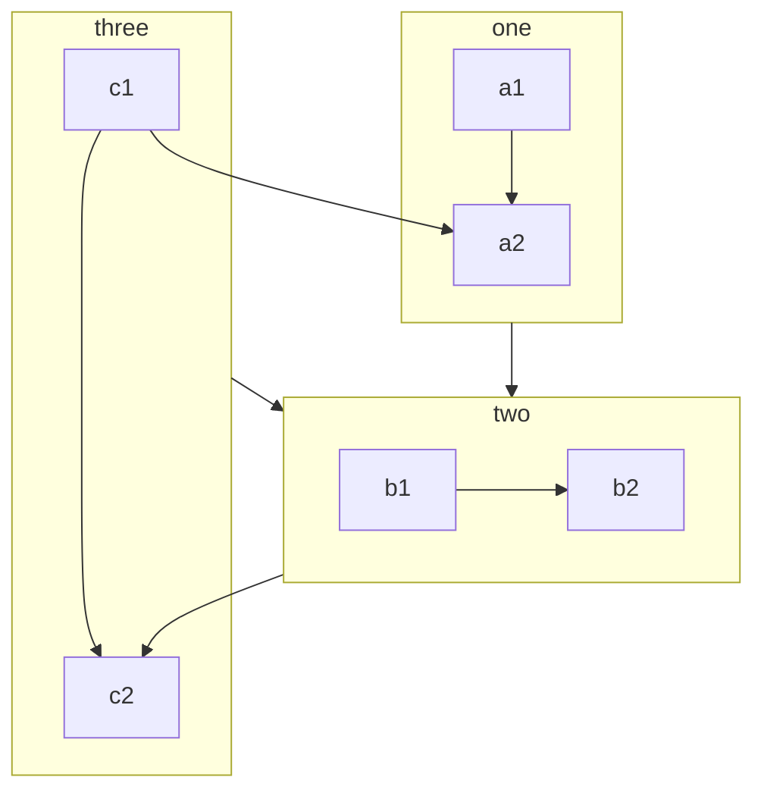

Every document page in VuePress is rendered by Markdown.

You need to build your document or blog page by creating and writing Markdown in the corresponding path.

<!-- more -->

## Markdown introduction

If you are a new learner and don’t know how to write Markdown, please read [Markdown Intro](https://vuepress-theme-hope.github.io/v2/basic/markdown/README.html) and [Markdown Demo](https://vuepress-theme-hope.github.io/v2/basic/markdown/demo.html).

::: info Frontmatter

Frontmatter is a important concept in VuePress. If you don’t know it, you need to read [Frontmatter Introduction](https://vuepress-theme-hope.github.io/v2/basic/vuepress/page.html#front-matter).

:::

## VuePress enhance

To enrich document writing, VuePress has extended Markdown syntax.

For these extensions, please read [Markdown extensions in VuePress](https://vuepress-theme-hope.github.io/v2/basic/vuepress/markdown.html).

## Theme enhance

### Enable all

You can set `themeconfig.plugins.htmlEnhance.enableAll` to enable all features of the [md-enhance](https://vuepress-theme-hope.github.io/v2/md-enhance/) plugin.

```js {3-5}
module.exports = {
  themeConfig: {
    plugins: {
      mdEnhance: {
        enableAll: true,
      },
    },
  },
};
```

## New Feature

### Custom Container

::: v-pre

Safely use {{ variable }} in markdown.

:::

::: info custom title

A custom information container with `code`, [link](#markdown).

```js
const a = 1;
```

:::

::: tip custom title

A custom tip container

:::

::: warning custom title

A custom warning container

:::

::: danger custom Title

A custom danger container

:::

::: details custom title

A custom details container

:::

:::: details Code

```md
::: v-pre

Safely use {{ variable }} in markdown.

:::

::: info custom title

A custom information container

:::

::: tip custom title

A custom tip container

:::

::: warning custom title

A custom warning container

:::

::: danger custom Title

A custom danger container

:::

::: details custom title

A custom details container

:::
```

::::

### CodeGroup

:::: code-group

::: code-group-item yarn

```bash
yarn add -D vuepress-theme-hope
```

:::

::: code-group-item npm:active

```bash
npm i -D vuepress-theme-hope
```

:::

::::

- [View Detail](https://vuepress-theme-hope.github.io/v2/guide/markdown/code-group.html)

### Superscript and Subscript

19^th^ H~2~O

- [View Detail](https://vuepress-theme-hope.github.io/v2/guide/markdown/sup-sub.html)

### Align

::: center

I am center

:::

::: right

I am right align

:::

- [View Detail](https://vuepress-theme-hope.github.io/v2/guide/markdown/align.html)

### Footnote

This text has footnote[^first].

[^first]: This is footnote content

- [View Detail](https://vuepress-theme-hope.github.io/v2/guide/markdown/footnote.html)

### Mark

You can mark ==important words== .

- [View Detail](https://vuepress-theme-hope.github.io/v2/guide/markdown/mark.html)

### Tasklist

- [x] Plan A
- [ ] Plan B

- [View Detail](https://vuepress-theme-hope.github.io/v2/guide/markdown/tasklist.html)

### Flowchart

```flow
cond=>condition: Process?
process=>operation: Process
e=>end: End

cond(yes)->process->e
cond(no)->e
```

- [View Detail](https://vuepress-theme-hope.github.io/v2/guide/markdown/flowchart.html)

### Mermaid



- [View Detail](https://vuepress-theme-hope.github.io/v2/guide/markdown/mermaid.html)

### Tex

$$
\frac {\partial^r} {\partial \omega^r} \left(\frac {y^{\omega}} {\omega}\right)
= \left(\frac {y^{\omega}} {\omega}\right) \left\{(\log y)^r + \sum_{i=1}^r \frac {(-1)^i r \cdots (r-i+1) (\log y)^{r-i}} {\omega^i} \right\}
$$

- [View Detail](https://vuepress-theme-hope.github.io/v2/guide/markdown/tex.html)

### Code Demo

::: demo A normal demo

```html
<h1>Mr.Hope</h1>
<p>Is <span id="very">very</span> handsome</p>
```

```js
document.querySelector("#very").addEventListener("click", () => {
  alert("Very handsome!");
});
```

```css
span {
  color: red;
}
```

:::

- [View Detail](https://vuepress-theme-hope.github.io/v2/guide/markdown/demo.html)

### Presentation

@slidestart

## Slide 1

A paragraph with some text and a [link](https://mrhope.site)

---

## Slide 2

- Item 1
- Item 2

---

## Slide 3.1

```js
const a = 1;
```

--

## Slide 3.2

$$
J(\theta_0,\theta_1) = \sum_{i=0}
$$

@slideend

- [View Detail](https://vuepress-theme-hope.github.io/v2/guide/markdown/presentation.html)
