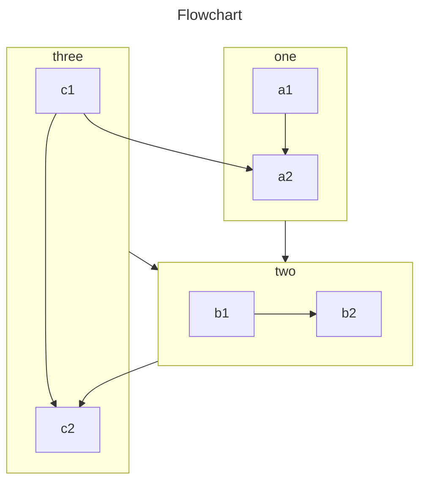

VuePress basically generate pages from Markdown files. So you can use it to generate documentation or blog sites easily.

You should create and write Markdown files, so that VuePress can convert them to different pages according to file structure.

<!-- more -->

## Markdown Introduction

If you are a new learner and don't know how to write Markdown, please read [Markdown Intro](https://theme-hope.vuejs.press/cookbook/markdown/) and [Markdown Demo](https://theme-hope.vuejs.press/cookbook/markdown/demo.html).

## Markdown Config

VuePress introduce configuration for each Markdown page using Frontmatter.

::: important Frontmatter

Frontmatter is an important concept in VuePress. If you don't know it, you need to read [Frontmatter Introduction](https://theme-hope.vuejs.press/cookbook/vuepress/page.html#front-matter).

:::

## Markdown Extension

The Markdown content in VuePress will be parsed by [markdown-it](https://github.com/markdown-it/markdown-it), which supports [syntax extensions](https://github.com/markdown-it/markdown-it#syntax-extensions) via markdown-it plugins.

### VuePress Enhancement

To enrich document writing, VuePress has extended Markdown syntax.

For these extensions, please read [Markdown extensions in VuePress](https://theme-hope.vuejs.press/basic/vuepress/markdown.html).

### Theme Enhancement

By using [`vuepress-plugin-md-enhance`][md-enhance], the theme extends more Markdown syntax and provides richer writing functions.

#### Tabs

::: tabs#fruit

@tab apple

Apple

@tab banana

Banana

@tab orange

Orange

:::

- [View Detail](https://theme-hope.vuejs.press/guide/markdown/content/tabs.html)

#### Footnote

This text has footnote[^first].

[^first]: This is footnote content

- [View Detail](https://theme-hope.vuejs.press/guide/markdown/content/footnote.html)

#### Include files

<!-- @include: ./README.md{11-17} -->

- [View Detail](https://theme-hope.vuejs.press/guide/markdown/content/include.html)

#### Reveal.js

@slidestart

## Slide 1

A paragraph with some text and a [link](https://mister-hope.com)

---

## Slide 2

- Item 1
- Item 2

---

## Slide 3.1

```js
const a = 1;
```

--

## Slide 3.2

$$
J(\theta_0,\theta_1) = \sum_{i=0}
$$

@slideend

- [View Detail](https://theme-hope.vuejs.press/guide/markdown/content/revealjs.html)

<!-- markdownlint-disable MD001 -->

#### TeX

$$
\frac {\partial^r} {\partial \omega^r} \left(\frac {y^{\omega}} {\omega}\right)
= \left(\frac {y^{\omega}} {\omega}\right) \left\{(\log y)^r + \sum_{i=1}^r \frac {(-1)^i r \cdots (r-i+1) (\log y)^{r-i}} {\omega^i} \right\}
$$

- [View Detail](https://theme-hope.vuejs.press/guide/markdown/grammar/math.html)

#### Tasklist

- [x] Plan A
- [ ] Plan B

[View Detail](https://theme-hope.vuejs.press/guide/markdown/grammar/tasklist.html)

#### Image Enhancement

Support setting color scheme and size.

- [View Detail](https://theme-hope.vuejs.press/guide/markdown/grammar/image.html)

#### Superscript and Subscript

19^th^ H~2~O

- [View Detail](https://theme-hope.vuejs.press/guide/markdown/stylize/sup-sub.html)

#### Component

```component VPCard
title: Mr.Hope
desc: Where there is light, there is hope
logo: https://mister-hope.com/logo.svg
link: https://mister-hope.com
background: rgba(253, 230, 138, 0.15)
```

- [View Detail](https://theme-hope.vuejs.press/guide/component/grammar.html)

#### Hint box and GFM alerts

::: v-pre

Safely use {{ variable }} in Markdown.

:::

::: info Custom Title

A custom information container with `code`, [link](#markdown-extension).

```js
const a = 1;
```

:::

::: tip Custom Title

A custom tip container

:::

::: warning Custom Title

A custom warning container

:::

::: caution Custom Title

A custom caution container

:::

::: details Custom Title

A custom details container

:::

- [GitHub Alert](https://theme-hope.vuejs.press/guide/markdown/stylize/alert.html)
- [Hint boxes](https://theme-hope.vuejs.press/guide/markdown/stylize/hint.html)

#### Align

::: center

I am center

:::

::: right

I am right align

:::

- [View Detail](https://theme-hope.vuejs.press/guide/markdown/stylize/align.html)

#### Attrs

A **word**{#word} having id.

- [View Detail](https://theme-hope.vuejs.press/guide/markdown/stylize/attrs.html)

#### Mark

You can mark ==important words== .

- [View Detail](https://theme-hope.vuejs.press/guide/markdown/stylize/mark.html)

#### Spoiler

VuePress Theme Hope is !!powerful!!.

- [View Detail](https://theme-hope.vuejs.press/guide/markdown/stylize/spoiler.html)

#### Stylize

Donate Mr.Hope a cup of coffee. _Recommended_

- [View Detail](https://theme-hope.vuejs.press/guide/markdown/stylize/stylize.html)

#### Chart.js

::: chartjs A Scatter Chart

```json
{
  "type": "scatter",
  "data": {
    "datasets": [
      {
        "label": "Scatter Dataset",
        "data": [
          { "x": -10, "y": 0 },
          { "x": 0, "y": 10 },
          { "x": 10, "y": 5 },
          { "x": 0.5, "y": 5.5 }
        ],
        "backgroundColor": "rgb(255, 99, 132)"
      }
    ]
  },
  "options": {
    "scales": {
      "x": {
        "type": "linear",
        "position": "bottom"
      }
    }
  }
}
```

:::

- [View Detail](https://theme-hope.vuejs.press/guide/markdown/chart/chartjs.html)

#### ECharts

::: echarts A line chart

```json
{
  "xAxis": {
    "type": "category",
    "data": ["Mon", "Tue", "Wed", "Thu", "Fri", "Sat", "Sun"]
  },
  "yAxis": {
    "type": "value"
  },
  "series": [
    {
      "data": [150, 230, 224, 218, 135, 147, 260],
      "type": "line"
    }
  ]
}
```

:::

- [View Detail](https://theme-hope.vuejs.press/guide/markdown/chart/echarts.html)

#### Flowchart

```flow
cond=>condition: Process?
process=>operation: Process
e=>end: End

cond(yes)->process->e
cond(no)->e
```

- [View Detail](https://theme-hope.vuejs.press/guide/markdown/chart/flowchart.html)

#### MarkMap

````markmap
---
markmap:
  colorFreezeLevel: 2
---

# markmap

## Links

- <https://markmap.js.org/>
- [GitHub](https://github.com/gera2ld/markmap)

## Related Projects

- [coc-markmap](https://github.com/gera2ld/coc-markmap)
- [gatsby-remark-markmap](https://github.com/gera2ld/gatsby-remark-markmap)

## Features

- links
- **strong** ~~del~~ *italic* ==highlight==
- multiline
  text
- `inline code`
-
    ```js
    console.log('code block');
    ```
- Katex
  - $x = {-b \pm \sqrt{b^2-4ac} \over 2a}$
  - [More Katex Examples](#?d=gist:af76a4c245b302206b16aec503dbe07b:katex.md)
- Now we can wrap very very very very long text based on `maxWidth` option
````

- [View Detail](https://theme-hope.vuejs.press/guide/markdown/chart/markmap.html)

#### Mermaid



- [View Detail](https://theme-hope.vuejs.press/guide/markdown/chart/mermaid.html)

#### PlantUML

@startuml
Alice -> Bob: Authentication Request

alt successful case

    Bob -> Alice: Authentication Accepted

else some kind of failure

    Bob -> Alice: Authentication Failure
    group My own label
    Alice -> Log : Log attack start
        loop 1000 times
            Alice -> Bob: DNS Attack
        end
    Alice -> Log : Log attack end
    end

else Another type of failure

Bob -> Alice: Please repeat

end
@enduml

- [View Detail](https://theme-hope.vuejs.press/guide/markdown/chart/plantuml.html)

#### Code Tabs

::: code-tabs#shell

@tab pnpm

```bash
pnpm add -D vuepress-theme-hope
```

@tab yarn

```bash
yarn add -D vuepress-theme-hope
```

@tab:active npm

```bash
npm i -D vuepress-theme-hope
```

:::

- [View Detail](https://theme-hope.vuejs.press/guide/markdown/code/code-tabs.html)

#### Code Demo

::: normal-demo A normal demo

```html
<h1>VuePress Theme Hope</h1>
<p>Is <span id="very">very</span> powerful!</p>
```

```js
document.querySelector("#very").addEventListener("click", () => {
  alert("Very powerful!");
});
```

```css
span {
  color: red;
}
```

:::

- [View Detail](https://theme-hope.vuejs.press/guide/markdown/code/demo.html)

#### Playground

::: playground#unocss UnoCSS demo

@file index.html

```html
<div class="flex flex-col text-center h-full justify-center">
  <div class="text-red">TEST for default preset</div>
  <div class="text-$fd-color">TEST for custom css</div>
</div>
```

@file config.js

```js
import { defineConfig, presetUno } from "unocss";

export default defineConfig({
  presets: [presetUno()],
});
```

@file custom.css

```css
:root {
  --fd-color: green;
}
```

:::

- [View Detail](https://theme-hope.vuejs.press/guide/markdown/code/playground.html)

#### Kotlin Playground

::: kotlin-playground Simple Playground

@file main.kt

```kotlin
class Contact(val id: Int, var email: String)

fun main(args: Array<String>) {
    val contact = Contact(1, "mary@gmail.com")
    println(contact.id)
}
```

:::

- [View Detail](https://theme-hope.vuejs.press/guide/markdown/code/kotlin-playground.html)

#### Sandpack Playground

::: sandpack#vue Vue Demo

@file /src/App.vue

```vue
<script setup>
import { ref } from "vue";

const msg = ref("Hello Playground!");
</script>

<template>
  <h1>{{ msg }}</h1>
  <input v-model="msg" />
</template>
```

:::

- [View Detail](https://theme-hope.vuejs.press/guide/markdown/code/sandpack.html)

#### Vue Playground

::: vue-playground Vue Playground

@file App.vue

```vue
<script setup>
import { ref } from "vue";

const msg = ref("Hello World!");
</script>

<template>
  <h1>{{ msg }}</h1>
  <input v-model="msg" />
</template>
```

:::

- [View Detail](https://theme-hope.vuejs.press/guide/markdown/code/vue-playground.html)

[md-enhance]: https://md-enhance.vuejs.press/
