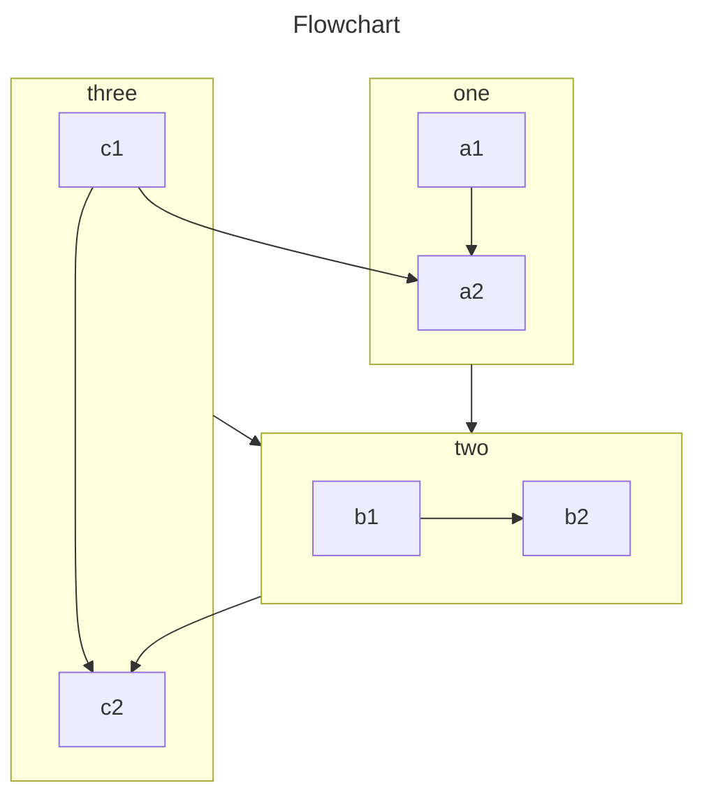

VuePress 主要从 Markdown 文件生成页面。因此，你可以使用它轻松生成文档或博客站点。

你需要创建并编写 Markdown，以便 VuePress 可以根据文件结构将它们转换为不同的页面。

<!-- more -->

## Markdown 介绍

如果你是一个新手，还不会编写 Markdown，请先阅读 [Markdown 介绍](https://theme-hope.vuejs.press/zh/cookbook/markdown/) 和 [Markdown 演示](https://theme-hope.vuejs.press/zh/cookbook/markdown/demo.html)。

## Markdown 配置

VuePress 通过 Frontmatter 为每个 Markdown 页面引入配置。

::: important Frontmatter

Frontmatter 是 VuePress 中很重要的一个概念，请阅读 [Frontmatter 介绍](https://theme-hope.vuejs.press/zh/cookbook/vuepress/page.html#front-matter) 了解详情。

:::

## Markdown 扩展

VuePress 会使用 [markdown-it](https://github.com/markdown-it/markdown-it) 来解析 Markdown 内容，因此可以借助于 markdown-it 插件来实现 [语法扩展](https://github.com/markdown-it/markdown-it#syntax-extensions) 。

### VuePress 扩展

为了丰富文档写作，VuePress 对 Markdown 语法进行了扩展。

关于这些扩展，请阅读 [VuePress 中的 Markdown 扩展](https://theme-hope.vuejs.press/zh/cookbook/vuepress/markdown.html)。

### 主题扩展

通过 [`vuepress-plugin-md-enhance`][md-enhance]，主题扩展了更多 Markdown 语法，提供更加丰富的写作功能。

#### 选项卡

::: tabs#fruit

@tab apple

Apple

@tab banana

Banana

@tab orange

Orange

:::

- [查看详情](https://theme-hope.vuejs.press/zh/guide/markdown/content/tabs.html)

#### 脚注

此文字有脚注[^first].

[^first]: 这是脚注内容

- [查看详情](https://theme-hope.vuejs.press/zh/guide/markdown/content/footnote.html)

#### 导入文件

<!-- @include: ./README.md{11-17} -->

- [查看详情](https://theme-hope.vuejs.press/zh/guide/markdown/content/include.html)

#### 幻灯片

@slidestart

## 幻灯片 1

一个有文字和 [链接](https://mister-hope.com) 的段落

---

## 幻灯片 2

- 项目 1
- 项目 2

---

## 幻灯片 3.1

```js
const a = 1;
```

--

## 幻灯片 3.2

$$
J(\theta_0,\theta_1) = \sum_{i=0}
$$

@slideend

- [查看详情](https://theme-hope.vuejs.press/zh/guide/markdown/content/revealjs.html)

<!-- markdownlint-disable MD001 -->

#### TeX 语法

$$
\frac {\partial^r} {\partial \omega^r} \left(\frac {y^{\omega}} {\omega}\right)
= \left(\frac {y^{\omega}} {\omega}\right) \left\{(\log y)^r + \sum_{i=1}^r \frac {(-1)^i r \cdots (r-i+1) (\log y)^{r-i}} {\omega^i} \right\}
$$

- [查看详情](https://theme-hope.vuejs.press/zh/guide/markdown/grammar/tex.html)

#### 任务列表

- [x] 计划 1
- [ ] 计划 2

[查看详情](https://theme-hope.vuejs.press/zh/guide/markdown/grammar/tasklist.html)

### 图片增强

支持为图片设置颜色模式和大小。

- [查看详情](https://theme-hope.vuejs.press/zh/guide/markdown/grammar/image.html)

#### 上下角标

19^th^ H~2~O

- [查看详情](https://theme-hope.vuejs.press/zh/guide/markdown/grammar/sup-sub.html)

#### 组件

```component VPCard
title: Mr.Hope
desc: Where there is light, there is hope
logo: https://mister-hope.com/logo.svg
link: https://mister-hope.com
background: rgba(253, 230, 138, 0.15)
```

- [查看详情](https://theme-hope.vuejs.press/zh/guide/component/grammar.html)

#### 提示容器

::: v-pre

安全的在 Markdown 中使用 {{ variable }}。

:::

::: info 自定义标题

信息容器，包含 `代码` 与 [链接](#提示容器)。

```js
const a = 1;
```

:::

::: tip 自定义标题

提示容器

:::

::: warning 自定义标题

警告容器

:::

::: caution 自定义标题

危险容器

:::

::: details 自定义标题

详情容器

:::

- [GitHub 警示](https://theme-hope.vuejs.press/zh/guide/markdown/stylize/alert.html)
- [提示框](https://theme-hope.vuejs.press/zh/guide/markdown/stylize/hint.html)

#### 自定义对齐

::: center

我是居中的

:::

::: right

我在右对齐

:::

- [查看详情](https://theme-hope.vuejs.press/zh/guide/markdown/stylize/align.html)

#### 属性支持

一个拥有 ID 的 **单词**{#word}。

- [查看详情](https://theme-hope.vuejs.press/zh/guide/markdown/stylize/attrs.html)

#### 标记

你可以标记 ==重要的内容== 。

- [查看详情](https://theme-hope.vuejs.press/zh/guide/markdown/stylize/mark.html)

#### 剧透

VuePress Theme Hope !!十分强大!!.

- [查看详情](https://theme-hope.vuejs.press/zh/guide/markdown/stylize/spoiler.html)

#### 样式化

向 Mr.Hope 捐赠一杯咖啡。 _Recommended_

- [查看详情](https://theme-hope.vuejs.press/zh/guide/markdown/stylize/stylize.html)

#### 图表

::: chart 一个散点图案例

```json
{
  "type": "scatter",
  "data": {
    "datasets": [
      {
        "label": "散点数据集",
        "data": [
          { "x": -10, "y": 0 },
          { "x": 0, "y": 10 },
          { "x": 10, "y": 5 },
          { "x": 0.5, "y": 5.5 }
        ],
        "backgroundColor": "rgb(255, 99, 132)"
      }
    ]
  },
  "options": {
    "scales": {
      "x": {
        "type": "linear",
        "position": "bottom"
      }
    }
  }
}
```

:::

- [查看详情](https://theme-hope.vuejs.press/zh/guide/markdown/chart/chartjs.html)

#### ECharts

::: echarts 一个折线图案例

```json
{
  "xAxis": {
    "type": "category",
    "data": ["Mon", "Tue", "Wed", "Thu", "Fri", "Sat", "Sun"]
  },
  "yAxis": {
    "type": "value"
  },
  "series": [
    {
      "data": [150, 230, 224, 218, 135, 147, 260],
      "type": "line"
    }
  ]
}
```

:::

- [查看详情](https://theme-hope.vuejs.press/zh/guide/markdown/chart/echarts.html)

#### 流程图

```flow
cond=>condition: 是否执行操作?
process=>operation: 操作
e=>end: 结束

cond(yes)->process->e
cond(no)->e
```

- [查看详情](https://theme-hope.vuejs.press/zh/guide/markdown/chart/flowchart.html)

#### MarkMap

````markmap
---
markmap:
  colorFreezeLevel: 2
---

# markmap

## 链接

- <https://markmap.js.org/>
- [GitHub](https://github.com/markmap/markmap)

## 功能

- 链接
- **强调** ~~删除线~~ *斜体* ==高亮==
- 多行
  文字
- `行内代码`
-
    ```js
    console.log('code block');
    ```
- Katex
  - $x = {-b \pm \sqrt{b^2-4ac} \over 2a}$
- 现在我们可以通过 `maxWidth` 选项自动换行非常非常非常非常非常非常非常非常非常非常长的内容
````

- [查看详情](https://theme-hope.vuejs.press/zh/guide/markdown/chart/markmap.html)

#### Mermaid



- [查看详情](https://theme-hope.vuejs.press/zh/guide/markdown/chart/mermaid.html)

#### PlantUML

@startuml
Alice -> Bob: 认证请求

alt 成功情况

    Bob -> Alice: 认证接受

else 某种失败情况

    Bob -> Alice: 认证失败
    group 我自己的标签
    Alice -> Log : 开始记录攻击日志
        loop 1000次
            Alice -> Bob: DNS 攻击
        end
    Alice -> Log : 结束记录攻击日志
    end

else 另一种失败

    Bob -> Alice: 请重复

end
@enduml

- [View Detail](https://theme-hope.vuejs.press/zh/guide/markdown/chart/plantuml.html)

#### 代码块

::: code-tabs

@tab pnpm

```bash
pnpm add -D vuepress-theme-hope
```

@tab yarn

```bash
yarn add -D vuepress-theme-hope
```

@tab:active npm

```bash
npm i -D vuepress-theme-hope
```

:::

- [查看详情](https://theme-hope.vuejs.press/zh/guide/markdown/code/code-tabs.html)

#### 代码演示

::: normal-demo 一个普通 Demo

```html
<h1>VuePress Theme Hope</h1>
<p><span id="very">非常</span>强大!</p>
```

```js
document.querySelector("#very").addEventListener("click", () => {
  alert("非常强大");
});
```

```css
span {
  color: red;
}
```

:::

- [查看详情](https://theme-hope.vuejs.press/zh/guide/markdown/code/demo.html)

#### 交互演示

::: playground#unocss UnoCSS 示例

@file index.html

```html
<div class="flex flex-col text-center h-full justify-center">
  <div class="text-red">TEST for default preset</div>
  <div class="text-$fd-color">TEST for custom css</div>
</div>
```

@file config.js

```js
import { defineConfig, presetUno } from "unocss";

export default defineConfig({
  presets: [presetUno()],
});
```

@file custom.css

```css
:root {
  --fd-color: green;
}
```

:::

- [查看详情](https://theme-hope.vuejs.press/zh/guide/markdown/code/playground.html)

#### Kotlin 交互演示

::: kotlin-playground Simple Playground

@file main.kt

```kotlin
class Contact(val id: Int, var email: String)

fun main(args: Array<String>) {
    val contact = Contact(1, "mary@gmail.com")
    println(contact.id)
}
```

:::

- [查看详情](https://theme-hope.vuejs.press/zh/guide/markdown/code/kotlin-playground.html)

#### Sandpack 交互演示

::: sandpack#vue Vue 示例

@file /src/App.vue

```vue
<script setup>
import { ref } from "vue";

const msg = ref("Hello Playground!");
</script>

<template>
  <h1>{{ msg }}</h1>
  <input v-model="msg" />
</template>
```

:::

- [查看详情](https://theme-hope.vuejs.press/zh/guide/markdown/code/sandpack.html)

#### Vue 交互演示

::: vue-playground Vue 交互演示

@file App.vue

```vue
<script setup>
import { ref } from "vue";

const msg = ref("Hello World!");
</script>

<template>
  <h1>{{ msg }}</h1>
  <input v-model="msg" />
</template>
```

:::

- [查看详情](https://theme-hope.vuejs.press/zh/guide/markdown/code/vue-playground.html)

[md-enhance]: https://plugin-md-enhance.vuejs.press/zh/
