With `vuepress-plugin-blog2`, you can easily bring blog feature into your theme.

## How it works

```mermaid
flowchart TB
  subgraph user ["User Side"]
    config["Set plugin options"]
  end

  subgraph node ["Node Side"]
    direction TB
    readConfig["Read Config"]-->
    node2["Get articles\nwith 'filter' option"]-->
    node3["Get info\nwith 'getInfo' option"]-->
    node4["Write info to routeMeta"]
    readConfig
    generatePage["Generate pages"]
    writeTemp["Write info to temp files"]

    subgraph category
      direction TB
      loopCategory["Loop each config"]-->
      getCategory["Get category\nwith 'getter' option"]-->
      mapCategory["Build\n'CategoryName → Pages'\nMap"]-->
      sortCategory["Sort pages\nwith 'sort' option"]
      loopCategory-->
      getCategoryPage["Get path,\nlayout,\nfrontmatter,\nitemPath,\nitemLayout,\nitemFrontmatter\noptions"]
      end

    readConfig-->loopCategory
    getCategoryPage--> generatePage
    sortCategory--> writeTemp

    subgraph type
      direction TB
      loopType[Loop each config]-->
      getTypePage["Get\n'path',\n'layout',\n'frontmatter'\noptions"]
      loopType-->
      filterType["Get pages\nwith 'filter' option"]-->
      sortType["Sort pages\nwith 'sort' option"]
    end

    readConfig-->loopType
    getTypePage--> generatePage
    sortType--> writeTemp
    end


  subgraph client ["Client Side"]
    direction TB
    readTemp["Read temp files"]-->
    callCategory["Call useBlogCategory API"]-->
    getPage
    readTemp-->
    callType["Call useBlogType API"]-->
    getPage
    getPage["Get page through key"]-->
    getInfo["Get article info in router with page path"]-->
    return["Return info"]
    visit["Visit blog page"]-->
    layout["Use layout and get info from frontmatter"]
  end

  config-->readConfig
  writeTemp-->readTemp
  generatePage-->visit
```



The flowchart above may help you understand its design goal and how the plugin works.

## Collecting Articles

The plugin filters all pages using `filter` option to drop pages you don't want.

::: note By default, all pages generating from Markdown files but not homepage are considered as articles.

:::

You can fully customize pages to collect through option `filter`, which accepts a function `(page: Page) => boolean`.

## Gathering Info

You should set `getInfo` option with a function accepting `Page` as argument and returning an object containing the info you want.

The plugin will collect all the info you want and write them to `routeMeta` field of each page, so you will be able to get this information through Composition API later.

::: details Demo

```ts
// theme entrance
import { blogPlugin } from "vuepress-plugin-blog2";

export default {
  name: "vuepress-theme-xxx",
  plugins: [
    blogPlugin({
      filter: ({ filePathRelative, frontmatter }) => {
        // drop those pages which is NOT generated from file
        if (!filePathRelative) return false;

        // drop those pages in `archives` directory
        if (filePathRelative.startsWith("archives/")) return false;

        // drop those pages which do not use default layout
        if (frontmatter.home || frontmatter.layout) return false;

        return true;
      },

      getInfo: ({ frontmatter, git = {}, data = {} }) => {
        // getting page info
        const info: Record<string, any> = {
          author: frontmatter.author || "",
          categories: frontmatter.categories || [],
          date: frontmatter.date || git.createdTime || null,
          tags: frontmatter.tags || [],
          excerpt: data.excerpt || "",
        };

        return info;
      },
    }),
    // other plugins ...
  ],
};
```

:::

## Customizing Categories and Types

Basically, you would want 2 types of collection in your blog:

- Category:

  "Category" means grouping articles with their labels.

  For example, each article may have their "categories" and "tags".

- Type:

  "Type" means identifying articles with conditions.

  For example, you may want to describe some of your articles as diary.

After understanding description of these 2 types, you can set `category` and `type` options, each accepts an array, and each element represents a configuration.

Let's start with 2 examples here.

Imagine you are setting tags for each articles with `tag` field in page frontmatter. You want a tag mapping page in `/tag/` with `TagMap` layout, and group each tag list with tagName in `/tag/tagName` with `TagList` layout, you probably need a configuration like this:

```ts
// theme entrance
import { blogPlugin } from "vuepress-plugin-blog2";

export default {
  name: "vuepress-theme-xxx",
  plugins: [
    blogPlugin({
      // other options ...
      category: [
        {
          key: "tag",
          getter: ({ frontmatter }) => frontmatter.tag || [],
          path: "/tag/",
          layout: "TagMap",
          frontmatter: () => ({ title: "Tag page" }),
          itemPath: "/tag/:name/",
          itemLayout: "TagList",
          itemFrontmatter: (name) => ({ title: `Tag ${name}` }),
        },
      ],
    }),
    // other plugins ...
  ],
};
```

Also, you may want to star some of your articles, and display them to visitors. When you are setting `star: true` in frontmatter to mark them, you probably need a configuration like this to display them in `/star/` path with `StarList` layout:

```ts
// theme entrance
import { blogPlugin } from "vuepress-plugin-blog2";

export default {
  name: "vuepress-theme-xxx",
  plugins: [
    blogPlugin({
      // other options ...
      type: [
        {
          key: "star",
          filter: ({ frontmatter }) => frontmatter.star,
          path: "/star/",
          layout: "StarList",
          frontmatter: () => ({ title: "Star page" }),
        },
      ],
    }),
    // other plugins ...
  ],
};
```

See, setting these 2 types is easy. For full options, please see [Category Config](./config.md#blog-category-config) and [Type Config](./config.md#blog-type-config).

## Using Composition API in Client-side

When generating each page, the plugin will set following information under `frontmatter.blog`:

```ts
interface BlogFrontmatterOptions {
  /** Current type of the page */
  type: "category" | "type";
  /** Unique key under current category or tag */
  key: string;
  /**
   * Current category name
   *
   * @description Only available in category item page
   */
  name?: string;
}
```

So you can invoke `useBlogCategory()` and `useBlogType()` directly, and the result will be the category or type bind to current route.

Also, you can pass `key` you want as argument, then you will get information bind to that key.

So with node side settings above, you can get information about "tag" and "star" in client side:

`TagMap` layout:

```vue
<template>
  <div>
    <h1>Tag page</h1>
    <ul>
      <li v-for="({ items, path }, name) in categoryMap.map">
        <RouterLink :key="name" :to="path" class="category">
          {{ name }}
          <span class="category-num">
            {{ items.length }}
          </span>
        </RouterLink>
      </li>
    </ul>
  </div>
</template>
<script setup lang="ts">
import { useBlogCategory } from "vuepress-plugin-blog2";

const categoryMap = useBlogCategory("tag");
</script>
```

`TagList` layout:

```vue
<template>
  <div>
    <h1>Tag page</h1>
    <div class="category-wrapper">
      <RouterLink
        v-for="({ items, path }, name) in categoryMap.map"
        :key="name"
        :to="path"
        class="category"
      >
        {{ name }}
        <span class="category-num">
          {{ items.length }}
        </span>
      </RouterLink>
    </div>
    <div class="article-wrapper" v-if="categoryMap.currentItems">
      <div v-if="!categoryMap.currentItems.length">Nothing in here.</div>
      <article
        v-for="{ info, path } in categoryMap.currentItems"
        class="article"
        @click="$router.push(path)"
      >
        <header class="title">
          {{
            (isTimeline
              ? `${new Date(info.date).toLocaleDateString()}: `
              : "") + info.title
          }}
        </header>
        <hr />
        <div class="article-info">
          <span v-if="info.author" class="author"
            >Author: {{ info.author }}</span
          >
          <span v-if="info.date && !isTimeline" class="date"
            >Date: {{ new Date(info.date).toLocaleDateString() }}</span
          >
          <span v-if="info.category" class="category"
            >Category: {{ info.category.join(", ") }}</span
          >
          <span v-if="info.tag" class="tag"
            >Tag: {{ info.tag.join(", ") }}</span
          >
        </div>
        <div v-if="info.excerpt" class="excerpt" v-html="info.excerpt" />
      </article>
    </div>
  </div>
</template>
<script setup lang="ts">
import { useBlogCategory } from "vuepress-plugin-blog2";

const categoryMap = useBlogCategory("tag");
</script>
```

`StarList` layout:

```vue
<template>
  <div class="article-wrapper" v-if="stars.items">
    <div v-if="!stars.items.length">Nothing in here.</div>
    <article
      v-for="{ info, path } in stars.items"
      class="article"
      @click="$router.push(path)"
    >
      <header class="title">
        {{
          (isTimeline ? `${new Date(info.date).toLocaleDateString()}: ` : "") +
          info.title
        }}
      </header>
      <hr />
      <div class="article-info">
        <span v-if="info.author" class="author">Author: {{ info.author }}</span>
        <span v-if="info.date && !isTimeline" class="date"
          >Date: {{ new Date(info.date).toLocaleDateString() }}</span
        >
        <span v-if="info.category" class="category"
          >Category: {{ info.category.join(", ") }}</span
        >
        <span v-if="info.tag" class="tag">Tag: {{ info.tag.join(", ") }}</span>
      </div>
      <div v-if="info.excerpt" class="excerpt" v-html="info.excerpt" />
    </article>
  </div>
</template>
<script setup lang="ts">
import { useBlogType } from "vuepress-plugin-blog2/client";

import ArticleList from "../components/ArticleList.vue";
import ParentLayout from "@vuepress/theme-default/layouts/Layout.vue";

const stars = useBlogType("star");
</script>
```

For return types, please see [Composition API Return Types](./config.md#composition-api).

## I18n Support

This plugin adds native i18n support, so your settings will be automatically applied to each language.

For example, if user has the following locales' config, and you are setting the "star" example above:

```ts
// .vuepress/config.ts
export default {
  locales: {
    "/": {
      lang: "en-US",
    },
    "/zh/": {
      lang: "zh-CN",
    },
  },
};
```

Then `/zh/star/` and `/star/` will both be available, and only articles under the correct locale will appear.

## Generating Excerpt

This plugin provides a built-in excerpt generator, which can be enabled by setting `excerpt` option to `true`.

::: info Excerpt introduction

An excerpt is an HTML fragment that is used to display a short description of an article in the blog list, so the excerpt has the following restrictions:

- It doesn't support any unknown tags (including all Vue components) and Vue syntax, so these contents will be removed when generating. If you have custom components (non-Vue components), set `isCustomElement` option.
- Since the snippet is an HTML fragment, you will not be able to import any images via relative paths or aliases, they will be removed directly. If you want to keep images, please use absolute path based on `.vuepress/public` or full URL to ensure they can be accessed in other places.

:::

The excerpt generator will try to find a valid excerpt separator from markdown contents, if it finds one, it will use content before the separator. The separator is default `<!-- more -->`, and you can customize it by setting `excerptSeparator` option.

If it cannot find a valid separator, it will parse content from the beginning of markdown file, and stop till its length reaches a preset value. The value is default `300`, and you can customize it by setting `excerptLength` option.

To choose which page should generate excerpt, you can use `excerptFilter` option.

::: tip Example

Normally you may want to use `frontmatter.description` if users set them, so you can let filter function return `false` if `frontmatter.description` is not empty.

:::
