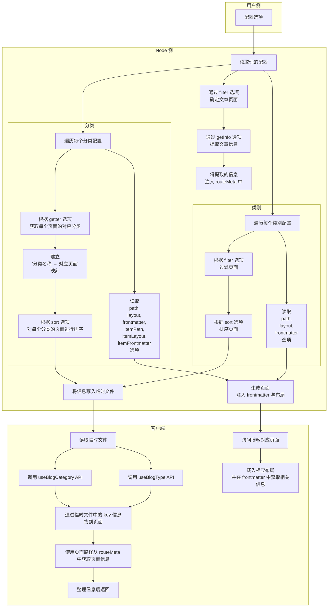

使用 `vuepress-plugin-blog2`，你可以轻松地将博客功能引入主题。

## 插件的工作逻辑



上方的流程图可以帮助你了解插件的工作原理及其设计目标。

## 收集文章并生成信息

起步时，插件会首选过滤并选择那些需要作为文章的页面。这将剔除你不想要的页面，并在后续处理中排除它们。

::: note

默认情况下，所有从 Markdown 文件生成但不是主页的页面，都将被包含作为文章。

:::

你可能需要设置 `filter` 选项来完全自定义要收集的页面。 `filter` 接受一个形状为 `(page: Page) => boolean` 的函数。

接着，你应该设置 `getInfo` 选项为一个接受 `Page` 作为参数并返回包含所需信息的对象的函数。这样稍后，你可以从组合 API 中获取这些信息。

::: details 案例

```ts
// 主题入口
import { blogPlugin } from "vuepress-plugin-blog2";

export default {
  name: "vuepress-theme-xxx",
  plugins: [
    blogPlugin({
      filter: ({ filePathRelative, frontmatter }) => {
        // 舍弃那些不是从 Markdown 文件生成的页面
        if (!filePathRelative) return false;

        // 舍弃 `archives` 文件夹的页面
        if (filePathRelative.startsWith("archives/")) return false;

        // 舍弃那些没有使用默认布局的页面
        if (frontmatter.home || frontmatter.layout) return false;

        return true;
      },

      getInfo: ({ excerpt, frontmatter, git = {} }) => {
        // 获取页面信息
        const info: Record<string, any> = {
          author: frontmatter.author || "",
          categories: frontmatter.categories || [],
          date: frontmatter.date || git.createdTime || null,
          tags: frontmatter.tags || [],
          excerpt: page.excerpt,
        };

        return info;
      },
    }),
    // 其他插件 ...
  ],
};
```

:::

## 自定义类别和类型

基本上，你的博客中需要两种类型的收藏:

- 类别:

  “类别”是用文章的标签 (或类别) 对它们进行分组。

  例如，每篇文章可能都有对应的“分类”和“标签”。

- 类型:

  “类型”是过滤不同条件的文章。

  例如，你的帖子中可能有日记或笔记。当帖子带有写作日期信息时，它可以称为“时间线项目”。

了解这两种类型的描述后，你可以设置 `category` 和 `type` 选项，它们都接受一个数组，每个元素代表一个配置。

让我们从此处 2 个例子开始。

假设你想为每篇文章设置标签，并且你正在通过 `frontmatter.tag` 设置它们。同时，你想要在 `/tag/` 中使用 `TagMap` 布局的标签页面，并在`/tag/标签名称` 中使用 `TagList` 布局对标签按名称进行分组，你可能需要这样的配置:

```ts
// 主题入口
import { blogPlugin } from "vuepress-plugin-blog2";

export default {
  name: "vuepress-theme-xxx",
  plugins: [
    blogPlugin({
      // 其他配置 ...
      category: [
        {
          key: "tag",
          getter: ({ frontmatter }) => frontmatter.tag || [],
          path: "/tag/",
          layout: "TagMap",
          frontmatter: () => ({ title: "标签页" }),
          itemPath: "/tag/:name/",
          itemLayout: "TagList",
          itemFrontmatter: (name) => ({ title: `${name}标签` }),
        },
      ],
    }),
    // 其他插件 ...
  ],
};
```

此外，你可能希望为你的一些文章加注星标，并将其展示给访问者。当你在 frontmatter 中设置 `star: true` 来标记它们时，你可能需要这样的配置来在 `/star/` 路径中以 `StarList` 布局显示它们:

```ts
// 主题入口
import { blogPlugin } from "vuepress-plugin-blog2";

export default {
  name: "vuepress-theme-xxx",
  plugins: [
    blogPlugin({
      // 其他配置 ...
      type: [
        {
          key: "star",
          filter: ({ frontmatter }) => frontmatter.star,
          path: "/star/",
          layout: "StarList",
          frontmatter: () => ({ title: "收藏页" }),
        },
      ],
    }),
    // 其他插件 ...
  ],
};
```

看，设置这两种类型很容易。有关完整选项，请参阅 [博客分类配置](./config.md#博客分类配置) 和 [博客分类配置](./config.md#博客类型配置)。

## 在客户端使用组合 API

当生成每个页面时，插件将在 `frontmatter.blog` 中设置如下信息

```ts
interface BlogFrontmatterOptions {
  /** 当前页面的类型 */
  type: "category" | "type";
  /** 在当前分类或类别下全局唯一的 key */
  key: string;
  /**
   * 当前的分类名称
   *
   * @description 仅在分类子项目页面中可用
   */

  name?: string;
}
```

所以你可以直接调用 `useBlogCategory()` 和 `useBlogType()`，结果将是当前路由绑定的类别或类型。

此外，你可以通过传递所需的 `key` 作为参数，来将获得绑定到该 `key` 的信息。

有关返回类型，请参阅 [Composition API 返回类型](./config.md#可组合式-API)。

## 多语言支持

该插件添加了原生多语言支持，因此你的设置将自动应用于每种语言。

例如，如果用户进行了以下 locales 配置，并且你正在设置上面的“star”示例:

```ts
// .vuepress/config.ts
export default {
  locales: {
    "/": {
      lang: "en-US",
    },
    "/zh/": {
      lang: "zh-CN",
    },
  },
};
```

那么 `/zh/star/` 和 `/star/` 都将可用，并且只会显示对应语言下的文章。
