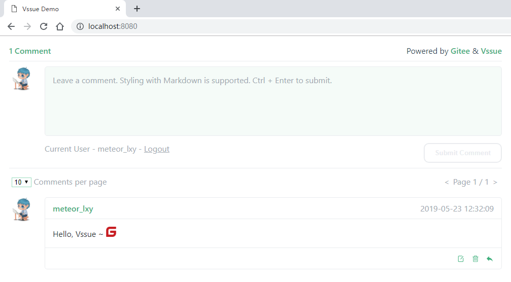

# Gitee Third Party Application

> Vssue can also work with self-hosted Gitee Enterprise Version. Set the `baseURL` options to your Gitee URL.
>
> Gitee requires `clientSecret` because Gitee does not support implicit grant type

## Create a new Third Party Application

- Go to [Settings - Third Party Application](https://gitee.com/oauth/applications)
- Click [Create Application](https://gitee.com/oauth/applications/new)

- Set the `Homepage URL` and `Authorization callback URL` to your site URL (Here we take `localhost:8080` for example)
- Select `issues` and `notes` permissions

## Get the Client ID and Secret

Then you’ve created a new Third Party Application, and here is your `Client ID` and `Client Secret`.

## Config and start your Vssue

Copy the `Client ID` and `Client Secret`, and set `owner` and `repo`.

> The URL pattern of gitee repo is `https://gitee.com/${owner}/${repo}`

Here we take `https://gitee.com/meteor_lxy/vssue-demo` for example, and set the `title` of issue to `Vssue Demo`.

Then run `anywhere -h localhost 8080` to serve the `index.html` on `localhost:8080`.

## Try out Vssue locally

Vssue has already run here. Click `Login` to login with gitee account and `click to create issue`.

Redirect to Gitee Authorization page. Click `Authorize` to login.

Leave a comment on this page ~

::: tip

You can go to the repository [meteor_lxy/vssue-demo](https://gitee.com/meteor_lxy/vssue-demo) to get the demo code. Check the [first issue](https://gitee.com/meteor_lxy/vssue-demo/issues/IWWTA) of that repository to see what happened.

:::
