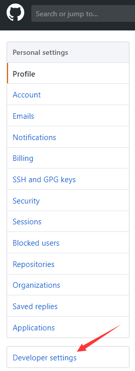
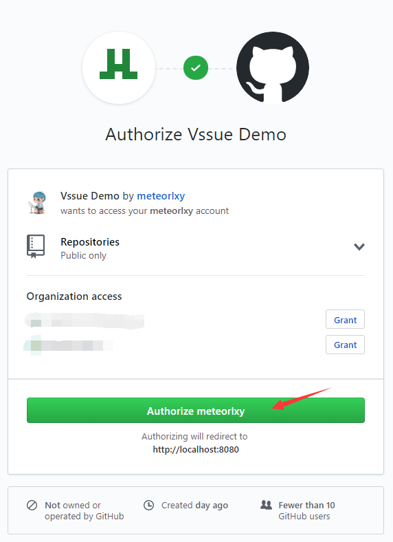

# GitHub OAuth App

> Vssue can also work with self-hosted GitHub Enterprise Server. Set the `baseURL` options to your GitHub URL. See [Options Reference - baseURL](../options/README.md#baseurl)
>
> GitHub requires `clientSecret` because [GitHub does not support implicit grant type](https://developer.github.com/apps/building-oauth-apps/authorizing-oauth-apps/)
>
> 

## Create a new OAuth App

- Go to [Settings - Developer Settings - OAuth Apps](https://github.com/settings/developers)
- Click [New OAuth App](https://github.com/settings/applications/new)

- Set the `Homepage URL` and `Authorization callback URL` to your site URL (Here we take `localhost:8080` for example)

## Get the Client ID and Secret

Then you’ve created a new OAuth App, and here is your `Client ID` and `Client Secret`.

## Config and start your Vssue

Copy the `Client ID` and `Client Secret`, and set `owner` and `repo`.

> The URL pattern of github repo is `https://github.com/${owner}/${repo}`

Here we take `https://github.com/meteorlxy/vssue-demo` for example, and set the `title` of issue to `Vssue Demo`.

Then run `anywhere -h localhost 8080` to serve the `index.html` on `localhost:8080`.

## Try out Vssue locally

Vssue has already run here. Click `Login` to login with GitHub account.

Redirect to GitHub Authorization page. Click `Authorize ${your account}` to login.

Leave a comment on this page ~

::: tip

You can go to the repository [meteorlxy/vssue-demo](https://github.com/meteorlxy/vssue-demo) to get the demo code. Check the [#1 issue](https://github.com/meteorlxy/vssue-demo/issues/1) of that repository to see what happened.

:::
