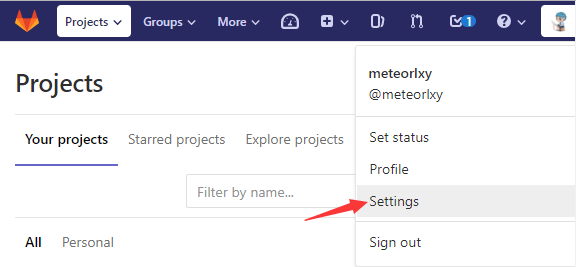
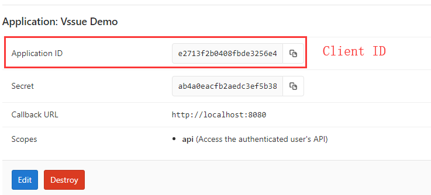

# GitLab Application

> See [Gitlab official docs](https://docs.gitlab.com/ce/integration/oauth_provider.html#adding-an-application-through-the-profile) for reference.
> Vssue can also work with self-hosted GitLab. Set the `baseURL` options to your Gitlab URL. See [Options Reference - baseURL](../options/README.md#baseurl)

## Create a new Application

- Go to [Settings - Applications](https://gitlab.com/profile/applications)

- Set the `Redirect URI` to your site URL (Here we take `localhost:8080` for example)
- Select `api` scope

## Get the Client ID

Then you’ve created a new Application, and here is your **Application ID** (`Client ID`).

## Config and start your Vssue

Copy the `Client ID`, and set `owner` and `repo`.

> The URL pattern of gitlab repo is `https://gitlab.com/${owner}/${repo}`

Here we take `https://gitlab.com/meteorlxy/vssue-demo` for example, and set the `title` of issue to `Vssue Demo`.

Then run `anywhere -h localhost 8080` to serve the `index.html` on `localhost:8080`.

## Try out Vssue locally

Vssue has already run here. Click `Login` to login with Gitlab account.

Redirect to GitLab Authorization page. Click `Authorize` to login.

Leave a comment on this page ~

::: tip

You can go to the repository [meteorlxy/vssue-demo](https://gitlab.com/meteorlxy/vssue-demo) to get the demo code. Check the [#1 issue](https://gitlab.com/meteorlxy/vssue-demo/issues/1) of that repository to see what happened.

:::
