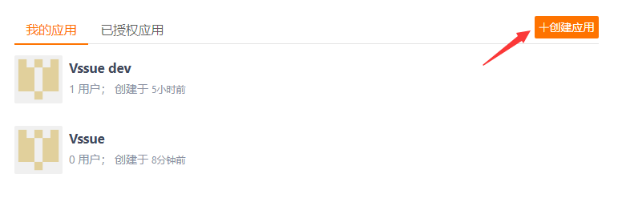

# Gitee 第三方应用

> Vssue 同样可以配合自己搭建的 Gitee 企业版 使用。只需要将 `baseURL` 设置为你的 Gitee URL 即可。查看 [配置参考 - baseURL](../options/README.md#baseurl)
>
> Gitee 需要设置 `clientSecret`，因为 Gitee 目前还不支持 implicit grant type

## 创建一个新的第三方应用

- 前往 [设置 - 第三方应用](https://gitee.com/oauth/applications)
- 点击 [创建应用](https://gitee.com/oauth/applications/new)

- 将 `应用主页` 和 `应用回调地址` 设置为你的网站 URL (这里我们用 `localhost:8080` 作为示例)
- 权限选择 `issues` 和 `notes`

## 获取 Client ID 和 Secret

现在你已经创建了一个新的第三方应用，并得到了相应的 `Client ID` 和 `Client Secret`。

## 配置并启动你的 Vssue

复制 `Client ID` 和 `Client Secret`, 并设置 `owner` 和 `repo`。

> Gitee repository 的 URL 模式为 `https://gitee.com/${owner}/${repo}`

这里我们以 `https://gitee.com/meteor_lxy/vssue-demo` 为例，并把 issue 的 `title` 设置为 `Vssue Demo`。

然后运行 `anywhere -h localhost 8080`，在 `localhost:8080` 监听一个 http server 并返回 `index.html`。

## 在本地尝试 Vssue

Vssue 已经成功运行。点击 `Login` 使用 Gitee 帐号登录，并通过 `Click to create issue` 创建 Issue。

重定向到 Gitee 授权页面。点击 `同意授权` 来登录。

在当前页面写下评论吧 ~

::: tip 提示

你可以前往 [meteor_lxy/vssue-demo](https://gitee.com/meteor_lxy/vssue-demo) 来获取 demo 代码。前往该仓库的 [第一个 issue](https://gitee.com/meteor_lxy/vssue-demo/issues/IWWTA) 看看发生了什么。

:::
