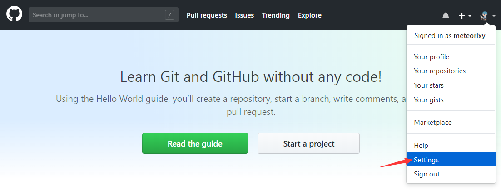
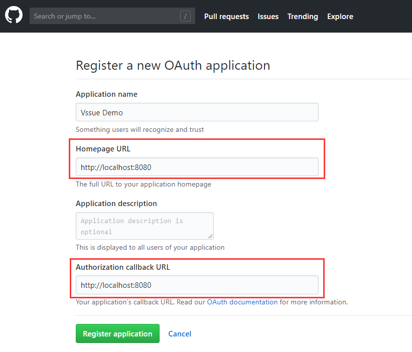
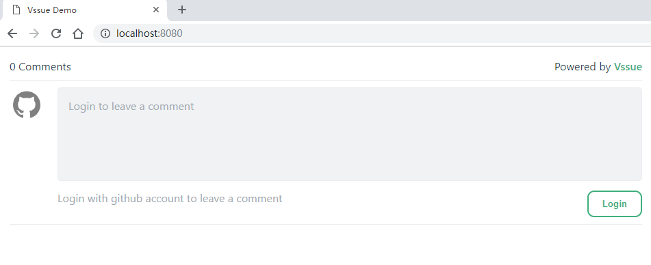
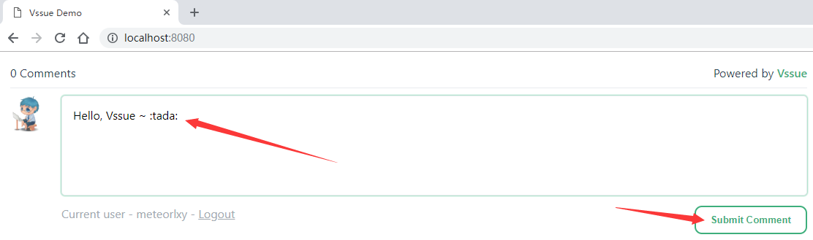

# GitHub OAuth App

> Vssue 同样可以配合自己搭建的 GitHub Enterprise Server 使用。只需要将 `baseURL` 设置为你的 GitHub URL 即可。查看 [配置参考 - baseURL](../options/README.md#baseurl)
>
> GitHub 需要设置 `clientSecret`，因为 [GitHub 目前还不支持 implicit grant type](https://developer.github.com/apps/building-oauth-apps/authorizing-oauth-apps/)
>
> 

## 创建一个新的 OAuth App

- 前往 [Settings - Developer Settings - OAuth Apps](https://github.com/settings/developers)
- 点击 [New OAuth App](https://github.com/settings/applications/new)

- 将 `Homepage URL` 和 `Authorization callback URL` 设置为你的网站 URL (这里我们用 `localhost:8080` 作为示例)

## 获取 Client ID 和 Secret

现在你已经创建了一个新的 OAuth App，并得到了相应的 `Client ID` 和 `Client Secret`。

## 配置并启动你的 Vssue

复制 `Client ID` 和 `Client Secret`, 并设置 `owner` 和 `repo`。

> GitHub repository 的 URL 模式为 `https://github.com/${owner}/${repo}`

这里我们以 `https://github.com/meteorlxy/vssue-demo` 为例，并把 issue 的 `title` 设置为 `Vssue Demo`。

然后运行 `anywhere -h localhost 8080`，在 `localhost:8080` 监听一个 http server 并返回 `index.html`。

## 在本地尝试 Vssue

Vssue 已经成功运行。点击 `Login` 使用 GitHub 帐号登录。

重定向到 GitHub 授权页面。点击 `Authorize ${你的帐号}` 来登录。

在当前页面写下评论吧 ~

::: tip

你可以前往 [meteorlxy/vssue-demo](https://github.com/meteorlxy/vssue-demo) 来获取 demo 代码。前往该仓库的 [#1 issue](https://github.com/meteorlxy/vssue-demo/issues/1) 看看发生了什么。

:::
