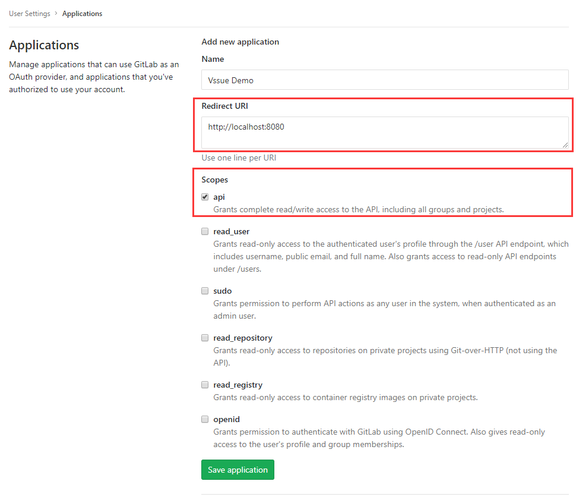
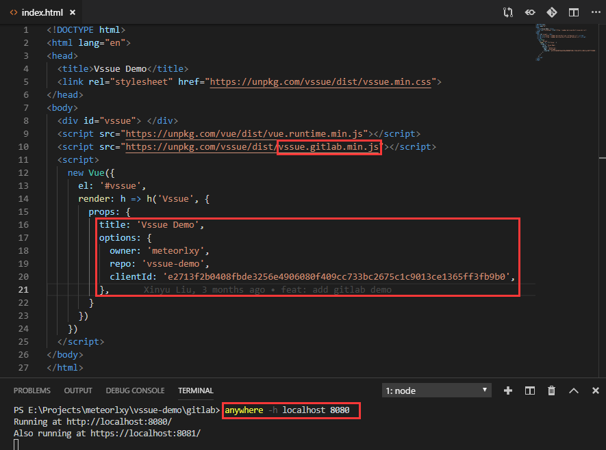
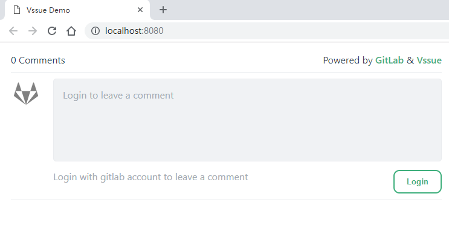
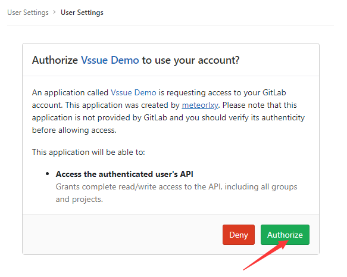
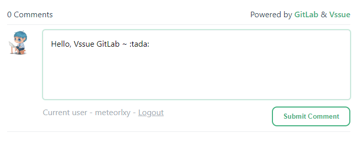
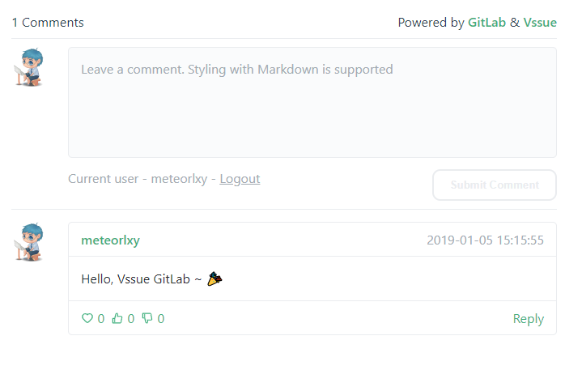

# GitLab Application

> 查看 [Gitlab 官方文档](https://docs.gitlab.com/ce/integration/oauth_provider.html#adding-an-application-through-the-profile) 作为参考。
> Vssue 同样可以配合自己搭建的 GitLab 使用。只需要将 `baseURL` 设置为你的 Gitlab URL 即可。查看 [配置参考 - baseURL](../options/README.md#baseurl)

## 创建一个新的 Application

- 前往 [Settings - Applications](https://gitlab.com/profile/applications)

- 将 `Redirect URI` 设置为你的网站 URL (这里我们用 `localhost:8080` 作为示例)
- 勾选 `api` scope

## 获取 Client ID

现在你已经创建了一个新的 Application，并得到了相应的 **Application ID** (`Client ID`)。

## 配置并启动你的 Vssue

复制 `Client ID`，并设置 `owner` 和 `repo`。

> Gitlab repository 的 URL 模式为 `https://gitlab.com/${owner}/${repo}`

这里我们以 `https://gitlab.com/meteorlxy/vssue-demo` 为例，并把 issue 的 `title` 设置为 `Vssue Demo`。

然后运行 `anywhere -h localhost 8080`，在 `localhost:8080` 监听一个 http server 并返回 `index.html`。

## 在本地尝试 Vssue

Vssue 已经成功运行。点击 `Login` 使用 Gitlab 帐号登录。

重定向到 Gitlab 授权页面。点击 `Authorize` 来登录。

在当前页面写下评论吧 ~

::: tip

你可以前往 [meteorlxy/vssue-demo](https://gitlab.com/meteorlxy/vssue-demo) 来获取 demo 代码。前往该仓库的 [#1 issue](https://gitlab.com/meteorlxy/vssue-demo/issues/1) 看看发生了什么。

:::
