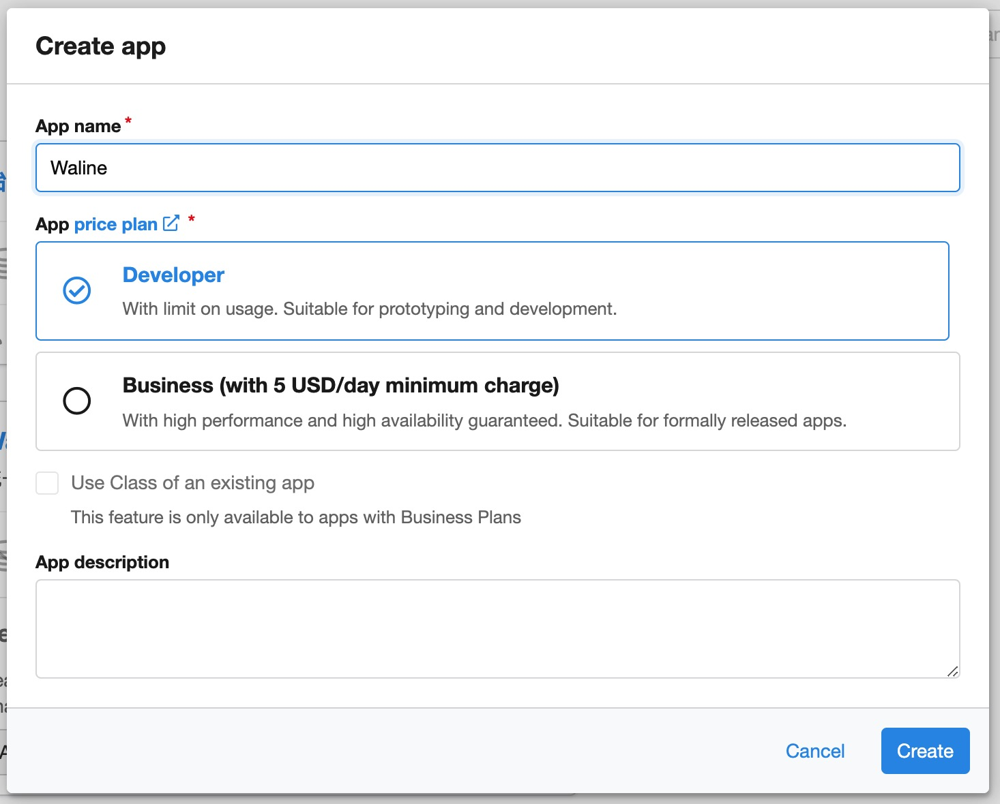
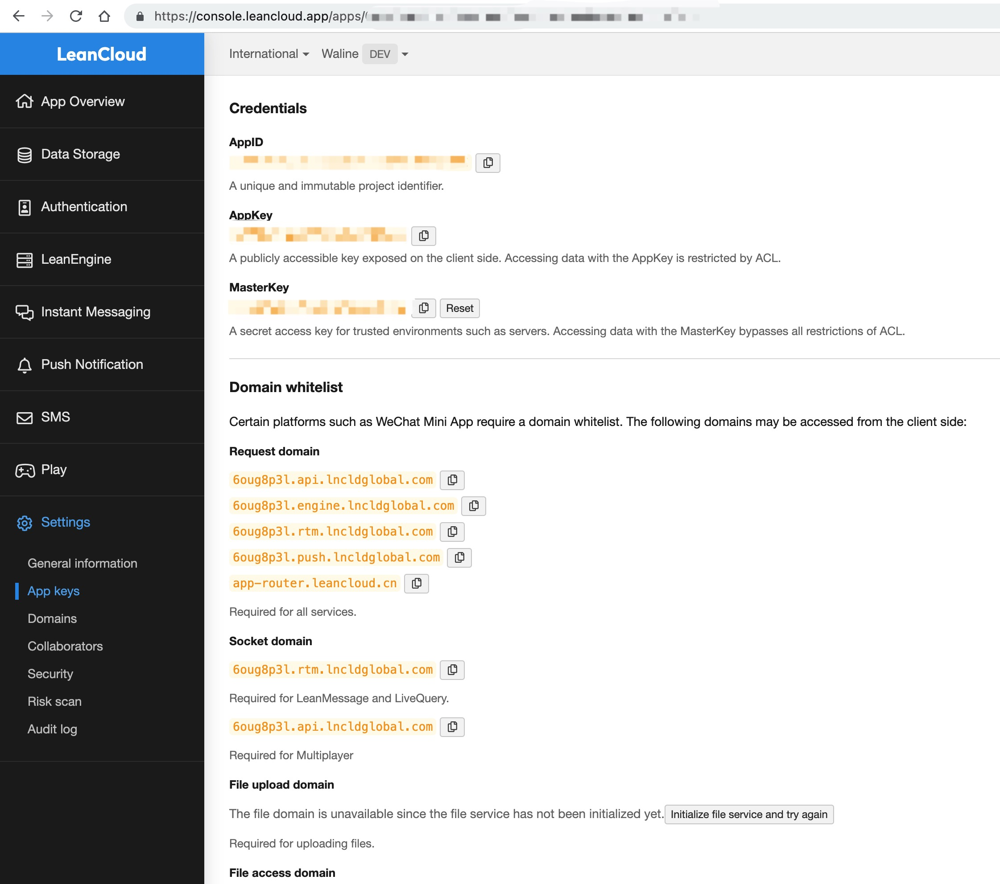
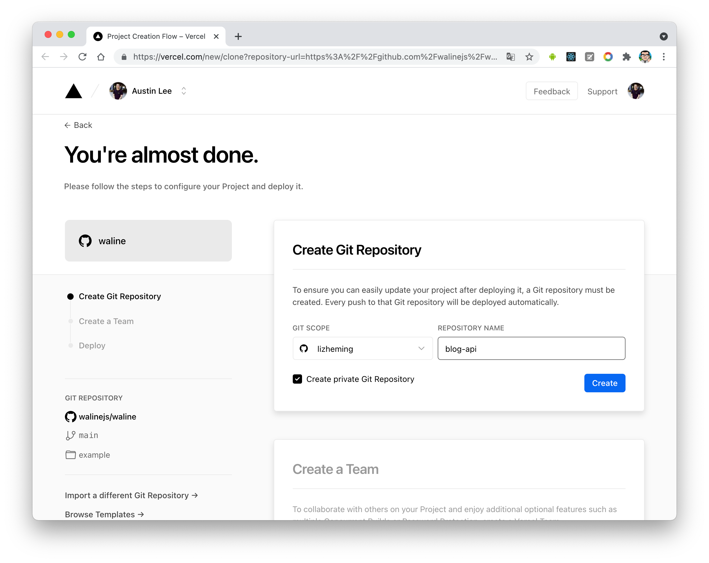
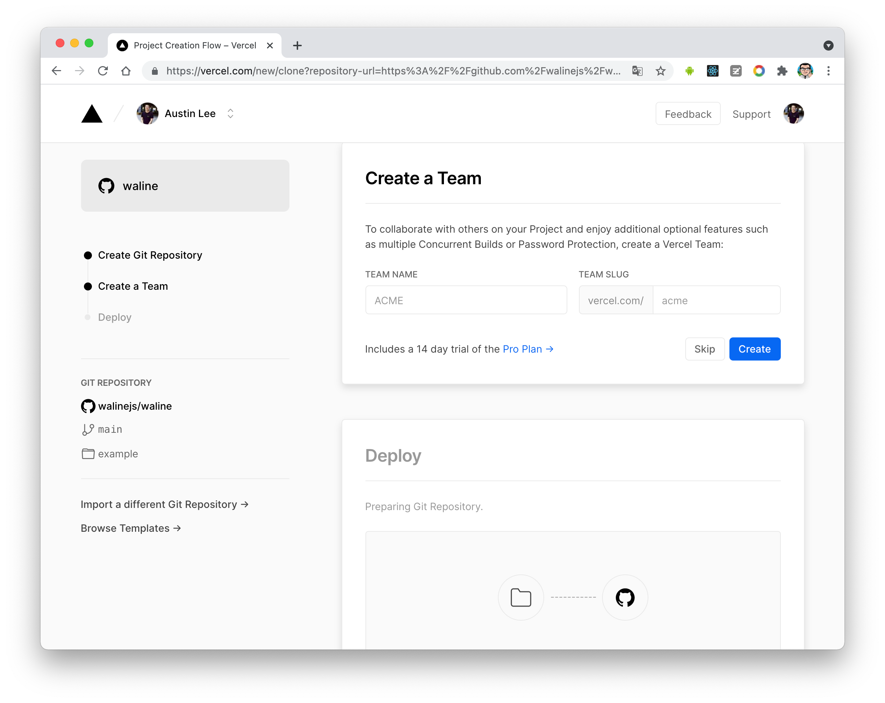
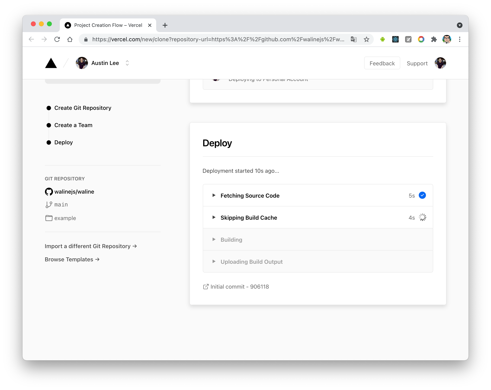
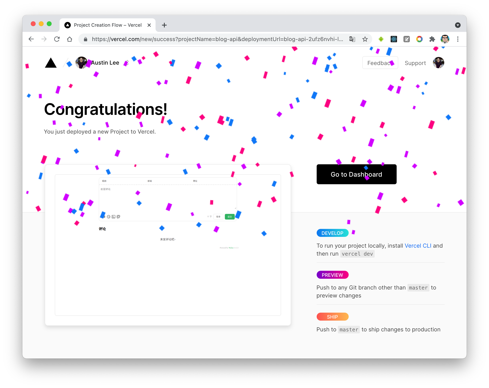
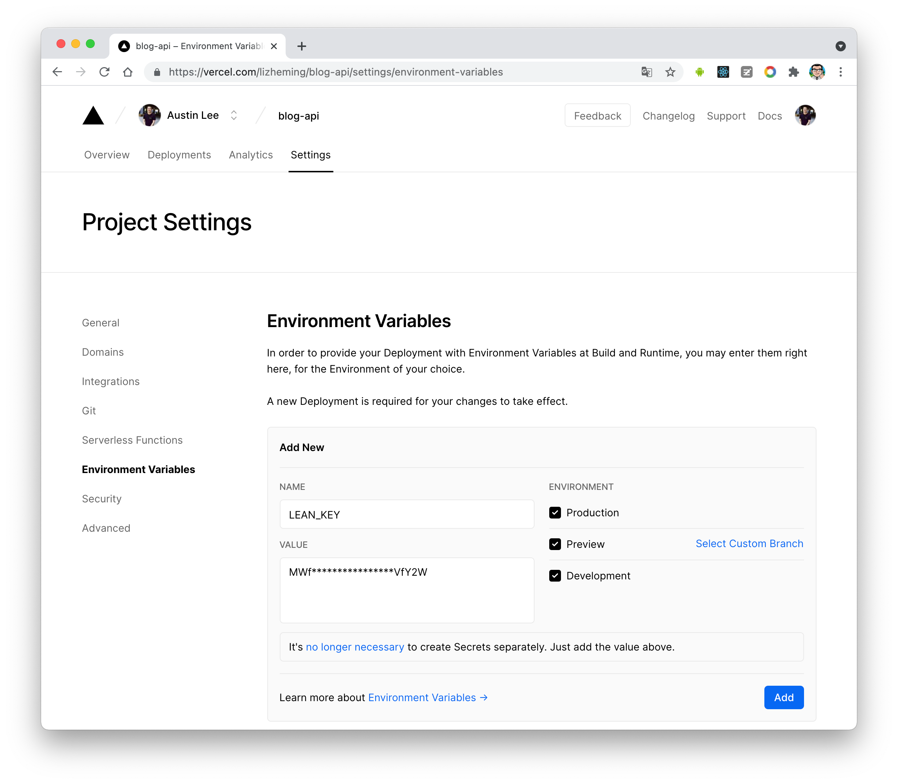
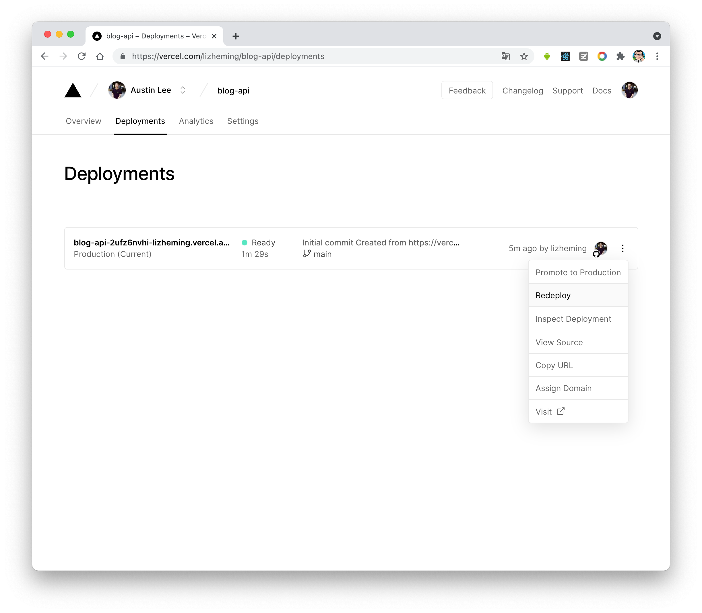
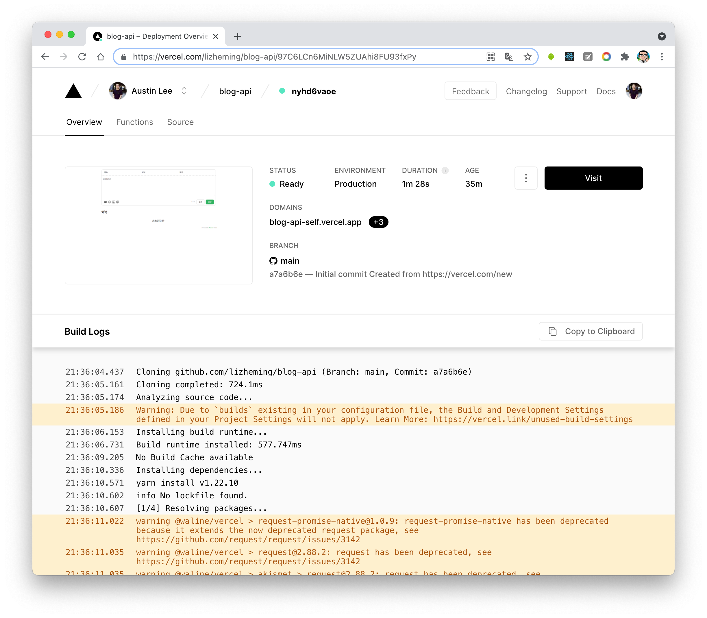

Welcome to Waline. In just a few steps, you can enable Waline to provide comments and pageviews on your site.

<!-- more -->

## LeanCloud Settings (Database)

1. [sign in](https://console.leancloud.app/login) or [sign up](https://console.leancloud.app/register) LeanCloud and enter [Console](https://console.leancloud.app/apps).

1. Click [Create app](https://console.leancloud.app/apps) button to create a new app and enter a name you like:

   

1. Enter the app, then select `Settings` > `App Keys` at the left bottom corner. You will see `APP ID`, `APP Key` and `Master Key` of your app. We will use them later

   

## Deploy to Vercel (Server)

1. Click the blue button above, it will redirect you to vercel to deploy with waline template.

1. If you haven’t logined, we recommend you to sign in with GitHub.

1. Input your Vercel project name then click `Create`.

   

1. Then Vercel will let you create Vercel Team account, click `Skip` and go on.

   

1. Repo which named you input before will be created and initiallized automatically base on waline example template by Vercel.

   

   After one minute or two, vercel should finish the deployment. Click `Go to Dashboard` button to redirect to your application dashboard.

   

1. Click `Settings` menu on the top, and `Environment Variables` button on the side to go to envrionment variables setting page. Then set `LEAN_ID`, `LEAN_KEY` and `LEAN_MASTER_KEY`. The variables’ value should be the ones you got in the previous step. `APP ID` is the value of `LEAN_ID`, and `APP Key` to `LEAN_KEY`, `Master Key` to `LEAN_MASTER_KEY`.

   

1. To let your environment variables setting active, you need redeploy your application. Click `Deployments` menu on the top and find the latest deployment at the top of list, click `Redeploy` button in the right dropdown menu.

   

1. If everything is ok, vercel will redirect to `Overview` page to start redeployment. Wait a moment the `STATUS` will change to `Ready`. Now you can click `Visit` to visit the site. This link is your server address.

   

## Client

### Using plugin

Set `type: "waline"` in the plugin options, and set `serverURL` as the link obtained in the previous step.

Then, place the `<CommentService>` component at a suitable location in your site (usually at the bottom of the page), you will be able to see the comment box.

::: tip

You can also pass in other options supported by Waline (except `el`).

For details, see [Waline Config](../config/waline.md)

:::

## Comment Management

1. After the deployment is complete, please visit `<serverURL>/ui/register` to register. The first person to register will be set as an administrator.
1. After you log in as administrator, you can see the comment management interface. You can edit, mark or delete comments here.
1. Users can also register their account in the comment box, and they will be redirected to their profile page after logging in.
