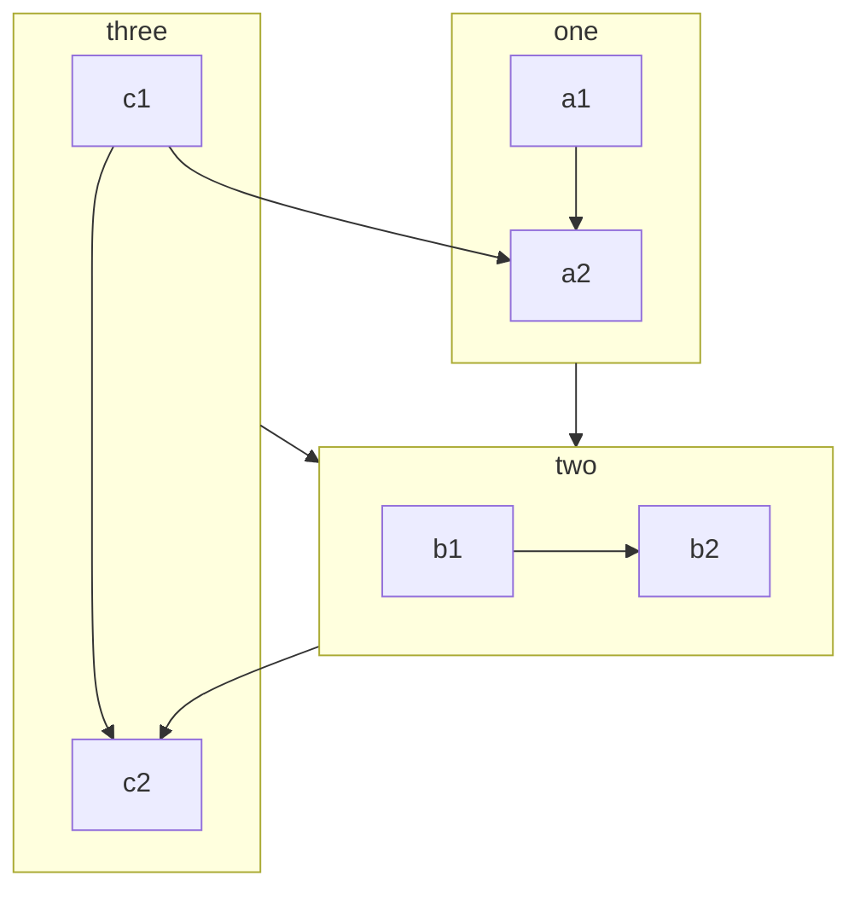

By installing and enableing this plugin, you can use more syntax in your Markdown files.

::: tip

Don’t worry about the size of your site. If you don’t enable related features, the final code won’t include code for these features.

At the same time, VuePress itself adds some Markdown syntaxes. You can [view the official documentation](https://v2.vuepress.vuejs.org/guide/markdown.html).

:::

## Enable All Features

You can set `enableAll: true` in plugin options to enable all features of this plugin.

::: danger

Please use this option ONLY for playing or testing.

The plugin is FULLY treeshakable, so you should use the options below and enable ONLY the feature you want to use.

Enabling features you don’t need will increase dev and build time. (`markdown-it` has to check for extra syntaxs)

Also, some feature will add large chunks to your output (can up to 2MB).

## New Feature

### Tabs

::: tabs#fruit

@tab apple

Apple

@tab banana

Banana

@tab orange

Orange

:::

- [View Detail](tabs.md)

### Code Tabs

::: code-tabs#shell

@tab pnpm

```bash
pnpm add -D vuepress-plugin-md-enhance@next
```

@tab yarn

```bash
yarn add -D vuepress-plugin-md-enhance@next
```

@tab:active npm

```bash
npm i -D vuepress-plugin-md-enhance@next
```

:::

- [View Detail](code-tabs.md)

### Superscript and Subscript

19^th^ H~2~O

- [View Detail](sup-sub.md)

### Align

::: center

I am center

:::

::: right

I am right align

:::

- [View Detail](align.md)

### Attrs

A **word**{#word} having id.

- [View Detail](attrs.md)

### Footnote

This text has footnote[^first].

[^first]: This is footnote content

- [View Detail](footnote.md)

### Mark

You can mark ==important words== .

- [View Detail](mark.md)

### Tasklist

- [x] Plan A
- [ ] Plan B

- [View Detail](tasklist.md)

### Image Enhancement

Support setting color scheme and size

- [View Detail](image.md)

### Chart

::: chart A Scatter Chart

```json
{
  "type": "scatter",
  "data": {
    "datasets": [
      {
        "label": "Scatter Dataset",
        "data": [
          { "x": -10, "y": 0 },
          { "x": 0, "y": 10 },
          { "x": 10, "y": 5 },
          { "x": 0.5, "y": 5.5 }
        ],
        "backgroundColor": "rgb(255, 99, 132)"
      }
    ]
  },
  "options": {
    "scales": {
      "x": {
        "type": "linear",
        "position": "bottom"
      }
    }
  }
}
```

:::

- [View Detail](chart.md)

## Echarts

::: echarts A line chart

```json
{
  "xAxis": {
    "type": "category",
    "data": ["Mon", "Tue", "Wed", "Thu", "Fri", "Sat", "Sun"]
  },
  "yAxis": {
    "type": "value"
  },
  "series": [
    {
      "data": [150, 230, 224, 218, 135, 147, 260],
      "type": "line"
    }
  ]
}
```

:::

- [View Detail](echarts.md)

### Flowchart

```flow
cond=>condition: Process?
process=>operation: Process
e=>end: End

cond(yes)->process->e
cond(no)->e
```

- [View Detail](flowchart.md)

### Mermaid



- [View Detail](mermaid.md)

### Tex

$$
\frac {\partial^r} {\partial \omega^r} \left(\frac {y^{\omega}} {\omega}\right)
= \left(\frac {y^{\omega}} {\omega}\right) \left\{(\log y)^r + \sum_{i=1}^r \frac {(-1)^i r \cdots (r-i+1) (\log y)^{r-i}} {\omega^i} \right\}
$$

- [View Detail](tex.md)

### Include files

@include(./demo.snippet.md{5-9})

- [View Detail](include.md)

### Code Demo

::: normal-demo A normal demo

```html
<h1>VuePress Theme Hope</h1>
<p>Is <span id="very">very</span> powerful!</p>
```

```js
document.querySelector("#very").addEventListener("click", () => {
  alert("Very powerful!");
});
```

```css
span {
  color: red;
}
```

:::

- [View Detail](demo/README.md)

### Stylize

<!-- markdownlint-disable MD033 -->

Setting this to a invalid stytax <span style="color:red">doesn't</span> have any effect.

- [View Detail](stylize.md)

<!-- markdownlint-enable MD033 -->

### Playground

You can insert Vue playground in Markdown files directly.

- [View Detail](playground.md)

### Presentation

@slidestart

## Slide 1

A paragraph with some text and a [link](https://mrhope.site)

---

## Slide 2

- Item 1
- Item 2

---

## Slide 3.1

```js
const a = 1;
```

--

## Slide 3.2

$$
J(\theta_0,\theta_1) = \sum_{i=0}
$$

@slideend

- [View Detail](presentation/README.md)
