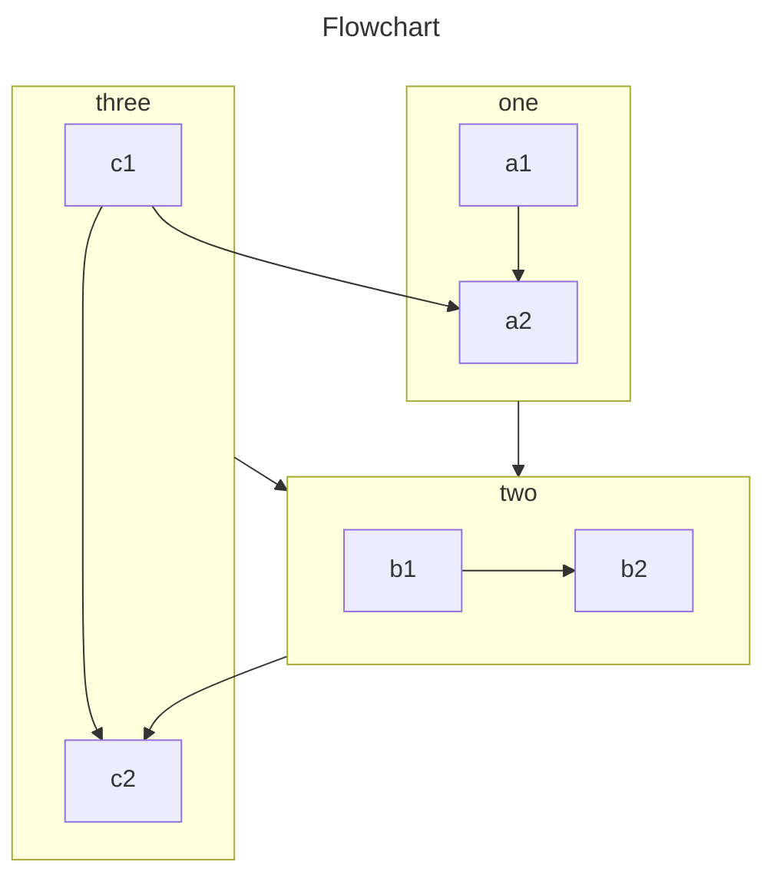

<!-- #region intro -->

This plugin provides 4 ways to let you insert charts into your markdown file.

- Chart.js: A lightweight, easy-to-use, highly customizable chart library.

  Chart.js is lighter comparing to Echarts.

- Echarts: A powerful, interactive charting and visualization library for browser.

  Echarts is more powerful comparing to Chart.js.

- Flowchart: A simple markdown extension to generate flowcharts and sequence diagrams.

  Lightweight, only focusing on flowcharts.

- Mermaid: Generation of diagram and flowchart from text in a similar manner as markdown.

  Powerful collection of common charts.

<!-- #endregion intro -->

<!-- more -->

## Demo

<!-- #region demo -->

### Chart.js

::: chart A Scatter Chart

```json
{
  "type": "scatter",
  "data": {
    "datasets": [
      {
        "label": "Scatter Dataset",
        "data": [
          { "x": -10, "y": 0 },
          { "x": 0, "y": 10 },
          { "x": 10, "y": 5 },
          { "x": 0.5, "y": 5.5 }
        ],
        "backgroundColor": "rgb(255, 99, 132)"
      }
    ]
  },
  "options": {
    "scales": {
      "x": {
        "type": "linear",
        "position": "bottom"
      }
    }
  }
}
```

:::

- [View Detail](./chartjs.md)

### Echarts

::: echarts A line chart

```json
{
  "xAxis": {
    "type": "category",
    "data": ["Mon", "Tue", "Wed", "Thu", "Fri", "Sat", "Sun"]
  },
  "yAxis": {
    "type": "value"
  },
  "series": [
    {
      "data": [150, 230, 224, 218, 135, 147, 260],
      "type": "line"
    }
  ]
}
```

:::

- [View Detail](./echarts.md)

### Flowchart

```flow
cond=>condition: Process?
process=>operation: Process
e=>end: End

cond(yes)->process->e
cond(no)->e
```

- [View Detail](./flowchart.md)

### Mermaid



- [View Detail](./mermaid.md)

<!-- #endregion demo -->
