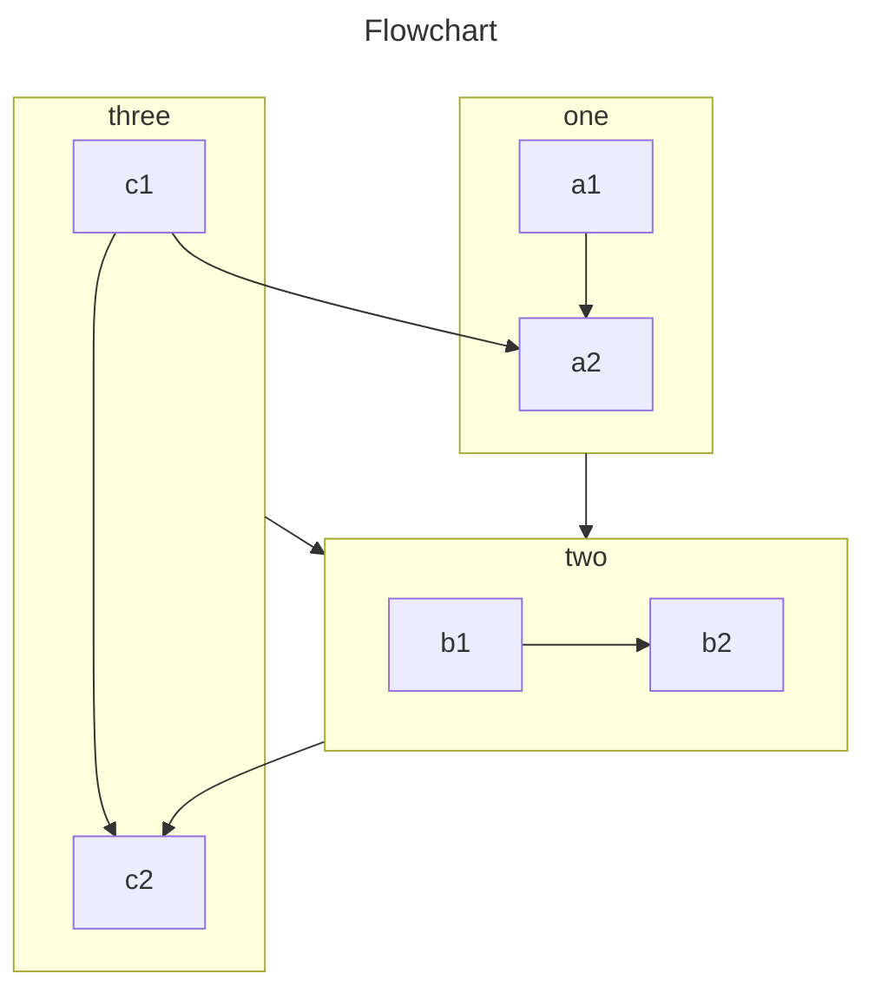

<!-- #region intro -->

This plugin provides 6 ways to let you insert charts into your markdown file.

- Chart.js: A lightweight, easy-to-use, highly customizable chart library.

  Chart.js is lighter comparing to ECharts.

- ECharts: A powerful, interactive charting and visualization library for browser.

  ECharts is more powerful comparing to Chart.js.

- Flowchart: A simple markdown extension to generate flowcharts and sequence diagrams.

  Lightweight, only focusing on flowcharts.

- Markmap: Create mindmap with markdown

  The runtime is very heavy, not recommended.

- Mermaid: Generation of diagram and flowchart from text in a similar manner as markdown.

  Powerful collection of common charts.

- Plantuml: UML diagram driven by Java.

  No runtime.

<!-- #endregion intro -->

<!-- more -->

## Demo

<!-- #region demo -->

### Chart.js

::: chart A Scatter Chart

```json
{
  "type": "scatter",
  "data": {
    "datasets": [
      {
        "label": "Scatter Dataset",
        "data": [
          { "x": -10, "y": 0 },
          { "x": 0, "y": 10 },
          { "x": 10, "y": 5 },
          { "x": 0.5, "y": 5.5 }
        ],
        "backgroundColor": "rgb(255, 99, 132)"
      }
    ]
  },
  "options": {
    "scales": {
      "x": {
        "type": "linear",
        "position": "bottom"
      }
    }
  }
}
```

:::

- [View Detail](./chartjs.md)

### ECharts

::: echarts A line chart

```json
{
  "xAxis": {
    "type": "category",
    "data": ["Mon", "Tue", "Wed", "Thu", "Fri", "Sat", "Sun"]
  },
  "yAxis": {
    "type": "value"
  },
  "series": [
    {
      "data": [150, 230, 224, 218, 135, 147, 260],
      "type": "line"
    }
  ]
}
```

:::

- [View Detail](./echarts.md)

### Flowchart

```flow
cond=>condition: Process?
process=>operation: Process
e=>end: End

cond(yes)->process->e
cond(no)->e
```

- [View Detail](./flowchart.md)

### Markmap

````markmap
---
markmap:
  colorFreezeLevel: 2
---

# markmap

## Links

- <https://markmap.js.org/>
- [GitHub](https://github.com/gera2ld/markmap)

## Related Projects

- [coc-markmap](https://github.com/gera2ld/coc-markmap)
- [gatsby-remark-markmap](https://github.com/gera2ld/gatsby-remark-markmap)

## Features

- links
- **strong** ~~del~~ *italic* ==highlight==
- multiline
  text
- `inline code`
-
    ```js
    console.log('code block');
    ```
- Katex
  - $x = {-b \pm \sqrt{b^2-4ac} \over 2a}$
- Now we can wrap very very very very long text based on `maxWidth` option
````

- [View Detail](./markmap.md)

### Mermaid



- [View Detail](./mermaid.md)

### Plantuml

@startuml
scale 5 as 150 pixels

clock clk with period 1
binary "enable" as en
binary "R/W" as rw
binary "data Valid" as dv
concise "dataBus" as db
concise "address bus" as addr

@6 as :write_beg
@10 as :write_end

@15 as :read_beg
@19 as :read_end

@0
en is low
db is "0x0"
addr is "0x03f"
rw is low
dv is 0

@:write_beg-3
en is high
@:write_beg-2
db is "0xDEADBEEF"
@:write_beg-1
dv is 1
@:write_beg
rw is high

@:write_end
rw is low
dv is low
@:write_end+1
rw is low
db is "0x0"
addr is "0x23"

@12
dv is high
@13
db is "0xFFFF"

@20
en is low
dv is low
@21
db is "0x0"

highlight :write_beg to :write_end #Gold:Write
highlight :read_beg to :read_end #lightBlue:Read

db@:write_beg-1 <-> @:write_end : setup time
db@:write_beg-1 -> addr@:write_end+1 : hold
@enduml

- [View Detail](./plantuml.md)

<!-- #endregion demo -->
