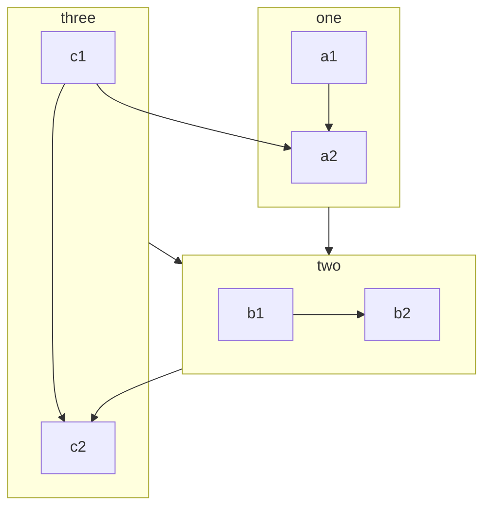
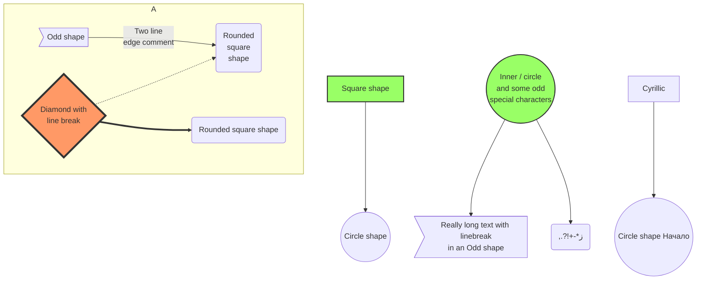

Let the Markdown file support [mermaid](https://mermaid-js.github.io/mermaid/#/) in your VuePress site.

<!-- more -->

## Configuration

```js {7}
module.exports = {
  plugins: [
    [
      "md-enhance",
      {
        // Enable mermaid
        mermaid: true,
      },
    ],
  ],
};
```

## Syntax

````md
```mermaid

<!-- Your mermaid code here. -->

```
````

## Usage

Please see [mermaid](https://mermaid-js.github.io/mermaid/#/).

## Demo

### Flowchart



::: details Code

````md

````

:::

### Sequence Diagram

```sequence
Alice ->> Bob: Hello Bob, how are you?
Bob-->>John: How about you John?
Bob--x Alice: I am good thanks!
Bob-x John: I am good thanks!
Note right of John: Bob thinks a long<br/>long time, so long<br/>that the text does<br/>not fit on a row.

Bob-->Alice: Checking with John...
Alice->John: Yes... John, how are you?
```

::: details Code

````md
```sequence
Alice ->> Bob: Hello Bob, how are you?
Bob-->>John: How about you John?
Bob--x Alice: I am good thanks!
Bob-x John: I am good thanks!
Note right of John: Bob thinks a long<br/>long time, so long<br/>that the text does<br/>not fit on a row.

Bob-->Alice: Checking with John...
Alice->John: Yes... John, how are you?
```
````

:::

### Class Diagram

```class
class Square~Shape~{
    int id
    List~int~ position
    setPoints(List~int~ points)
    getPoints() List~int~
}

Square : -List~string~ messages
Square : +setMessages(List~string~ messages)
Square : +getMessages() List~string~
```

::: details Code

````md
```class
class Square~Shape~{
    int id
    List~int~ position
    setPoints(List~int~ points)
    getPoints() List~int~
}

Square : -List~string~ messages
Square : +setMessages(List~string~ messages)
Square : +getMessages() List~string~
```
````

:::

### State Diagram

```state
[*] --> Active

state Active {
    [*] --> NumLockOff
    NumLockOff --> NumLockOn : EvNumLockPressed
    NumLockOn --> NumLockOff : EvNumLockPressed
    --
    [*] --> CapsLockOff
    CapsLockOff --> CapsLockOn : EvCapsLockPressed
    CapsLockOn --> CapsLockOff : EvCapsLockPressed
    --
    [*] --> ScrollLockOff
    ScrollLockOff --> ScrollLockOn : EvScrollLockPressed
    ScrollLockOn --> ScrollLockOff : EvScrollLockPressed
}
```

::: details Code

````md
```state
[*] --> Active

state Active {
    [*] --> NumLockOff
    NumLockOff --> NumLockOn : EvNumLockPressed
    NumLockOn --> NumLockOff : EvNumLockPressed
    --
    [*] --> CapsLockOff
    CapsLockOff --> CapsLockOn : EvCapsLockPressed
    CapsLockOn --> CapsLockOff : EvCapsLockPressed
    --
    [*] --> ScrollLockOff
    ScrollLockOff --> ScrollLockOn : EvScrollLockPressed
    ScrollLockOn --> ScrollLockOff : EvScrollLockPressed
}
```
````

:::

### Entity Relationship Diagrams

```er
CAR ||--o{ NAMED-DRIVER : allows
CAR {
    string registrationNumber
    string make
    string model
}
PERSON ||--o{ NAMED-DRIVER : is
PERSON {
    string firstName
    string lastName
    int age
}
```

::: details Code

````md
```er
CAR ||--o{ NAMED-DRIVER : allows
CAR {
    string registrationNumber
    string make
    string model
}
PERSON ||--o{ NAMED-DRIVER : is
PERSON {
    string firstName
    string lastName
    int age
}
```
````

:::

### User Journey Diagram

```journey
title My working day
section Go to work
  Make tea: 5: Me
  Go upstairs: 3: Me
  Do work: 1: Me, Cat
section Go home
  Go downstairs: 5: Me
  Sit down: 5: Me
```

::: details Code

````md
```journey
title My working day
section Go to work
  Make tea: 5: Me
  Go upstairs: 3: Me
  Do work: 1: Me, Cat
section Go home
  Go downstairs: 5: Me
  Sit down: 5: Me
```
````

:::

### Gantt diagrams

```gantt
dateFormat  YYYY-MM-DD
title       Adding GANTT diagram functionality to mermaid
excludes    weekends
%% (`excludes` accepts specific dates in YYYY-MM-DD format, days of the week ("sunday") or "weekends", but not the word "weekdays".)

section A section
Completed task            :done,    des1, 2014-01-06,2014-01-08
Active task               :active,  des2, 2014-01-09, 3d
Future task               :         des3, after des2, 5d
Future task2              :         des4, after des3, 5d

section Critical tasks
Completed task in the critical line :crit, done, 2014-01-06,24h
Implement parser and jison          :crit, done, after des1, 2d
Create tests for parser             :crit, active, 3d
Future task in critical line        :crit, 5d
Create tests for renderer           :2d
Add to mermaid                      :1d

section Documentation
Describe gantt syntax               :active, a1, after des1, 3d
Add gantt diagram to demo page      :after a1  , 20h
Add another diagram to demo page    :doc1, after a1  , 48h

section Last section
Describe gantt syntax               :after doc1, 3d
Add gantt diagram to demo page      :20h
Add another diagram to demo page    :48h
```

::: details Code

````md
```gantt
dateFormat  YYYY-MM-DD
title       Adding GANTT diagram functionality to mermaid
excludes    weekends
%% (`excludes` accepts specific dates in YYYY-MM-DD format, days of the week ("sunday") or "weekends", but not the word "weekdays".)

section A section
Completed task            :done,    des1, 2014-01-06,2014-01-08
Active task               :active,  des2, 2014-01-09, 3d
Future task               :         des3, after des2, 5d
Future task2              :         des4, after des3, 5d

section Critical tasks
Completed task in the critical line :crit, done, 2014-01-06,24h
Implement parser and jison          :crit, done, after des1, 2d
Create tests for parser             :crit, active, 3d
Future task in critical line        :crit, 5d
Create tests for renderer           :2d
Add to mermaid                      :1d

section Documentation
Describe gantt syntax               :active, a1, after des1, 3d
Add gantt diagram to demo page      :after a1  , 20h
Add another diagram to demo page    :doc1, after a1  , 48h

section Last section
Describe gantt syntax               :after doc1, 3d
Add gantt diagram to demo page      :20h
Add another diagram to demo page    :48h
```
````

:::

### Pie chart diagrams

```pie
title What Voldemort doesn't have?
  "FRIENDS" : 2
  "FAMILY" : 3
  "NOSE" : 45
```

::: details Code

````md
```pie
title What Voldemort doesn't have?
  "FRIENDS" : 2
  "FAMILY" : 3
  "NOSE" : 45
```
````

:::

### A complex example



::: details Code

````md

````

:::
