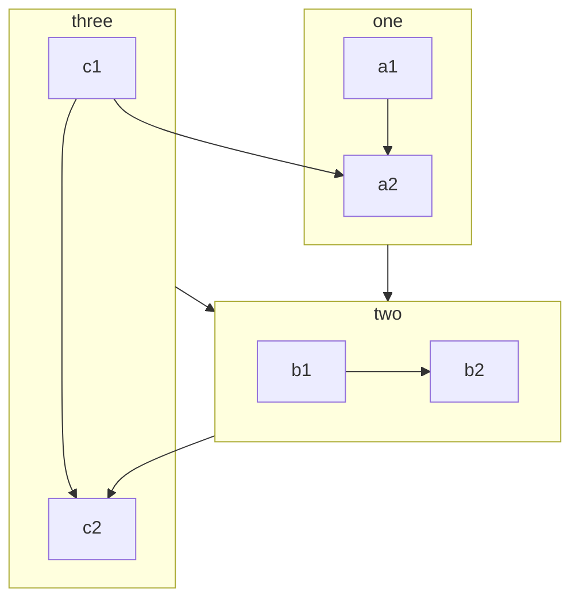

By installing and enableing this plugin, you can use more syntax in your Markdown files.

::: tip

Don’t worry about the size of your site. If you don’t enable related features, the final code won’t include code for these features.

At the same time, VuePress itself adds some Markdown syntaxes. You can [view the official documentation](https://v1.vuepress.vuejs.org/guide/markdown.html).

:::

## Enable all

You can set `themeconfig.mdEnhance.enableAll` to enable all features of the [md-enhance](https://vuepress-theme-hope.github.io/md-enhance) plugin.

```js {3-5}
module.exports = {
  themeConfig: {
    mdEnhance: {
      enableAll: true,
    },
  },
};
```

::: danger

Please use this option ONLY for playing or testing.

As time grows,`vupress-plugin-md-enhance` is becoming more powerful. It’s adding more syntax to Markdown parser and more code to output.

Enabling features you don’t need will increase dev and build time. (`markdown-it` has to check for extra syntaxs)

Also, presentation feature will add a 700KB size chunk (mostly is `reveal.js`) to your output.

Please use the options below and enable ONLY the feature you want to use.

:::

## New Feature

### Superscript and Subscript

19^th^ H~2~O

- [View Detail](sup-sub.md)

### Align

::: center

I am center

:::

::: right

I am right align

:::

- [View Detail](align.md)

### Footnote

This text has footnote[^first].

[^first]: This is footnote content

- [View Detail](footnote.md)

### Mark

You can mark ==important words== .

- [View Detail](mark.md)

### Tasklist

- [x] Plan A
- [ ] Plan B

- [View Detail](tasklist.md)

### Flowchart

```flow
cond=>condition: Process?
process=>operation: Process
e=>end: End

cond(yes)->process->e
cond(no)->e
```

- [View Detail](flowchart.md)

### Mermaid



- [View Detail](mermaid.md)

### Tex

$$
\frac {\partial^r} {\partial \omega^r} \left(\frac {y^{\omega}} {\omega}\right)
= \left(\frac {y^{\omega}} {\omega}\right) \left\{(\log y)^r + \sum_{i=1}^r \frac {(-1)^i r \cdots (r-i+1) (\log y)^{r-i}} {\omega^i} \right\}
$$

- [View Detail](tex.md)

### Code Demo

::: demo A normal demo

```html
<h1>Mr.Hope</h1>
<p>Is <span id="very">very</span> handsome</p>
```

```js
document.querySelector("#very").addEventListener("click", () => {
  alert("Very handsome!");
});
```

```css
span {
  color: red;
}
```

:::

- [View Detail](demo/readme.md)

### Presentation

@slidestart

## Slide 1

A paragraph with some text and a [link](https://mrhope.site)

---

## Slide 2

- Item 1
- Item 2

---

## Slide 3.1

```js
const a = 1;
```

--

## Slide 3.2

$$
J(\theta_0,\theta_1) = \sum_{i=0}
$$

@slideend

- [View Detail](presentation/readme.md)
