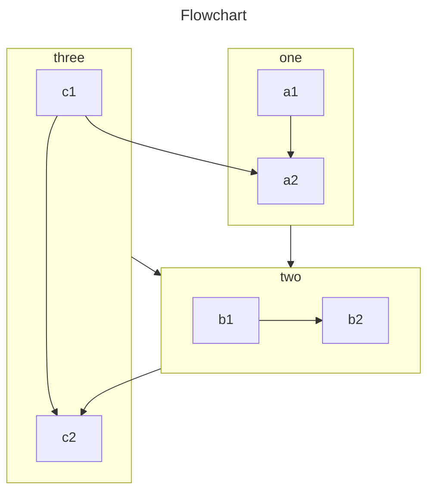

通过安装并启用此插件，你可以在 Markdown 中使用更多的语法。

::: tip

请不用担心你的网站大小，如果你不启用相关功能，最终代码不会包含这些功能相关的代码。

同时 VuePress 本身新增了一些 Markdown 语法，如果你对它们不熟悉，可以 [查看官方文档](https://vuejs.press/zh/guide/markdown.html)。

:::

## 新增的更多语法

### 选项卡

::: tabs#fruit

@tab apple

Apple

@tab banana

Banana

@tab orange

Orange

:::

- [查看详情](tabs.md)

### 代码块

::: code-tabs#shell

@tab pnpm

```bash
pnpm add -D vuepress-plugin-md-enhance
```

@tab yarn

```bash
yarn add -D vuepress-plugin-md-enhance
```

@tab:active npm

```bash
npm i -D vuepress-plugin-md-enhance
```

:::

- [查看详情](code-tabs.md)

### 自定义对齐

::: center

我是居中的

:::

::: right

我在右对齐

:::

- [查看详情](align.md)

### 属性支持

一个有 id 的 **单词**{#word}。

- [查看详情](attrs.md)

### 上下角标

19^th^ H~2~O

- [查看详情](sup-sub.md)

### 脚注

此文字有脚注[^first].

[^first]: 这是脚注内容

- [查看详情](footnote.md)

### 标记

你可以标记 ==重要的内容== 。

- [查看详情](mark.md)

### 任务列表

- [x] 计划 1
- [ ] 计划 2

- [查看详情](tasklist.md)

### 图片增强

支持设置标题、颜色模式和大小

- [查看详情](image.md)

### 卡片

```card
title: Mr.Hope
desc: Where there is light, there is hope
logo: https://mister-hope.com/logo.svg
link: https://mister-hope.com
color: rgba(253, 230, 138, 0.15)
```

- [查看详情](card.md)

### 图表

::: chart 一个散点图案例

```json
{
  "type": "scatter",
  "data": {
    "datasets": [
      {
        "label": "散点数据集",
        "data": [
          { "x": -10, "y": 0 },
          { "x": 0, "y": 10 },
          { "x": 10, "y": 5 },
          { "x": 0.5, "y": 5.5 }
        ],
        "backgroundColor": "rgb(255, 99, 132)"
      }
    ]
  },
  "options": {
    "scales": {
      "x": {
        "type": "linear",
        "position": "bottom"
      }
    }
  }
}
```

:::

- [查看详情](chart.md)

### Echarts

::: echarts 一个折线图案例

```json
{
  "xAxis": {
    "type": "category",
    "data": ["Mon", "Tue", "Wed", "Thu", "Fri", "Sat", "Sun"]
  },
  "yAxis": {
    "type": "value"
  },
  "series": [
    {
      "data": [150, 230, 224, 218, 135, 147, 260],
      "type": "line"
    }
  ]
}
```

:::

- [查看详情](echarts.md)

### 流程图

```flow
cond=>condition: 是否执行操作?
process=>operation: 操作
e=>end: 结束

cond(yes)->process->e
cond(no)->e
```

- [查看详情](flowchart.md)

### Mermaid 图表



- [查看详情](mermaid.md)

### Tex 语法

$$
\frac {\partial^r} {\partial \omega^r} \left(\frac {y^{\omega}} {\omega}\right)
= \left(\frac {y^{\omega}} {\omega}\right) \left\{(\log y)^r + \sum_{i=1}^r \frac {(-1)^i r \cdots (r-i+1) (\log y)^{r-i}} {\omega^i} \right\}
$$

- [查看详情](tex.md)

### 导入文件

<!-- @include: ./demo.snippet.md{9-13} -->

- [查看详情](include.md)

### 代码演示

::: normal-demo 一个普通 Demo

```html
<h1>VuePress Theme Hope</h1>
<p><span id="very">非常</span>强大!</p>
```

```js
document.querySelector("#very").addEventListener("click", () => {
  alert("非常强大");
});
```

```css
span {
  color: red;
}
```

:::

- [查看详情](demo/README.md)

### 样式化

<!-- markdownlint-disable MD033 -->

设置它<span style="color:red">没有</span>任何效果，请<span style="color:red">不要</span>这样使用

- [查看详情](stylize.md)

<!-- markdownlint-enable MD033 -->

### 交互演示

::: playground#ts TS 案例

@file index.ts

```ts
const msg = "hello world";

const speak = (msg: string) => console.log(msg);

speak(msg);
```

:::

- [查看详情](playground.md)

### Vue 交互演示

::: vue-playground Vue 交互演示

@file App.vue

```vue
<script setup>
import { ref } from "vue";

const msg = ref("Hello World!");
</script>

<template>
  <h1>{{ msg }}</h1>
  <input v-model="msg" />
</template>
```

:::

- [查看详情](vue-playground.md)

### 幻灯片

@slidestart

## 幻灯片 1

一个有文字和 [链接](https://mister-hope.com) 的段落

---

## 幻灯片 2

- 项目 1
- 项目 2

---

## 幻灯片 3.1

```js
const a = 1;
```

--

## 幻灯片 3.2

$$
J(\theta_0,\theta_1) = \sum_{i=0}
$$

@slideend

- [查看详情](presentation/README.md)
