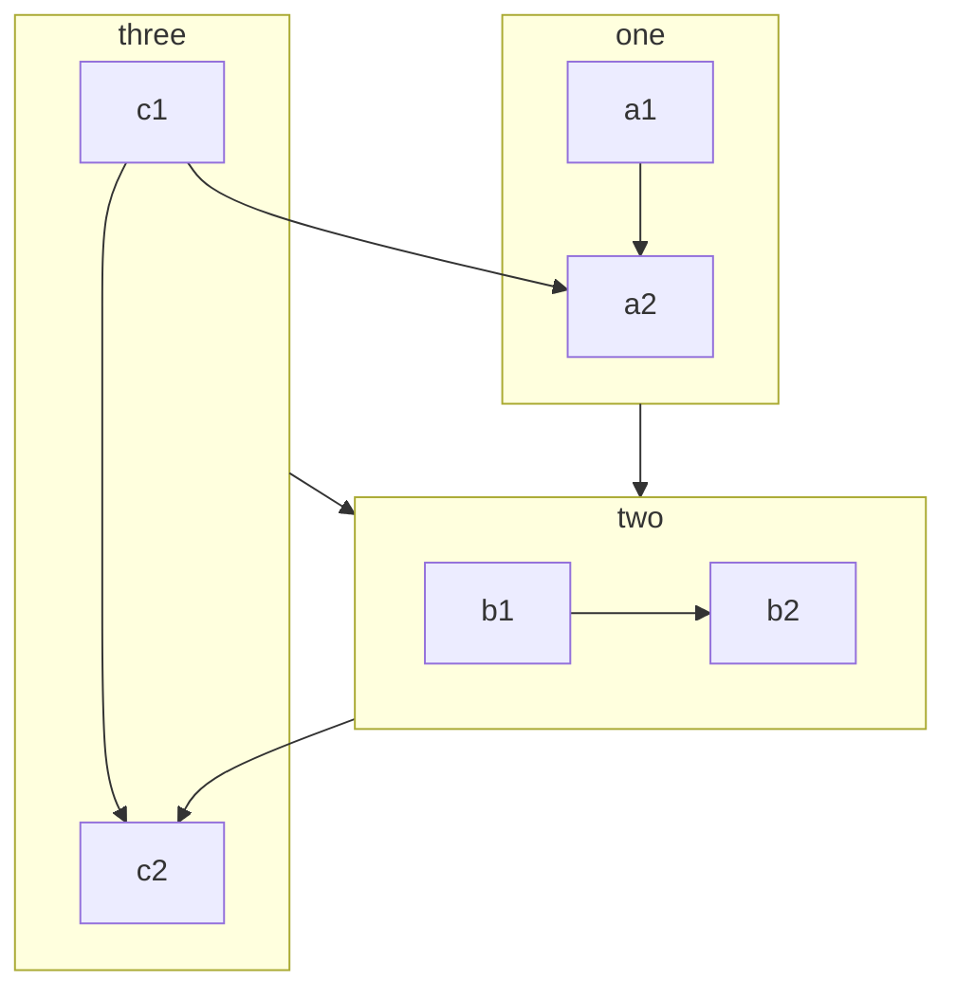

通过安装并启用此插件，你可以在 Markdown 中使用更多的语法。

::: tip

请不用担心你的网站大小，如果你不启用相关功能，最终代码不会包含这些功能相关的代码。

同时 VuePress 本身新增了一些 Markdown 语法，如果你对它们不熟悉，可以 [查看官方文档](https://v2.vuepress.vuejs.org/zh/guide/markdown.html)。

:::

## 一键启用

你可以在选项中 `enableAll` 设置为 `true` 来启用插件的所有功能。

::: danger

请仅将此选项用于体验或测试。随着时间的增长，`vuepress-plugin-md-enhance` 变得越来越强大。它为 Markdown 解析器添加了更多语法，并输出了更多代码。

启用不需要的功能将增加开发和构建时间。 (`markdown-it` 必须检查额外的语法)

同样，幻灯片演示功能将在输出中添加 700KB 大小的代码 (主要是 `reveal.js`)。

因此，请使用下面的选项，仅启用需要的功能。

:::

## 新增的更多语法

### 代码块

:::: code-group

::: code-group-item pnpm

```bash
pnpm add -D vuepress-plugin-md-enhance@next
```

:::

::: code-group-item yarn

```bash
yarn add -D vuepress-plugin-md-enhance@next
```

:::

::: code-group-item npm:active

```bash
npm i -D vuepress-plugin-md-enhance@next
```

:::

::::

- [查看详情](code-group.md)

### 自定义对齐

::: center

我是居中的

:::

::: right

我在右对齐

:::

- [查看详情](align.md)

### 上下角标

19^th^ H~2~O

- [查看详情](sup-sub.md)

### 脚注

此文字有脚注[^first].

[^first]: 这是脚注内容

- [查看详情](footnote.md)

### 标记

你可以标记 ==重要的内容== 。

- [查看详情](mark.md)

### 任务列表

- [x] 计划 1
- [ ] 计划 2

- [查看详情](tasklist.md)

### 图表

::: chart 一个散点图案例

```json
{
  "type": "scatter",
  "data": {
    "datasets": [
      {
        "label": "散点数据集",
        "data": [
          { "x": -10, "y": 0 },
          { "x": 0, "y": 10 },
          { "x": 10, "y": 5 },
          { "x": 0.5, "y": 5.5 }
        ],
        "backgroundColor": "rgb(255, 99, 132)"
      }
    ]
  },
  "options": {
    "scales": {
      "x": {
        "type": "linear",
        "position": "bottom"
      }
    }
  }
}
```

:::

- [查看详情](chart.md)

### 流程图

```flow
cond=>condition: 是否执行操作?
process=>operation: 操作
e=>end: 结束

cond(yes)->process->e
cond(no)->e
```

- [查看详情](flowchart.md)

### Mermaid 图表



- [查看详情](mermaid.md)

### Tex 语法

$$
\frac {\partial^r} {\partial \omega^r} \left(\frac {y^{\omega}} {\omega}\right)
= \left(\frac {y^{\omega}} {\omega}\right) \left\{(\log y)^r + \sum_{i=1}^r \frac {(-1)^i r \cdots (r-i+1) (\log y)^{r-i}} {\omega^i} \right\}
$$

- [查看详情](tex.md)

### 导入文件

@include(./demo.snippet.md{5,9})

- [查看详情](include.md)

### 代码演示

::: normal-demo 一个普通 Demo

```html
<h1>VuePress Theme Hope</h1>
<p><span id="very">非常</span>强大!</p>
```

```js
document.querySelector("#very").addEventListener("click", () => {
  alert("非常强大");
});
```

```css
span {
  color: red;
}
```

:::

- [查看详情](demo/README.md)

### 幻灯片

@slidestart

## 幻灯片 1

一个有文字和 [链接](https://mrhope.site) 的段落

---

## 幻灯片 2

- 项目 1
- 项目 2

---

## 幻灯片 3.1

```js
const a = 1;
```

--

## 幻灯片 3.2

$$
J(\theta_0,\theta_1) = \sum_{i=0}
$$

@slideend

- [查看详情](presentation/README.md)
