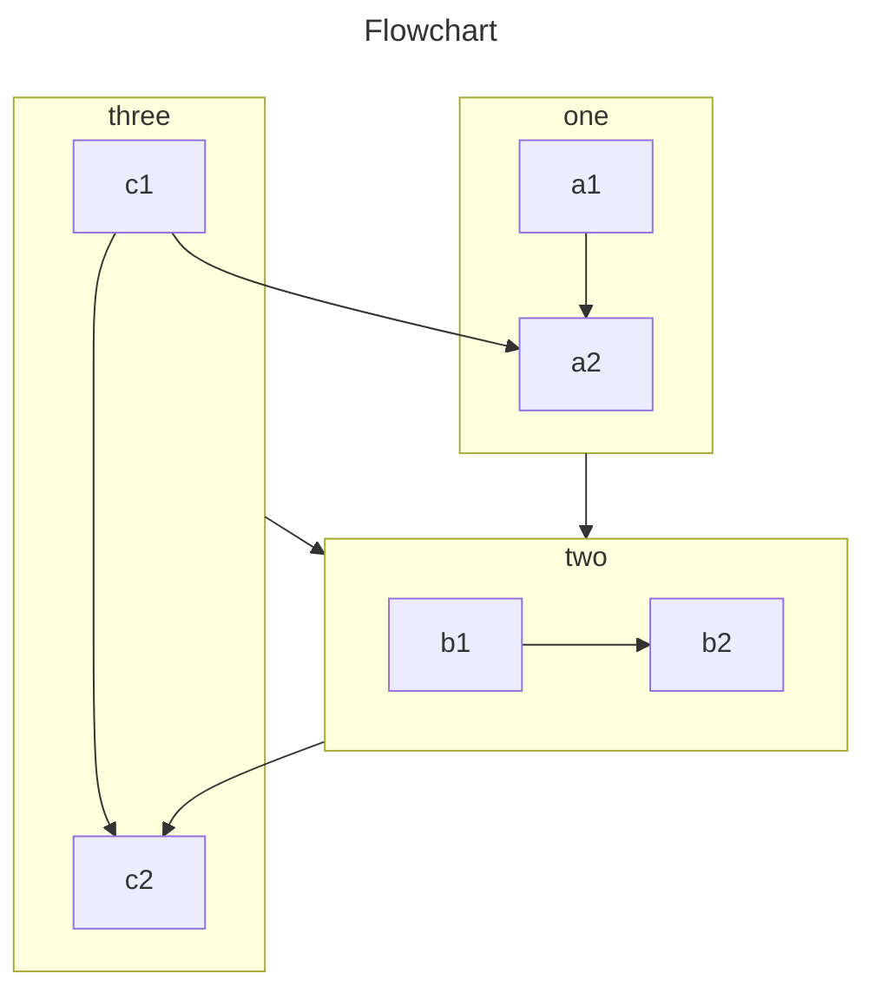

<!-- #region intro -->

该插件提供了 4 种方法让您将图表插入到 Markdown 文件中。

- Chart.js：一个轻量级、易于使用、高度可定制的图表库。

  与 Echarts 相比，Chart.js 更轻量。

- Echarts：一个强大的、交互式的浏览器图表和可视化库。

  与 Chart.js 相比，Echarts 更强大。

- flowchart: Markdown 扩展，用于生成流程图和序列图。

  轻量级，只关注流程图。

- Markmap: 从 Markdown 生成思维导图

  运行环境非常重，不推荐使用。

- Mermaid：以与 Markdown 类似的方式从文本生成图表和流程图。

  常用图表的强大集合。

<!-- #endregion intro -->

<!-- more -->

## 案例

<!-- #region demo -->

### Chart.js

::: chart 一个散点图案例

```json
{
  "type": "scatter",
  "data": {
    "datasets": [
      {
        "label": "散点数据集",
        "data": [
          { "x": -10, "y": 0 },
          { "x": 0, "y": 10 },
          { "x": 10, "y": 5 },
          { "x": 0.5, "y": 5.5 }
        ],
        "backgroundColor": "rgb(255, 99, 132)"
      }
    ]
  },
  "options": {
    "scales": {
      "x": {
        "type": "linear",
        "position": "bottom"
      }
    }
  }
}
```

:::

- [查看详情](./chartjs.md)

### Echarts

::: echarts 一个折线图案例

```json
{
  "xAxis": {
    "type": "category",
    "data": ["Mon", "Tue", "Wed", "Thu", "Fri", "Sat", "Sun"]
  },
  "yAxis": {
    "type": "value"
  },
  "series": [
    {
      "data": [150, 230, 224, 218, 135, 147, 260],
      "type": "line"
    }
  ]
}
```

:::

- [查看详情](./echarts.md)

### 流程图

```flow
cond=>condition: 是否执行操作?
process=>operation: 操作
e=>end: 结束

cond(yes)->process->e
cond(no)->e
```

- [查看详情](./flowchart.md)

### Markmap

````markmap
---
markmap:
  colorFreezeLevel: 2
---

# markmap

## 链接

- <https://markmap.js.org/>
- [GitHub](https://github.com/markmap/markmap)

## 功能

- 链接
- **强调** ~~删除线~~ *斜体* ==高亮==
- 多行
  文字
- `行内代码`
-
    ```js
    console.log('code block');
    ```
- Katex
  - $x = {-b \pm \sqrt{b^2-4ac} \over 2a}$
- 现在我们可以通过 `maxWidth` 选项自动换行非常非常非常非常非常非常非常非常非常非常长的内容
````

- [查看详情](./markmap.md)

### Mermaid 图表



- [查看详情](./mermaid.md)

<!-- #endregion demo -->
