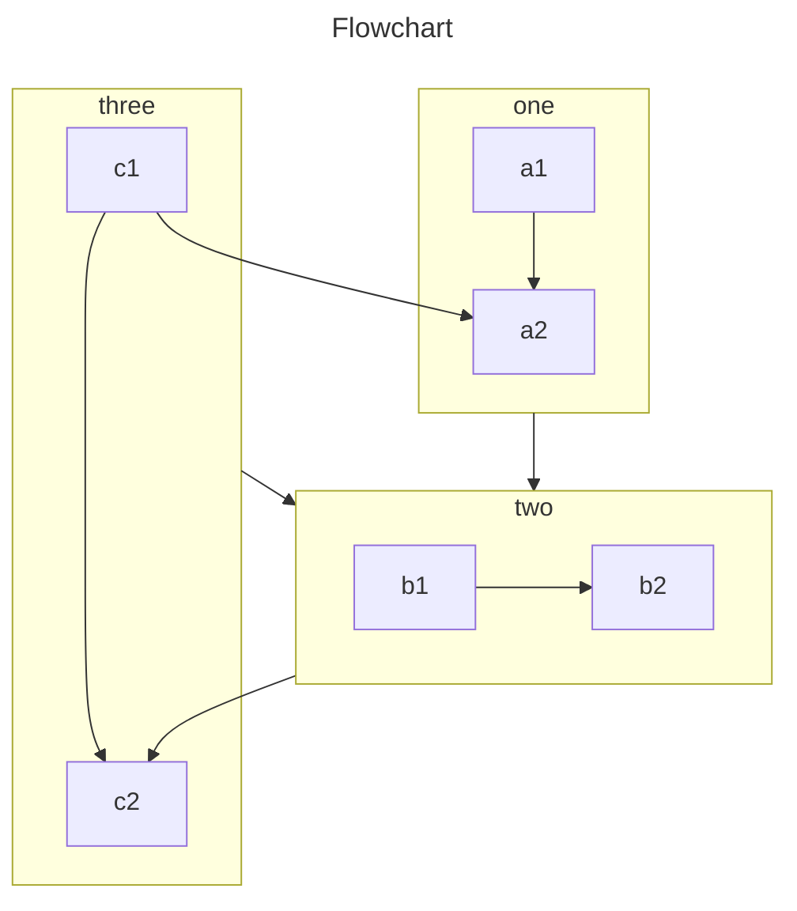

<!-- #region before -->

让你的 VuePress 站点中的 Markdown 文件支持 [mermaid](https://mermaid.js.org/)。

<!-- more -->

## 配置

在你的项目中安装 [mermaid](https://mermaid.js.org/):

::: code-tabs#shell

@tab pnpm

```bash
pnpm add -D mermaid
```

@tab yarn

```bash
yarn add -D mermaid
```

@tab npm

```bash
npm i -D mermaid
```

:::

之后启用它:

<!-- #endregion before -->

::: code-tabs#language

@tab TS

```ts {8}
// .vuepress/config.ts
import { mdEnhancePlugin } from "vuepress-plugin-md-enhance";

export default {
  plugins: [
    mdEnhancePlugin({
      // 启用 mermaid
      mermaid: true,
    }),
  ],
};
```

@tab JS

```js {8}
// .vuepress/config.js
import { mdEnhancePlugin } from "vuepress-plugin-md-enhance";

export default {
  plugins: [
    mdEnhancePlugin({
      // 启用 mermaid
      mermaid: true,
    }),
  ],
};
```

:::

<!-- #region after -->

## 语法

````md
```mermaid

<!-- 在此处放置 mermaid 代码 -->

```
````

除了使用 mermaid 代码块，你也可以直接使用以下代码块：

- class: `classDiagram`
- c4c: `C4Context`
- er: `erDiagram`
- gantt: `gantt`
- git-graph: `gitGraph`
- journey: `journey`
- mindmap: `mindmap`
- pie: `pie`
- quadrant: `quadrantChart`
- requirement: `requirementDiagram`
- sankey: `sankey-beta`
- sequence: `sequenceDiagram`
- state: `stateDiagram-v2`
- timeline: `timeline`
- xy: `xychart-beta`

你不需要再声明图表类型，也不需要缩进图表代码。

当图表支持设置标题时，你可以直接在代码块信息后添加标题:

````md
```sequence 代码标题
顺序图代码内容
...
```
````

## 使用

详见 [mermaid 官方文档](https://mermaid.js.org/)。

## 高级

你可以在客户端配置文件中导入并使用 `defineMermaidConfig` 来自定义 Mermaid 配置:

```ts
// .vuepress/client.ts
import { defineClientConfig } from "@vuepress/client";
import { defineMermaidConfig } from "vuepress-plugin-md-enhance/client";

defineMermaidConfig({
  // 在此设置 mermaid 选项
});

export default defineClientConfig({
  // ...
});
```

## 例子

::: md-demo 流程图



:::

::: md-demo 循序图

```sequence Greetings
Alice ->> Bob: Hello Bob, how are you?
Bob-->>John: How about you John?
Bob--x Alice: I am good thanks!
Bob-x John: I am good thanks!
Note right of John: Bob thinks a long<br/>long time, so long<br/>that the text does<br/>not fit on a row.

Bob-->Alice: Checking with John...
Alice->John: Yes... John, how are you?
```

:::

::: md-demo 类图

```class Animal Example
note "From Duck till Zebra"
Animal <|-- Duck
note for Duck "can fly\ncan swim\ncan dive\ncan help in debugging"
Animal <|-- Fish
Animal <|-- Zebra
Animal : +int age
Animal : +String gender
Animal: +isMammal()
Animal: +mate()
class Duck{
  +String beakColor
  +swim()
  +quack()
}
class Fish{
  -int sizeInFeet
  -canEat()
}
class Zebra{
  +bool is_wild
  +run()
}
```

:::

::: md-demo 状态图

```state Check if n is negative

state if_state <<choice>>
[*] --> IsPositive
IsPositive --> if_state
if_state --> False: if n < 0
if_state --> True : if n >= 0
```

:::

::: md-demo 关系图

```er Er Example
CAR ||--o{ NAMED-DRIVER : allows
CAR {
    string registrationNumber
    string make
    string model
}
PERSON ||--o{ NAMED-DRIVER : is
PERSON {
    string firstName
    string lastName
    int age
}
```

:::

::: md-demo 用户日记图

```journey
title My working day
section Go to work
  Make tea: 5: Me
  Go upstairs: 3: Me
  Do work: 1: Me, Cat
section Go home
  Go downstairs: 5: Me
  Sit down: 5: Me
```

:::

::: md-demo 甘特图

```gantt
dateFormat  YYYY-MM-DD
title       Adding GANTT diagram functionality to mermaid
excludes    weekends
%% (`excludes` accepts specific dates in YYYY-MM-DD format, days of the week ("sunday") or "weekends", but not the word "weekdays".)

section A section
Completed task            :done,    des1, 2014-01-06,2014-01-08
Active task               :active,  des2, 2014-01-09, 3d
Future task               :         des3, after des2, 5d
Future task2              :         des4, after des3, 5d

section Critical tasks
Completed task in the critical line :crit, done, 2014-01-06,24h
Implement parser                    :crit, done, after des1, 2d
Create tests for parser             :crit, active, 3d
Future task in critical line        :crit, 5d
Create tests for renderer           :2d
Add to mermaid                      :1d

section Documentation
Describe gantt syntax               :active, a1, after des1, 3d
Add gantt diagram to demo page      :after a1  , 20h
Add another diagram to demo page    :doc1, after a1  , 48h

section Last section
Describe gantt syntax               :after doc1, 3d
Add gantt diagram to demo page      :20h
Add another diagram to demo page    :48h
```

:::

::: md-demo 饼图

```pie
title What Voldemort doesn't have?
  "FRIENDS" : 2
  "FAMILY" : 3
  "NOSE" : 45
```

:::

::: md-demo Git 图表

```git-graph
commit
branch hotfix
checkout hotfix
commit
branch develop
checkout develop
commit id:"ash" tag:"abc"
branch featureB
checkout featureB
commit type:HIGHLIGHT
checkout main
checkout hotfix
commit type:NORMAL
checkout develop
commit type:REVERSE
checkout featureB
commit
checkout main
merge hotfix
checkout featureB
commit
checkout develop
branch featureA
commit
checkout develop
merge hotfix
checkout featureA
commit
checkout featureB
commit
checkout develop
merge featureA
branch release
checkout release
commit
checkout main
commit
checkout release
merge main
checkout develop
merge release
```

:::

::: md-demo C4C 图表

```c4c
title System Context diagram for Internet Banking System

Person(customerA, "Banking Customer A", "A customer of the bank, with personal bank accounts.")
Person(customerB, "Banking Customer B")
Person_Ext(customerC, "Banking Customer C")
System(SystemAA, "Internet Banking System", "Allows customers to view information about their bank accounts, and make payments.")

Person(customerD, "Banking Customer D", "A customer of the bank, <br/> with personal bank accounts.")

Enterprise_Boundary(b1, "BankBoundary") {

  SystemDb_Ext(SystemE, "Mainframe Banking System", "Stores all of the core banking information about customers, accounts, transactions, etc.")

  System_Boundary(b2, "BankBoundary2") {
    System(SystemA, "Banking System A")
    System(SystemB, "Banking System B", "A system of the bank, with personal bank accounts.")
  }

  System_Ext(SystemC, "E-mail system", "The internal Microsoft Exchange e-mail system.")
  SystemDb(SystemD, "Banking System D Database", "A system of the bank, with personal bank accounts.")

  Boundary(b3, "BankBoundary3", "boundary") {
    SystemQueue(SystemF, "Banking System F Queue", "A system of the bank, with personal bank accounts.")
    SystemQueue_Ext(SystemG, "Banking System G Queue", "A system of the bank, with personal bank accounts.")
  }
}

BiRel(customerA, SystemAA, "Uses")
BiRel(SystemAA, SystemE, "Uses")
Rel(SystemAA, SystemC, "Sends e-mails", "SMTP")
Rel(SystemC, customerA, "Sends e-mails to")
```

:::

::: md-demo 思维导图

```mindmap
root((VuePress))
  Out of box
    Default theme
      Navbar
      Sidebar
      Darkmode
    I18n
    Search
      Search
      DocSearch<br />by algolia
  Customize
    Theme
      (hope)
    Plugins
      (components)
      (md-enhance)
      (photo-swipe)
      (copy-code2)
      (copyright2)
      (feed2)
      (sitemap2)
      (seo2)
```

:::

::: md-demo 时间线

```timeline
title Timeline of Industrial Revolution
section 17th-20th century
    Industry 1.0 : Machinery, Water power, Steam <br>power
    Industry 2.0 : Electricity, Internal combustion engine, Mass production
    Industry 3.0 : Electronics, Computers, Automation
section 21st century
    Industry 4.0 : Internet, Robotics, Internet of Things
    Industry 5.0 : Artificial intelligence, Big data,3D printing
```

:::

::: md-demo 桑基图

```sankey
Agricultural 'waste',Bio-conversion,124.729
Bio-conversion,Liquid,0.597
Bio-conversion,Losses,26.862
Bio-conversion,Solid,280.322
Bio-conversion,Gas,81.144
Biofuel imports,Liquid,35
Biomass imports,Solid,35
Coal imports,Coal,11.606
Coal reserves,Coal,63.965
Coal,Solid,75.571
District heating,Industry,10.639
District heating,Heating and cooling - commercial,22.505
District heating,Heating and cooling - homes,46.184
Electricity grid,Over generation / exports,104.453
Electricity grid,Heating and cooling - homes,113.726
Electricity grid,H2 conversion,27.14
Electricity grid,Industry,342.165
Electricity grid,Road transport,37.797
Electricity grid,Agriculture,4.412
Electricity grid,Heating and cooling - commercial,40.858
Electricity grid,Losses,56.691
Electricity grid,Rail transport,7.863
Electricity grid,Lighting & appliances - commercial,90.008
Electricity grid,Lighting & appliances - homes,93.494
Gas imports,Ngas,40.719
Gas reserves,Ngas,82.233
Gas,Heating and cooling - commercial,0.129
Gas,Losses,1.401
Gas,Thermal generation,151.891
Gas,Agriculture,2.096
Gas,Industry,48.58
Geothermal,Electricity grid,7.013
H2 conversion,H2,20.897
H2 conversion,Losses,6.242
H2,Road transport,20.897
Hydro,Electricity grid,6.995
Liquid,Industry,121.066
Liquid,International shipping,128.69
Liquid,Road transport,135.835
Liquid,Domestic aviation,14.458
Liquid,International aviation,206.267
Liquid,Agriculture,3.64
Liquid,National navigation,33.218
Liquid,Rail transport,4.413
Marine algae,Bio-conversion,4.375
Ngas,Gas,122.952
Nuclear,Thermal generation,839.978
Oil imports,Oil,504.287
Oil reserves,Oil,107.703
Oil,Liquid,611.99
Other waste,Solid,56.587
Other waste,Bio-conversion,77.81
Pumped heat,Heating and cooling - homes,193.026
Pumped heat,Heating and cooling - commercial,70.672
Solar PV,Electricity grid,59.901
Solar Thermal,Heating and cooling - homes,19.263
Solar,Solar Thermal,19.263
Solar,Solar PV,59.901
Solid,Agriculture,0.882
Solid,Thermal generation,400.12
Solid,Industry,46.477
Thermal generation,Electricity grid,525.531
Thermal generation,Losses,787.129
Thermal generation,District heating,79.329
Tidal,Electricity grid,9.452
UK land based bioenergy,Bio-conversion,182.01
Wave,Electricity grid,19.013
Wind,Electricity grid,289.366
```

:::

::: md-demo 依赖图

```requirement
requirement test_req {
id: 1
text: the test text.
risk: high
verifymethod: test
}

element test_entity {
type: simulation
}

test_entity - satisfies -> test_req
```

:::

::: md-demo 象限图

```quadrant
title Reach and engagement of campaigns
x-axis Low Reach --> High Reach
y-axis Low Engagement --> High Engagement
quadrant-1 We should expand
quadrant-2 Need to promote
quadrant-3 Re-evaluate
quadrant-4 May be improved
Campaign A: [0.3, 0.6]
Campaign B: [0.45, 0.23]
Campaign C: [0.57, 0.69]
Campaign D: [0.78, 0.34]
Campaign E: [0.40, 0.34]
Campaign F: [0.35, 0.78]
```

:::

::: md-demo XY 图

```xy
title "Sales Revenue"
x-axis [jan, feb, mar, apr, may, jun, jul, aug, sep, oct, nov, dec]
y-axis "Revenue (in $)" 4000 --> 11000
bar [5000, 6000, 7500, 8200, 9500, 10500, 11000, 10200, 9200, 8500, 7000, 6000]
line [5000, 6000, 7500, 8200, 9500, 10500, 11000, 10200, 9200, 8500, 7000, 6000]
```

:::

::: md-demo 一个复杂的案例


:::

<!-- #endregion after -->
