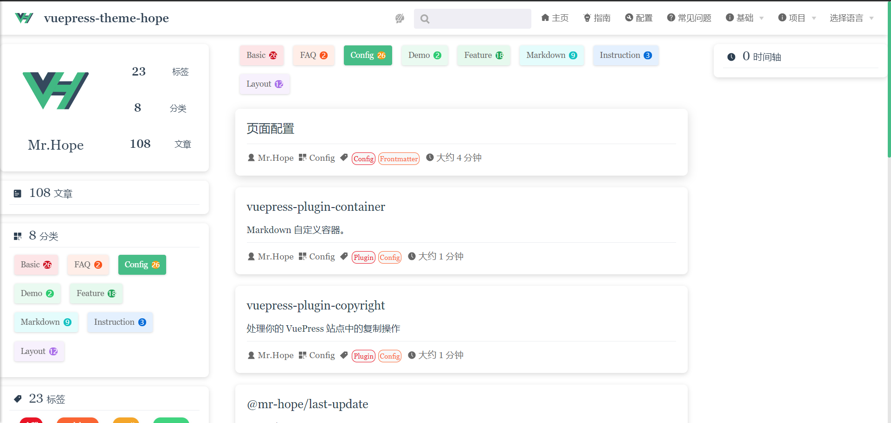

# Blog related

The theme enables some blogging features by configuring `@vuepress/plugin-blog`. Of course you can configure `themeConfig.blog` to `false` to disable all blog functions.

## Category

Just add `category: <category name>` to the Front Matter of the page, and the article will be automatically rendered in the list of category pages with url `/category/`.

Please note that only one category can be set for an article.

## Tags

Just add `tags: <category name>` to the Front Matter of the page, and the article will be automatically listed in the list on the `/tag/` tag page.

`tags` accepts `string | string []`, which means that an article can contain multiple tags.

## Article

All articles will be added to the article list by default and rendered under path `/article/` .

If you don't want the list to contain specific articles, just set `article` to`false` in the corresponding article's Front Matter.

## timeline

All articles with a writing date will be sorted by time in the `/timeline/` timeline,

If you don't want an article to be included, just set `timeline` to `false` in the corresponding article's Frontmatter.

::: warning
Do not add and place the corresponding folders ("tag", "article", "timeline") in the root directory, otherwise the files may be overwritten during compilation and cause errors.

If you do need an "articles" folder, consider using "articles".
:::
