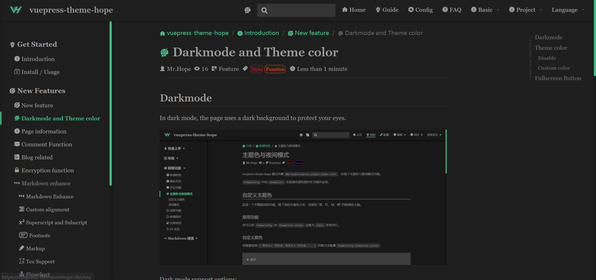

# Darkmode

In dark mode, the page uses a black background to protect your eyes.

Dark mode support options:

- `'auto-switch'`: "off | automatic | on" three-stage switch (default)
- `'switch'`: "Close | Open" toggle switch
- `'auto'`: Automatically decide whether to apply dark mode based on user device's color-scheme or current time
- `'disable'`: disable dark mode
