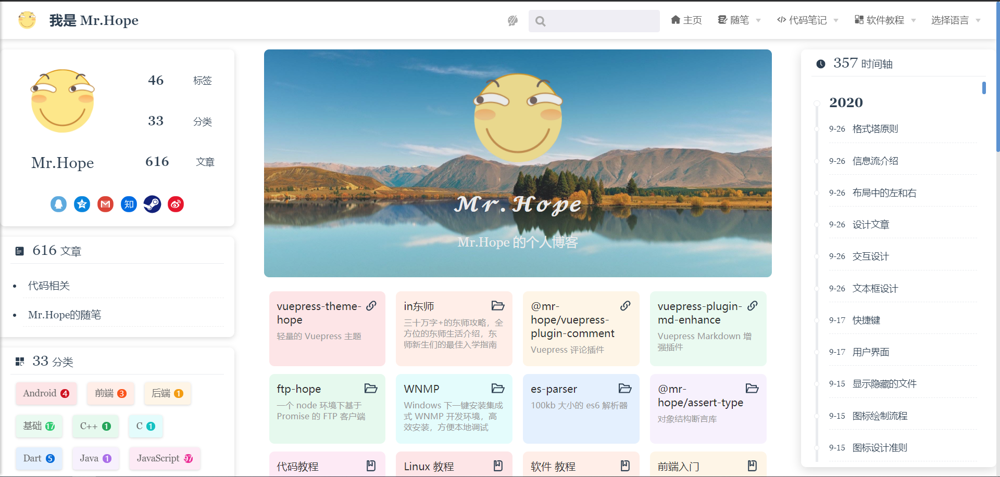

# Blog homepage

vuepress-theme-hope allows you to enable a blog-style homepage.

You need to set `blog` to `true` in the Front Matter of the corresponding page to enable blog style.

## Configurable items

You can freely configure the blogger's avatar and blogger's name in the upper left. Their configuration items are `themeConfig.blog.avatar` and `themeConfig.blog.name`. If you do not fill them in, they will automatically fall back to the site Logo (`themeConfig.logo`) and the site name (`themeConfig.name`).

If you use `themeConfig.intro` to configure the address of the personal introduction page, click on the blogger ’s profile picture and blogger ’s name in the upper left corner, and it will automatically jump to the link you provided.

You can also configure your social media links in the format of `social media name: social media links` in the object `themeConfig.blog.links`.

::: tip Available social media:

- `'Baidu'`
- `'Dingding'`
- `'Dribbble'`
- `'Evernote'`
- `'Facebook'`
- `'Flipboard'`
- `'Github'`
- `'Gmail'`
- `'Instagram'`
- `'Line'`
- `'Linkedin'`
- `'Pinterest'`
- `'Pocket'`
- `'QQ'`
- `'Qzone'`
- `'Rss'`
- `'Steam'`
- `'Taobao'`
- `'Twitter'`
- `'Wechat'`
- `'Weibo'`
- `'Whatsapp'`
- `'Youtube'`
- `'Zhihu'`

:::

If you are not satisfied with the prompt text on the top of the timeline page, you can use `themeConfig.blog.timeline` to customize one.

## available parameters in Front Matter

### hero

- Type: `boolean`
- Default: `true`

Whether to display the icon and description of the home page. For the icons and description settings of the homepage, please see the default homepage.

### bgImage

- Type: `string`

For the address of the background picture, you must fill in the absolute path. If not filled in, a default landscape picture will be automatically applied.

### bgImageStyle

- Type: `Record <string, string>`

The CSS style of the background image.

### heroImageStyle

- Type: `Record <string, string>`

CSS style for home icon
