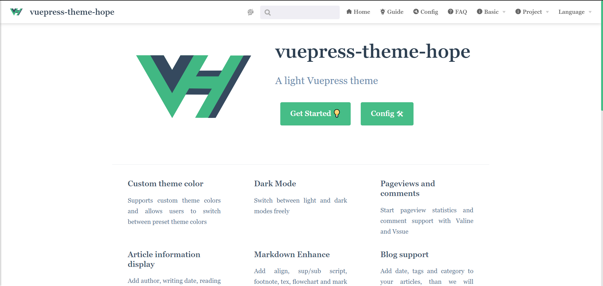

# Home Page

vuepress-theme-hope improves the default home page.

If you want to use it, set `home: true` in page Front Matter. Any extra content after the `YAML front matter` will be parsed as normal Markdown and rendered after the features section.



## Item style

The Front Matter parameters that can be configured are as follows:

### home

- Type: `boolean`

Enable homepage style when set to `true`

### title

- Type: `string | false`
- Default: `'Hello'`

Title, won't display if it is set to `false`

### heroImage

- Type: `string`

Home hero (logo) image address, need to fill in the absolute path (pictures need to be placed in the `.vuepress/public` folder)

### darkHeroImage

- 类型: `string`

Darkmode Home hero (logo) image address, need to fill in the absolute path (pictures need to be placed in the `.vuepress/public` folder), will be the same as `heroImage` by default.

### heroText

- Type: `string`

Home icon alt text

### tagline

- Type: `string`
- Default: `'Welcome to your VuePress site'`

Append text

### action

- Type: `ActionConfig | ActionConfig[]`

`ActionConfig` structure:

- text: Button text
- link: Button link

### features

- Type: `Feature[]`

Structure of `Feature`:

- title: `string` title
- details: `string` details
- link (optional): `string` link address

Feature description

## Demo

```yaml
---
home: true
icon: homefill
title: vuepress-theme-hope
heroImage: /logo.svg
heroText: vuepress-theme-hope
tagline: A light Vuepress theme
action:
  - text: Get Started 💡
    link: /en/guide/

  - text: Config 🛠
    link: /en/config/

features:
  - title: Custom theme color
    details: Supports custom theme colors and allows users to switch between preset theme colors
    link: /en/guide/feature/themecolor/

  - title: Dark Mode
    details: Switch between light and dark modes freely
    link: /en/guide/feature/darkmode/

  - title: Pageviews and comments
    details: Start pageview statistics and comment support with Valine and Vssue
    link: /en/guide/feature/comment/

  - title: Article information display
    details: Add author, writing date, reading time, word count and other information to your article
    link: /en/guide/feature/page-info/

  - title: Markdown Enhance
    details: Add align, sup/sub script, footnote, tex, flowchart and mark support in markdown
    link: /en/guide/feature/markdown/

  - title: Blog support
    details: Add date, tags and category to your articles, than we will generate article, tag, category and timeline list for you
    link: /en/guide/feature/blog/

  - title: Article Encryption
    details: Encrypt you article based on path and folders, so that only the one you want could see them
    link: /en/guide/feature/blog/

  - title: More new features
    details: Including icon support, path navigation, footer support, fullscreen button, blog homepage, etc.
    link: /en/guide/feature/

  - title: PWA support
    details: The built-in PWA plugin will make your website more like an APP.
    link: /en/config/plugin/pwa/

  - title: TS support
    details: Turn on Typescript support for your Vuepress
    link: /en/guide/feature/typescript/

footer: MIT Licensed | Copyright © 2019-present Mr.Hope
copyright: false
---

```
