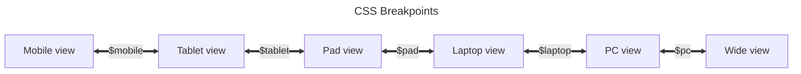

## Adding Markdown Extensions

You can use `extendsMarkdown` hook in [config file](../cookbook/vuepress/config.md#config-file) to add Markdown extensions:

::: code-tabs#language

@tab TS

```ts title=".vuepress/config.ts"
import { defineUserConfig } from "vuepress";

export default defineUserConfig({
  // site config
  // ...

  extendsMarkdown: (md) => {
    md.use(yourExtension, options);
  },
});
```

@tab JS

```js title=".vuepress/config.js"
import { defineUserConfig } from "vuepress";

export default defineUserConfig({
  // site config
  // ...

  extendsMarkdown: (md) => {
    md.use(yourExtension, options);
  },
});
```

:::

## Foldable Sidebar / TOC on Mobile / Left Sidebar on PC

To better adapt to different sizes of devices, the theme uses [responsive layout](../guide/interface/responsive.md) to adjust the layout according to the screen width.

Since the layout is pre-rendered, all sizes of screens share the same DOM structure. To correctly render FCP and for better performance, different size layouts are almost entirely rendered by CSS rather than controlling by scripts. We implement several sets of CSS to display different layouts with same DOM structure. This means that you cannot customize these layouts or adjust their order.

The only thing you can configure is the CSS breakpoint. The default breakpoints are as follows:



You can customize these breakpoints with [style config file](../config/style.md#configscss).

For example:

- If you don't like the wide layout, you can set the `$pc` breakpoint to a very large value:

  ```scss title=".vuepress/config.scss"
  $pc: 9999px;
  ```

- If you don't want the Pad layout, you can overlap the `$tablet` breakpoint and the `$pad` breakpoint:

  ```scss title=".vuepress/config.scss"
  $tablet: 959px;
  ```

Of course, if you are expect enough, you can achieve the layout you want by overriding the theme's CSS styles. This may be difficult, but it is technically feasible.

## Display h4 or deeper level titles

By default, VuePress only extracts h2 and h3 titles from Markdown, so you will never see h4 titles by configuring the theme alone.

You need to configure [markdown.headers.levels](https://vuejs.press/reference/config/#markdown-headers) in the VuePress configuration file:

```ts title=".vuepress/config.ts"
export default {
  markdown: {
    headers: {
      // extract levels you need
      levels: [2, 3, 4, 5, 6],
    },
  },

  // other config
  // ...
};
```

After extracting deeper level titles above, you can display more titles by increasing the value of `headerDepth` in [theme config](../config/theme/layout.md#headerdepth) or [page Frontmatter](../config/frontmatter/layout.md#headerdepth).

## Adjust content width

If you are not satisfied with the default content width, you can adjust the content width by setting the `$content-width` variable in the [palette file](../config/style.md#layout-config).

::: warning Narrow content width

If you feel that the content width is very narrow, this is probably your personal aesthetic problem, because vuepress-theme-hope follows the best layout design practices. For related discussions and solutions to make the content fill the screen, see [this discussion](https://github.com/orgs/vuepress-theme-hope/discussions/3742).

:::
