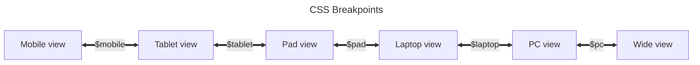

## Adding Markdown Extensions

You can use `extendsMarkdown` hook in [config file](../cookbook/vuepress/config.md#config-file) to add Markdown extensions:

```ts {7-9} title=".vuepress/config.ts"
import { defineUserConfig } from "vuepress";

export default defineUserConfig({
  // site config
  // ...

  extendsMarkdown: (md) => {
    md.use(yourMdItPlugin, options);
  },
});
```

## Foldable Sidebar / TOC on Mobile / Left Sidebar on PC

To better adapt to different sizes of devices, the theme uses [responsive layout](../guide/interface/responsive.md) to adjust the layout according to the screen width.

Since the layout is pre-rendered, all sizes of screens share the same DOM structure. To correctly render FCP and for better performance, different size layouts are almost entirely rendered by CSS rather than controlling by scripts. We implement several sets of CSS to display different layouts with same DOM structure. This means that you cannot customize these layouts or adjust their order.

The only thing you can configure is the CSS breakpoint. The default breakpoints are as follows:



You can customize these breakpoints with [style config file](../config/style.md#configscss).

For example:

- If you don't like the wide layout, you can set the `$pc` breakpoint to a very large value:

  ```scss title=".vuepress/config.scss"
  $pc: 9999px;
  ```

- If you don't want the Pad layout, you can overlap the `$tablet` breakpoint and the `$pad` breakpoint:

  ```scss title=".vuepress/config.scss"
  $tablet: 959px;
  ```

Of course, if you are expect enough, you can achieve the layout you want by overriding the theme's CSS styles. This may be difficult, but it is technically feasible.

## Adjust content width

If you are not satisfied with the default content width, you can adjust the content width by setting the `$content-width` variable in the [palette file](../config/style.md#layout-config).

::: warning Narrow content width

If you feel that the content width is very narrow, this is probably your personal aesthetic problem, because vuepress-theme-hope follows the best layout design practices. For related discussions and solutions to make the content fill the screen, see [this discussion](https://github.com/orgs/vuepress-theme-hope/discussions/3742).

:::

## Links in Config

The bundler needs to know the path of the assets to be bundled, so only contents that can be statically analyzed can be bundled. This means that:

- In Markdown: Only relative page links and images links are supported
- In html (including vue template): Only relative links are supported, including `src` attribute of `img` and `video` tag
- In style files (css, scss): Some kinds of assets, including background image urls, font files, etc.
- In script files: Links in `import` statements or `import()` expressions

But for all kinds of configuration in VuePress, including [frontmatter](../cookbook/vuepress/page.md#frontmatter), [vuepress config file](../cookbook/vuepress/config.md) as well as theme options and plugin options, VuePress parse them as data, so they can not be statically analyzed by bundlers. This means any links will be kept as is, so you must make it resolvable.

Most link will accept the following values:

- A full link: can be accessed directly, like `https://example.com/example.jpg`
- A route link: will be resolved from the root of the site, like `/foo/example.jpg`.

  Pathname of route link will be different with different base path, e.g.: `/foo/example.jpg` for base `/` and `/bar/foo/example.jpg` for base `/bar/`

Only a few options keep the input unchanged, which means that the input starting with `/` will not automatically add the base path. These options will have a warning in the document, such as the `head` option in the [VuePress configuration file](../cookbook/vuepress/config.md#config-file).
