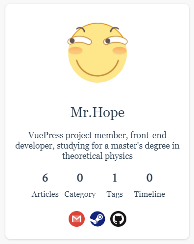

Themes allow you to display basic information about the blogger.

<!-- more -->



## Avatar and blogger name

You can config blogger avatar and name displayed through `blog.avatar` and `blog.name`.

::: note

If you don't set those options, they automatically fall back to the site logo (`themeConfig.logo`) and site name (`themeConfig.name`).

:::

::: tip

If you want the avatar to be clipped with round shape, set `blog.roundAvatar: true`.

:::

## Motto, Social Media & Profile Link

You can use `blog.description` to set your own introduction, motto or slogan.

You can also specify a personal introduction page link through `blog.intro`, so when users click on the avatar and name, they will be direct to that page.

You can also config your social media links with `blog.medias` option.

- If the social media icon is available below, you can set `MediaName: MediaLink` directly.
- Otherwise, you should pass in a tuple `MediaName: [MediaLink , MediaIconSvgString or MediaIconPath]`,

::: tip Available social media:

- `"Baidu"`
- `"Bitbucket"`
- `"Dingding"`
- `"Discord"`
- `"Dribbble"`
- `"Email"`
- `"Evernote"`
- `"Facebook"`
- `"Flipboard"`
- `"Gitee"`
- `"GitHub"`
- `"Gitlab"`
- `"Gmail"`
- `"Instagram"`
- `"Line"`
- `"Linkedin"`
- `"Pinterest"`
- `"Pocket"`
- `"QQ"`
- `"Qzone"`
- `"Reddit"`
- `"Rss"`
- `"Steam"`
- `"Twitter"`
- `"Wechat"`
- `"Weibo"`
- `"Whatsapp"`
- `"Youtube"`
- `"Zhihu"`

:::

::::: details Example

:::: code-group

::: code-group-item TS

```ts {2,4,6}
// .vuepress/config.ts
import { path } from "@vuepress/utils";
import { defineHopeConfig } from "vuepress-theme-hope";

export default defineHopeConfig({
  themeConfig: {
    blog: {
      media: {
        // GitHub Icon is available
        GitHub: "https://github.com/Mister-Hope",
        // A custom Media called "MediaX" (just an example)
        MediaX: [
          // link
          "https://mediax.com/UserX/",
          // icon string
          "<svg ....</svg>",
        ],
        // A custom Media called "MediaY" (just an example)
        MediaY: [
          // link
          "https://mediay.com/UserY/",
          // icon path
          path.resolve(__dirname, "icons/mediay.svg"),
        ],
      },
    },
  },
});
```

:::

::: code-group-item JS

```js {2,4,6}
// .vuepress/config.js
const { path } = require("@vuepress/utils");
const { defineHopeConfig } = require("vuepress-theme-hope");

module.exports = defineHopeConfig({
  themeConfig: {
    blog: {
      media: {
        // GitHub Icon is available
        GitHub: "https://github.com/Mister-Hope",
        // A custom Media called "MediaX" (just an example)
        MediaX: [
          // link
          "https://mediax.com/UserX/",
          // icon string
          "<svg ....</svg>",
        ],
        // A custom Media called "MediaY" (just an example)
        MediaY: [
          // link
          "https://mediay.com/UserY/",
          // icon path
          path.resolve(__dirname, "icons/mediay.svg"),
        ],
      },
    },
  },
});
```

:::

::::

:::::
