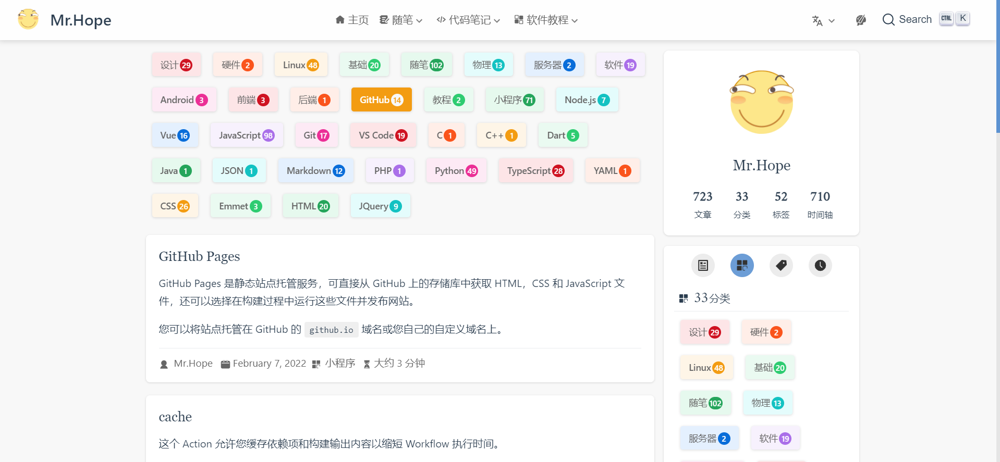
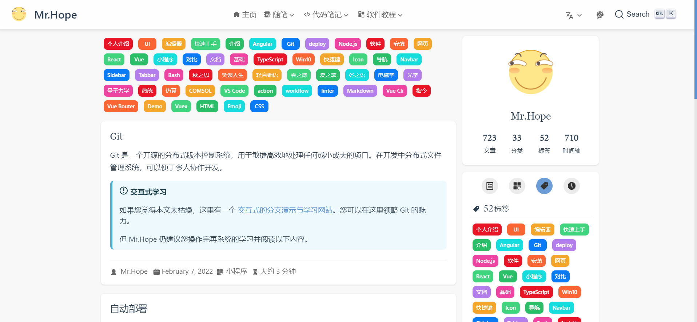
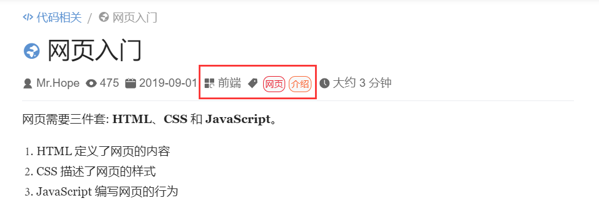
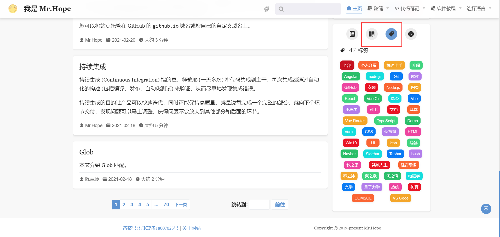

You can configure category and tags for articles through frontmatter to make them appear in specific categories and tags pages.

<!-- more -->

## Category Settings

Just add `category: <category name>` to the frontmatter of the page, and the article will be automatically rendered in the list of the `/category/<category name>/` category page.

For example, add this to a certain page:

```md
---
category: HTML
---

Page content...
```

Then you can find it under the `/category/HTML` page.

::: info Example



- [Link](https://mrhope.site/category/JavaScript/)

:::

::: warning

Please note that only one category can be set for an article. (V2 plan supports multiple categories of articles)

:::

## Tags

Just add the `tags` array to the frontmatter of the page, and set the tag to which one or more articles belong, and the article will be automatically rendered in the list of the `/tag/<tag name>/` tag page.

For example, add this in a certain page:

```md
---
tags:
  - HTML
  - Web
---

Page content...
```

Then you can find it under the `/tag/HTML` and `/tag/Web` pages.

::: info Example



- [Link](https://mrhope.site/tag/Vuex/)

:::

## View list

Besides directly accessing the corresponding link, the category and tag name will be displayed at the article information at the top of the article. You can click on it to navigate to the corresponding list to view the articles of the same category or tag.



You can also select the category or tag tab in the sidebar of the blog homepage and select the corresponding item to enter the list.


