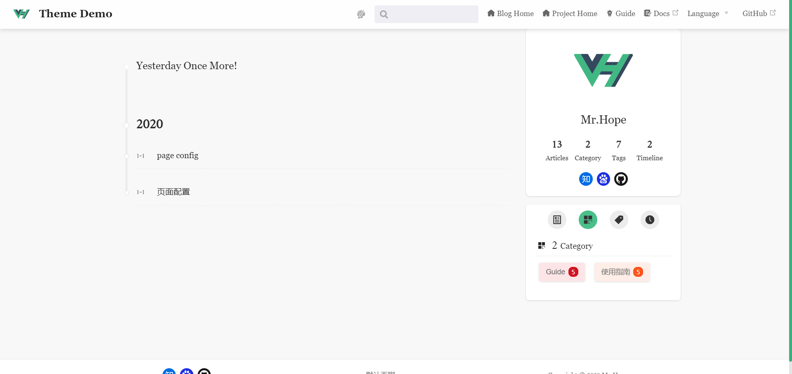
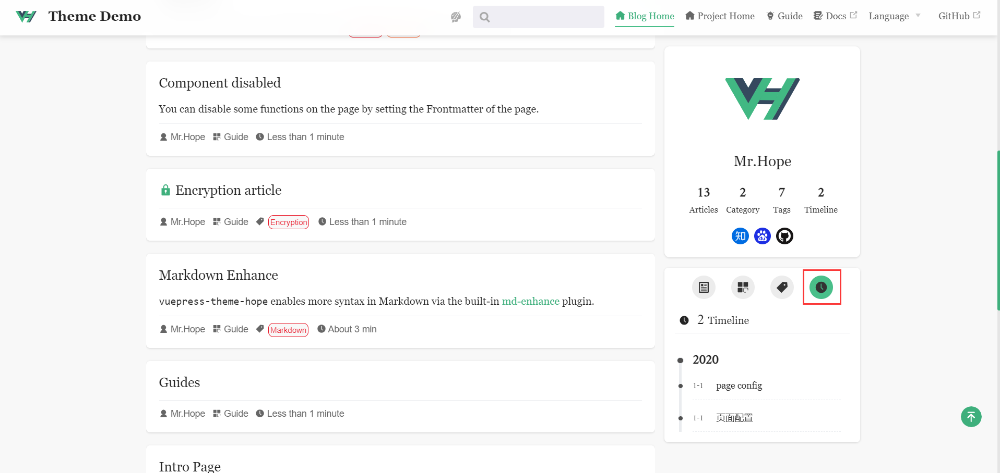

You can access the time page through `/timeline/`. On the page, you can view all the articles in time reverse order.

## Excluding Articles

By default, all articles which has a writing date will be displayed in timeline. If you don't want an article to be included, just set the `timeline` to `false` in the frontmatter of the article.

## Set Timeline title

We allow you to customize the top text of the timeline, you can configure it through `blog.timeline` in theme options.

## Sidebar

We have added a timeline tab in the sidebar of blog-related pages for users to quickly preview the timeline.

