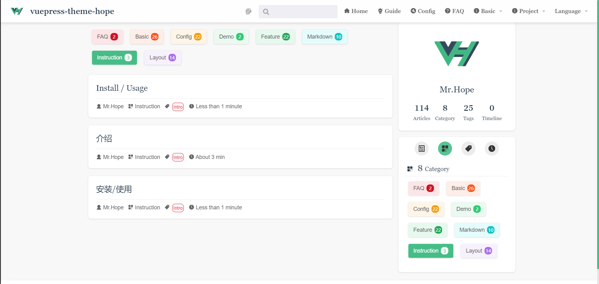

# Blog related

The theme enables some blogging features by configuring `@vuepress/plugin-blog`. Also you can set `themeConfig.blog` to `false` to disable all blog features.

## Category

Just add `category: <category name>` to the Front Matter of the page, and the article will be automatically rendered in the list of category pages with url `/category/`.

Please note that only one category can be set per article.

## Tags

Just add `tags: <tag name>` to the Front Matter of the page, and the article will be automatically listed in the list on the `/tag/` tag page.

`tags` accepts `string | string []`, which means that an article can contain multiple tags.

## Article

All articles will be added to the article list by default and rendered under path `/article/` .

If you don't want specific articles to be included, just set `article` to `false` in the article's Front Matter.

## timeline

All articles with a writing date will be sorted by time in the timeline page `/timeline/`.

If you don't want an article to be included, just set `timeline` to `false` in the article's Frontmatter.

::: warning
Do not add and place the corresponding folders ("tag", "article", "timeline") in the root directory, otherwise the files may be overwritten during compilation and cause errors.

If you do need an "articles" folder, consider using "articles".
:::

## Copyright Information

Sometimes, you may not want some of your articles to be copied by others, or you want others to automatically generate a piece of copyright information to the clipboard when copying.

You can configure this content on the page. Setting `noCopy: true` in Front Matter will disable copying of this page, and setting `noSelect: true` will disable the selection of this page.

You can also use `minLength` to set the minimum number of characters to trigger copying or append copyright information. The default is `100`.
