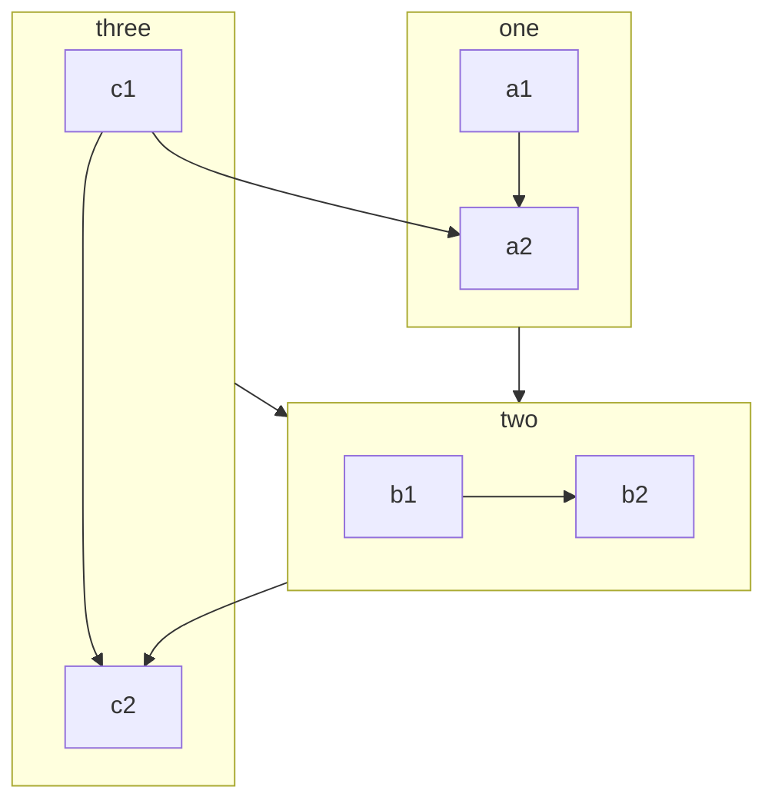

Every document page in VuePress is rendered by Markdown.

You need to build your document or blog page by creating and writing Markdown in the corresponding path.

<!-- more -->

## Markdown introduction

If you are a new learner and don’t know how to write Markdown, please read [Markdown Intro](../../cookbook/markdown/README.md) and [Markdown Demo](../../cookbook/markdown/demo.md).

::: info Frontmatter

Frontmatter is a important concept in VuePress. If you don’t know it, you need to read [Frontmatter Introduction](../../cookbook/vuepress/page.md#front-matter).

:::

## VuePress enhance

To enrich document writing, VuePress has extended Markdown syntax.

For these extensions, please read [Markdown extensions in VuePress](../../cookbook/vuepress/markdown.md).

## Theme enhance

### CodeGroup

:::: code-group

::: code-group-item yarn

```bash
yarn add -D vuepress-theme-hope
```

:::

::: code-group-item npm:active

```bash
npm i -D vuepress-theme-hope
```

:::

::::

- [View Detail](../markdown/code-group.md)

### Superscript and Subscript

19^th^ H~2~O

- [View Detail](../markdown/sup-sub.md)

### Align

::: center

I am center

:::

::: right

I am right align

:::

- [View Detail](../markdown/align.md)

### Footnote

This text has footnote[^first].

[^first]: This is footnote content

- [View Detail](../markdown/footnote.md)

### Mark

You can mark ==important words== .

- [View Detail](../markdown/mark.md)

### Tasklist

- [x] Plan A
- [ ] Plan B

- [View Detail](../markdown/tasklist.md)

### Chart

::: chart A Scatter Chart

```json
{
  "type": "scatter",
  "data": {
    "datasets": [
      {
        "label": "Scatter Dataset",
        "data": [
          { "x": -10, "y": 0 },
          { "x": 0, "y": 10 },
          { "x": 10, "y": 5 },
          { "x": 0.5, "y": 5.5 }
        ],
        "backgroundColor": "rgb(255, 99, 132)"
      }
    ]
  },
  "options": {
    "scales": {
      "x": {
        "type": "linear",
        "position": "bottom"
      }
    }
  }
}
```

:::

- [View Detail](../markdown/chart.md)

### Flowchart

```flow
cond=>condition: Process?
process=>operation: Process
e=>end: End

cond(yes)->process->e
cond(no)->e
```

- [View Detail](../markdown/flowchart.md)

### Mermaid



- [View Detail](../markdown/mermaid.md)

### Tex

$$
\frac {\partial^r} {\partial \omega^r} \left(\frac {y^{\omega}} {\omega}\right)
= \left(\frac {y^{\omega}} {\omega}\right) \left\{(\log y)^r + \sum_{i=1}^r \frac {(-1)^i r \cdots (r-i+1) (\log y)^{r-i}} {\omega^i} \right\}
$$

- [View Detail](../markdown/tex.md)

### Code Demo

::: demo A normal demo

```html
<h1>VuePress Theme Hope</h1>
<p>Is <span id="very">very</span> powerful!</p>
```

```js
document.querySelector("#very").addEventListener("click", () => {
  alert("Very powerful!");
});
```

```css
span {
  color: red;
}
```

:::

- [View Detail](../markdown/demo.md)

### Presentation

@slidestart

## Slide 1

A paragraph with some text and a [link](https://mrhope.site)

---

## Slide 2

- Item 1
- Item 2

---

## Slide 3.1

```js
const a = 1;
```

--

## Slide 3.2

$$
J(\theta_0,\theta_1) = \sum_{i=0}
$$

@slideend

- [View Detail](../markdown/presentation.md)
