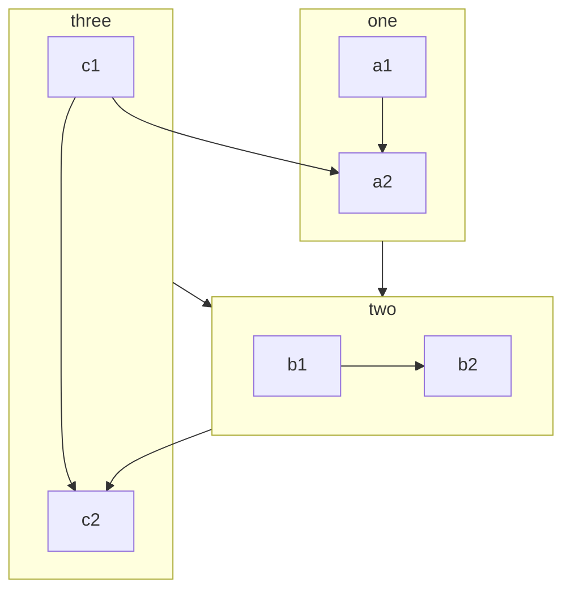

VuePress basically generate pages from Markdown files. So you can use it to generate documentation or blog sites easily.

You should create and write Markdown files, so that VuePress can convert them to different pages according to file structure.

<!-- more -->

## Markdown Introduction

If you are a new comer and don’t know how to write Markdown, please read [Markdown Intro](../../cookbook/markdown/README.md) and [Markdown Demo](../../cookbook/markdown/demo.md).

## Markdown Config

VuePress introduce configuration for each Markdown page using Frontmatter.

::: info

Frontmatter is a important concept in VuePress. If you don’t know it, you need to read [Frontmatter Introduction](../../cookbook/vuepress/page.md#frontmatter).

:::

## Markdown Extension

The Markdown content in VuePress will be parsed by [markdown-it](https://github.com/markdown-it/markdown-it), which supports [syntax extensions](https://github.com/markdown-it/markdown-it#syntax-extensions) via markdown-it plugins.

### VuePress Enhancement

To enrich document content, VuePress extends standard Markdown syntax.

For these extended syntax, please see [Built-in Markdown Features](../../cookbook/vuepress/markdown.md).

### Theme Enhancement

By using [`vuepress-plugin-md-enhance`][md-enhance], the theme extends more Markdown syntax and provides richer writing functions.

#### Custom Container

::: v-pre

Safely use {{ variable }} in Markdown.

:::

::: info Custom Title

A custom information container with `code`, [link](#custom-container).

```js
const a = 1;
```

:::

::: tip Custom Title

A custom tip container

:::

::: warning Custom Title

A custom warning container

:::

::: danger Custom Title

A custom danger container

:::

::: details Custom Title

A custom details container

:::

:::: details Code

```md
::: v-pre

Safely use {{ variable }} in Markdown.

:::

::: info Custom Title

A custom information container

:::

::: tip Custom Title

A custom tip container

:::

::: warning Custom Title

A custom warning container

:::

::: danger Custom Title

A custom danger container

:::

::: details Custom Title

A custom details container

:::
```

::::

- [View Detail](../markdown/container.md)

#### Tabs

::: tabs#fruit

@tab apple

Apple

@tab banana

Banana

@tab orange

Orange

:::

- [View Detail](../markdown/tabs.md)

#### Code Tabs

::: code-tabs

@tab yarn

```bash
yarn add -D vuepress-theme-hope
```

@tab:active npm

```bash
npm i -D vuepress-theme-hope
```

:::

- [View Detail](../markdown/code-tabs.md)

#### Superscript and Subscript

19^th^ H~2~O

- [View Detail](../markdown/sup-sub.md)

#### Align

::: center

I am center

:::

::: right

I am right align

:::

- [View Detail](../markdown/align.md)

#### Attrs

A **word**{#word} having id.

- [View Detail](../markdown/attrs.md)

#### Footnote

This text has footnote[^first].

[^first]: This is footnote content

- [View Detail](../markdown/footnote.md)

#### Mark

You can mark ==important words== .

- [View Detail](../markdown/mark.md)

#### Tasklist

- [x] Plan A
- [ ] Plan B

- [View Detail](../markdown/tasklist.md)

#### Image Enhancement

Support setting color scheme and size

- [View Detail](../markdown/image.md)

#### Chart

::: chart A Scatter Chart

```json
{
  "type": "scatter",
  "data": {
    "datasets": [
      {
        "label": "Scatter Dataset",
        "data": [
          { "x": -10, "y": 0 },
          { "x": 0, "y": 10 },
          { "x": 10, "y": 5 },
          { "x": 0.5, "y": 5.5 }
        ],
        "backgroundColor": "rgb(255, 99, 132)"
      }
    ]
  },
  "options": {
    "scales": {
      "x": {
        "type": "linear",
        "position": "bottom"
      }
    }
  }
}
```

:::

- [View Detail](../markdown/chart.md)

#### Echarts

::: echarts A line chart

```json
{
  "xAxis": {
    "type": "category",
    "data": ["Mon", "Tue", "Wed", "Thu", "Fri", "Sat", "Sun"]
  },
  "yAxis": {
    "type": "value"
  },
  "series": [
    {
      "data": [150, 230, 224, 218, 135, 147, 260],
      "type": "line"
    }
  ]
}
```

:::

- [View Detail](../markdown/echarts.md)

#### Flowchart

```flow
cond=>condition: Process?
process=>operation: Process
e=>end: End

cond(yes)->process->e
cond(no)->e
```

- [View Detail](../markdown/flowchart.md)

#### Mermaid



- [View Detail](../markdown/mermaid.md)

#### Tex

$$
\frac {\partial^r} {\partial \omega^r} \left(\frac {y^{\omega}} {\omega}\right)
= \left(\frac {y^{\omega}} {\omega}\right) \left\{(\log y)^r + \sum_{i=1}^r \frac {(-1)^i r \cdots (r-i+1) (\log y)^{r-i}} {\omega^i} \right\}
$$

- [View Detail](../markdown/tex.md)

#### Include files

@include(../markdown/demo.snippet.md{5-9})

- [View Detail](../markdown/include.md)

#### Code Demo

::: normal-demo A normal demo

```html
<h1>VuePress Theme Hope</h1>
<p>Is <span id="very">very</span> powerful!</p>
```

```js
document.querySelector("#very").addEventListener("click", () => {
  alert("Very powerful!");
});
```

```css
span {
  color: red;
}
```

:::

- [View Detail](../markdown/demo.md)

#### Stylize

Donate Mr.Hope a cup of coffee. _Recommended_

- [View Detail](../markdown/stylize.md)

#### Playground

::: playground#ts TS demo

@file index.ts

```ts
const msg = "hello world";

const speak = (msg: string) => console.log(msg);

speak(msg);
```

:::

- [View Detail](../markdown/playground.md)

#### Vue Playground

::: vue-playground Vue Playground

@file App.vue

```vue
<script setup>
import { ref } from "vue";

const msg = ref("Hello World!");
</script>

<template>
  <h1>{{ msg }}</h1>
  <input v-model="msg" />
</template>
```

:::

- [View Detail](../markdown/vue-playground.md)

#### Presentation

@slidestart

## Slide 1

A paragraph with some text and a [link](https://mrhope.site)

---

## Slide 2

- Item 1
- Item 2

---

## Slide 3.1

```js
const a = 1;
```

--

## Slide 3.2

$$
J(\theta_0,\theta_1) = \sum_{i=0}
$$

@slideend

- [View Detail](../markdown/presentation.md)

[md-enhance]: https://vuepress-theme-hope.github.io/v2/md-enhance/
