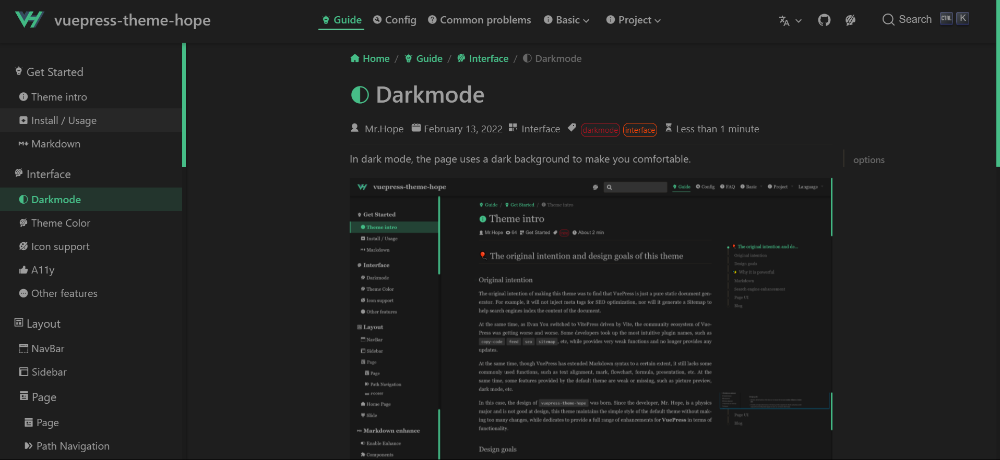

In dark mode, the page uses a dark background to make you comfortable.

<!-- more -->

## options

You can config darkmode through `themeConfig.darkmode`。

Available options:

- `'auto-switch'`: "off | automatic | on" switch (default)
- `'switch'`: "Close | Open" toggle switch
- `'auto'`: Automatically decide whether to apply dark mode based on user device’s color-scheme or current time
- `'force-dark'`: only dark mode
- `'disable'`: disable dark mode
