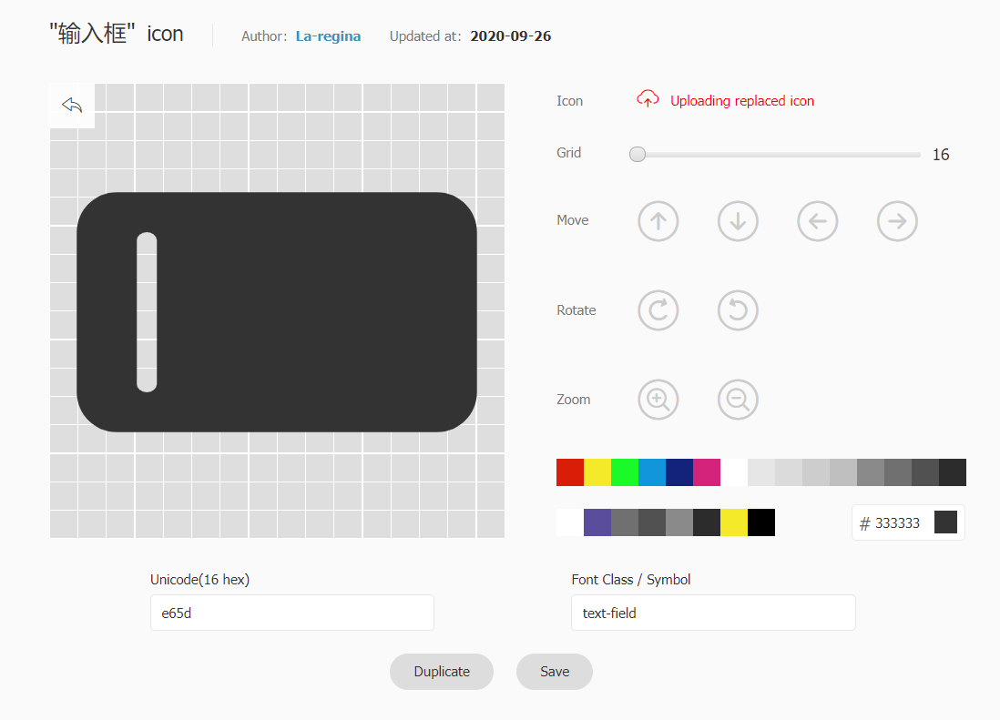
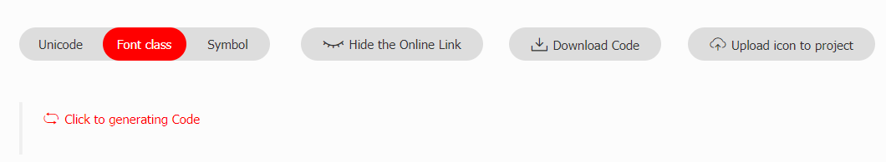

The entire theme adds FontClass / Picture format icon support in multiple places.

You can use iconfont and fontawesome to add icons to your project.

- For china users, iconfont is recommended
- For overseas users, fontawesome is recommended

Also, png/svg format icon is supported. You can use absolute path or pathname to add icons.

<!-- more -->

## Setting Icons

You can use icon in multiple places.

- Page: set `icon` in frontmatter

  This icon will be used in breadcrumb, page title, navbar generated item, sidebar generated item, page nav, etc.

- Navbar: set `icon` option in NavbarItemConfig

- Sidebar: set `icon` option in SidebarItemConfig

- HomePage: set `icon` option in feature item

## Iconfont

[Iconfont](https://iconfont.cn) is a vector icon management and communication platform created by Alimama MUX.

The designer uploads the icon to the Iconfont platform, and the user can customize the download of icons in a variety of formats. Users can also convert the icon into a font.

### How to use

First, you need to create a new project to set and manage your website’s icons:

1. Log in to Iconfont using GitHub or Weibo.
1. Find "Resources → My Projects" at the top of the website, and click the "New Project" icon in the upper right corner.
1. Set a recognizable project name
1. Fill in `FontClass/Symbol prefix` with `icon-` (you can also fill in according to your preference, but you need to set this value to `iconPrefix` in theme options with an extra `iconfont` prefix)
1. Font Family please keep `iconfont`


### Import Icon

1. Search freely through iconfont to find the icon you want to use, and click the "Add to Library" button on the icon

   

1. After searching for all the icons, click the "Add to Library" icon in the upper right corner, click "Add to Project" below and select the project you created then confirm.

### Edit Icon

On the project page, you can edit the icons in the project, including adjustments with position, size, rotate, color, Unicode number and Font Class / Symbol.



### Generate Icon Files

1. Please click the "Font Class" button above the project and click Generate.

   

1. Set the css link to `iconAssets` in theme options.

::: tip

If you add a new icon in the future, please regenerate the new CSS address and set it to `iconAssets` in theme options.

:::

## Fontawesome

This theme has built-in Fontawesome support.

### Import

You need to set `iconAssets: "fontawesome"` in theme options.

::: code-tabs#language

@tab TS

```ts
// .vuepress/config.ts
import { defineUserConfig } from "vuepress";
import { hopeTheme } from "vuepress-theme-hope";

export default defineUserConfig({
  theme: hopeTheme({
    iconAssets: "fontawesome",
  }),
});
```

@tab JS

```js {7-9}
// .vuepress/config.js
import { hopeTheme } from "vuepress-theme-hope";

export default {
  theme: hopeTheme({
    iconAssets: "fontawesome",
  }),
};
```

:::

::: note

Font-awesome current version is V6

:::

### Usage

Please follow [fontawesome document](https://fontawesome.com/).

- [Usage Instructions](https://fontawesome.com/docs/web/add-icons/how-to)
- [Icon List](https://fontawesome.com/icons)

## IconFont Featured Icons

You can set `iconAssets` to `"iconfont"` to use the following IconFont featured icons:

::: code-tabs#language

@tab TS

```ts
// .vuepress/config.ts
import { defineUserConfig } from "vuepress";
import { hopeTheme } from "vuepress-theme-hope";

export default defineUserConfig({
  theme: hopeTheme({
    iconAssets: "iconfont",
  }),
});
```

@tab JS

```js {7-9}
// .vuepress/config.js
import { hopeTheme } from "vuepress-theme-hope";

export default {
  theme: hopeTheme({
    iconAssets: "iconfont",
  }),
};
```

:::

<IconDisplay link="//at.alicdn.com/t/font_2410206_a0xb9hku9iu.css" />

<script setup lang="ts">
import IconDisplay from '@IconDisplay';
</script>
