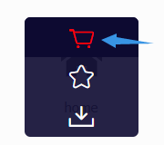

The entire theme has added FontClass format icon support in mutiple places.

You can use iconfont and fontawesome to add icons to your project.

- For china users, iconfont is recommended
- For overseas users, fontawesome is recommended

<!-- more -->

## Iconfont

[Iconfont](https://iconfont.cn) is a vector icon management and communication platform created by Alimama MUX.

The designer uploads the icon to the Iconfont platform, and the user can customize the download of icons in a variety of formats. Users can also convert the icon into a font.

### How to use

First, you need to create a new project to set and manage your website’s icons:

1. Log in to Iconfont using GitHub or Weibo.
1. Find "Resources → My Projects" at the top of the website, and click the "New Project" icon in the upper right corner.
1. Set a recognizable project name
1. Fill in `FontClass/Symbol prefix` with `icon-` (you can also fill in according to your preference, but you need to set this value to `themeConfig.iconPrefix`)
1. Font Family please keep `iconfont`


### Import icon

1. Search freely through iconfont to find the icon you want to use, and click the "Add to Library" button on the icon

   

1. After searching for all the icons, click the "Add to Library" icon in the upper right corner, click "Add to Project" below and select the project you created then confirm.

### Edit icon

On the project page, you can edit the icons in the project, including adjustments with position, size, rotate, color, Unicode number and Font Class / Symbol.


### Generate icon files

1. Please click the "Font Class" button above the project and click Generate.

   

1. Import the link in `index.styl` of `.vuepress/styles`. E.g:

   ```styl
   @import "//at.alicdn.com/t/font_2410206_kxwb6og9m5.css";
   ```

::: tip

If you add a new icon in the future, please regenerate the new CSS address and overwrite the old CSS address in `.vuepress/styles/index.styl`.

:::

## Fontawesome

This theme has built-in Fontawesome support.

### Import

Add in `index.styl` of `.vuepress/styles`:

```styl
@import "~@mr-hope/vuepress-shared/styles/font-awesome";
```

> Font-awesome current version is 5.15.3

And set `themeConfig.iconPrefix` to `'fas fa-'`.

### Use

Please follow [fontawesome document](https://fontawesome.com/).

- [Usage Instructions](https://fontawesome.com/how-to-use/on-the-web/referencing-icons/basic-use)
- [Icon List](https://fontawesome.com/icons?d=gallery)

## other instructions

- Icon will have `iconfont` class name by default
- The prefix of the icon class is `icon-` by default, which can be changed in the `iconPrefix` field in themeConfig

## Featured Icons

```styl
@import '//at.alicdn.com/t/font_2410206_kxwb6og9m5.css';
```

<IconDisplay  link="//at.alicdn.com/t/font_2410206_kxwb6og9m5.css" />
