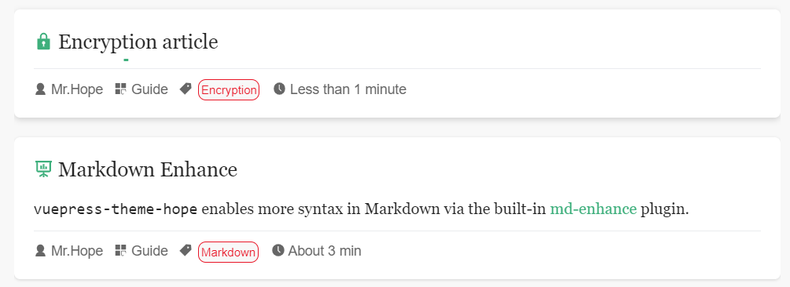

The topic provides you with a list of all articles under the path `/article/` by default.

## Auto Excerpt

By default, the theme will only display the excerpt or description you specify in the article list.

If you want the theme to automatically extract excerpts, set `plugins.blog.autoExcerpt: true` in theme options.

## Article

All articles will be added to the article list by default and rendered under the path `/article/`.

If you don’t want the list to contain some specific articles, just set the `article` to `false` in the frontmatter of the article, or you may customize it through `plugins.blog.filter` in theme options.

To sticky a specific article in the article list, just set `sticky` to `true` in the frontmatter of the article.

::: tip Order

For sticky articles, you can set `sticky` with a number to set their order. Articles with large numbers will be listed first.

:::

## Star Articles

You can star an article by setting `star` to `true` in frontmatter. After staring, users can view these articles on the `/star/` page.

At the same time, any star articles will be displayed in the article column on the sidebar of the blog homepage.

::: info

Our consideration for providing star options: Theme users may want to show visitors some high-quality articles, but do not want sticky articles to flood the homepage, resulting in visitors not being able to see the recently updated articles.

:::

::: tip Order

Similar to sticky articles, you can also set `star` to number to set their order. Articles with large numbers will be listed first.

:::

## Encryption and Slides

The theme provides separate lists for the two special pages: encrypted article page and slide page. You can view them on the `/encrypt/` and `/slide/` pages.

At the same time, to help visitors distinguish between these two categories of pages, their categories will be clearly marked with icons in the article list.

