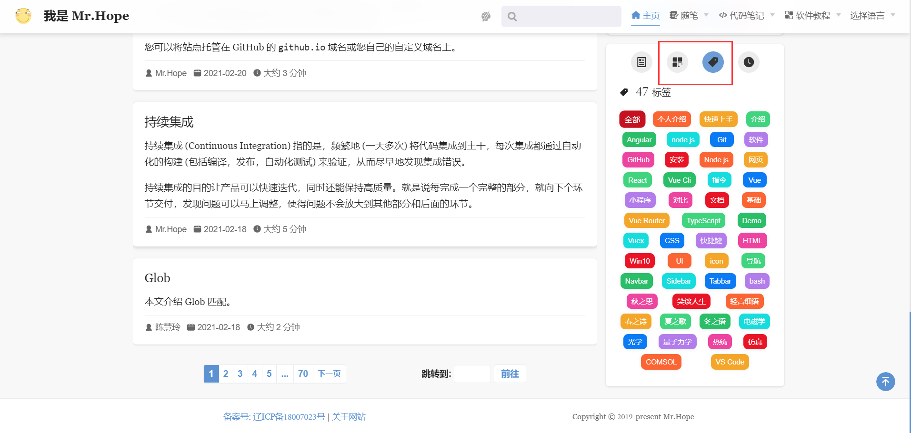

Вы можете настроить категорию и теги для статей через Frontmatter, чтобы они отображались на страницах определенных категорий и тегов.

<!-- more -->

## Настройки категории

Просто добавьте массив категорий в `category` в frontmatter, и статья будет автоматически отображена в списке `/category/<category name>/` страницы категорий.

Например, добавьте это на определенную страницу:

```md
---
category:
  - HTML
  - Web
---

Содержание страницы...
```

Затем вы можете найти его на странице `/category/html`.


## Теги

Просто установите параметр `tag` во frontmatter страницы и установите значение для одного или нескольких тегов, после чего статья будет автоматически отображаться в списке страницы тегов `/tag/<tag name>/`.

Например, после добавления этого во frontmatter:

```md
---
tag:
  - HTML
  - Web
---

Содержание страницы...
```

Затем вы можете найти его на страницах `/tag/html` и `/tag/web`.


## Посмотреть список

Помимо прямого доступа к соответствующей ссылке, категория и имя тега будут отображаться в информации о статье в верхней части статьи. Вы можете щелкнуть по нему, чтобы перейти к соответствующему списку для просмотра статей той же категории или тега.


Вы также можете выбрать вкладку категории или тега на боковой панели главной страницы блога и выбрать соответствующий элемент, чтобы войти в список.


