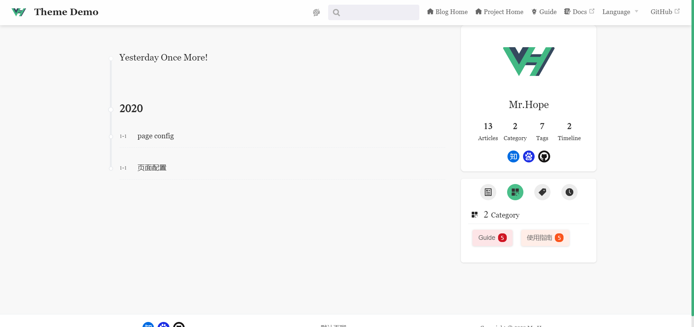
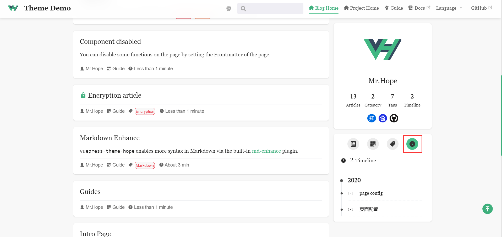

Вы можете получить доступ к странице времени через `/timeline/`. На странице можно просмотреть все статьи в обратном по времени порядке.

## Исключение статей

По умолчанию все статьи, у которых есть дата написания, будут отображаться на таймлайне. Если вы не хотите, чтобы статья была включена, просто установите `timeline` на `false` в начале статьи frontmatter.

## Установить заголовок временной шкалы

Мы позволяем вам настраивать верхний текст временной шкалы, вы можете настроить его через `blog.timeline` в настройках темы.

## Боковая панель

Мы добавили вкладку временной шкалы на боковую панель страниц, связанных с блогом, чтобы пользователи могли быстро просмотреть временную шкалу.

