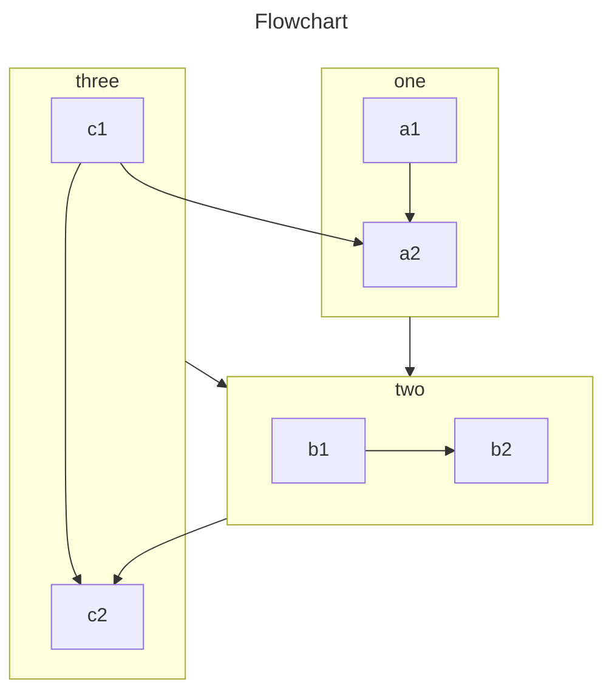

VuePress в основном генерирует страницы из файлов Markdown. Таким образом, вы можете легко использовать его для создания документации или блогов.

Вы должны создавать и записывать файлы Markdown, чтобы VuePress мог преобразовывать их на разные страницы в соответствии со структурой файла.

<!-- more -->

## Введение в Markdown

Если вы новичок и не знаете, как писать в Markdown, прочитайте [Введение в Markdown](../../cookbook/markdown/README.md) и [Демонстрация Markdown](../../cookbook/markdown/demo.md).

## Конфигурация Markdown

VuePress вводит настройку для каждой страницы маркдауна с помощью Frontmatter.

::: info

Frontmatter — важная концепция в VuePress. Если вы этого не знаете, вам нужно прочитать [Введение в Frontmatter](../../cookbook/vuepress/page.md#frontmatter).

:::

## Расширение Markdown

Содержимое Markdown в VuePress будет анализироваться [markdown-it](https://github.com/markdown-it/markdown-it), который поддерживает [расширения синтаксиса](https://github.com/markdown-it/markdown-it#syntax-extensions) через плагины markdown-it.

### Улучшение VuePress

Чтобы обогатить содержимое документа, VuePress расширяет стандартный синтаксис Markdown.

Чтобы узнать об этом расширенном синтаксисе, смотрите [Встроенные функции Markdown](../../cookbook/vuepress/markdown.md).

### Улучшение темы

Используя <ProjectLink name="md-enhance">`vuepress-plugin-md-enhance`</ProjectLink>, тема расширяет синтаксис Markdown и предоставляет более богатые функции записи.

#### Пользовательский контейнер

::: v-pre

Безопасно используйте {{ variable }} в Markdown.

:::

::: info Custom Title

Пользовательский информационный контейнер с `code`, [ссылка](#пользовательский-контейнер).

```js
const a = 1;
```

:::

::: tip Custom Title

A custom tip container

:::

::: warning Custom Title

A custom warning container

:::

::: danger Custom Title

A custom danger container

:::

::: details Custom Title

A custom details container

:::

:::: details Code

```md
::: v-pre

Safely use {{ variable }} in Markdown.

:::

::: info Custom Title

A custom information container

:::

::: tip Custom Title

A custom tip container

:::

::: warning Custom Title

A custom warning container

:::

::: danger Custom Title

A custom danger container

:::

::: details Custom Title

A custom details container

:::
```

::::

- [Посмотреть детали](../markdown/container.md)

#### Вкладки

::: tabs#fruit

@tab apple

Apple

@tab banana

Banana

@tab orange

Orange

:::

- [Посмотреть детали](../markdown/tabs.md)

#### Вкладки кода

::: code-tabs

@tab yarn

```bash
yarn add -D vuepress-theme-hope
```

@tab:active npm

```bash
npm i -D vuepress-theme-hope
```

:::

- [Посмотреть детали](../markdown/code-tabs.md)

#### Верхний индекс и нижний индекс

19^th^ H~2~O

- [Посмотреть детали](../markdown/sup-sub.md)

#### Выравнивание

::: center

I am center

:::

::: right

I am right align

:::

- [Посмотреть детали](../markdown/align.md)

#### Атрибуты

A **word**{#word} having id.

- [Посмотреть детали](../markdown/attrs.md)

#### Сноска

This text has footnote[^first].

[^first]: This is footnote content

- [Посмотреть детали](../markdown/footnote.md)

#### Выделение

You can mark ==important words== .

- [Посмотреть детали](../markdown/mark.md)

#### Список задач

- [x] Plan A
- [ ] Plan B

- [Посмотреть детали](../markdown/tasklist.md)

#### Улучшение изображения

Support setting color scheme and size

- [Посмотреть детали](../markdown/image.md)

#### Диаграмма

::: chart A Scatter Chart

```json
{
  "type": "scatter",
  "data": {
    "datasets": [
      {
        "label": "Scatter Dataset",
        "data": [
          { "x": -10, "y": 0 },
          { "x": 0, "y": 10 },
          { "x": 10, "y": 5 },
          { "x": 0.5, "y": 5.5 }
        ],
        "backgroundColor": "rgb(255, 99, 132)"
      }
    ]
  },
  "options": {
    "scales": {
      "x": {
        "type": "linear",
        "position": "bottom"
      }
    }
  }
}
```

:::

- [Посмотреть детали](../markdown/chart.md)

#### Echarts

::: echarts A line chart

```json
{
  "xAxis": {
    "type": "category",
    "data": ["Mon", "Tue", "Wed", "Thu", "Fri", "Sat", "Sun"]
  },
  "yAxis": {
    "type": "value"
  },
  "series": [
    {
      "data": [150, 230, 224, 218, 135, 147, 260],
      "type": "line"
    }
  ]
}
```

:::

- [Посмотреть детали](../markdown/echarts.md)

#### Блок-схема

```flow
cond=>condition: Process?
process=>operation: Process
e=>end: End

cond(yes)->process->e
cond(no)->e
```

- [Посмотреть детали](../markdown/flowchart.md)

#### Mermaid



- [Посмотреть детали](../markdown/mermaid.md)

#### Tex

$$
\frac {\partial^r} {\partial \omega^r} \left(\frac {y^{\omega}} {\omega}\right)
= \left(\frac {y^{\omega}} {\omega}\right) \left\{(\log y)^r + \sum_{i=1}^r \frac {(-1)^i r \cdots (r-i+1) (\log y)^{r-i}} {\omega^i} \right\}
$$

- [Посмотреть детали](../markdown/tex.md)

#### Включение файлов

@include(../markdown/demo.snippet.md{9-13})

- [Посмотреть детали](../markdown/include.md)

#### Демонстрация кода

::: normal-demo A normal demo

```html
<h1>VuePress Theme Hope</h1>
<p>Is <span id="very">very</span> powerful!</p>
```

```js
document.querySelector("#very").addEventListener("click", () => {
  alert("Very powerful!");
});
```

```css
span {
  color: red;
}
```

:::

- [Посмотреть детали](../markdown/demo.md)

#### Стилизация

Донат Mr.Hope на чашку кофе. _Рекомендуется_

- [Посмотреть детали](../markdown/stylize.md)

#### Playground

::: playground#ts TS demo

@file index.ts

```ts
const msg = "hello world";

const speak = (msg: string) => console.log(msg);

speak(msg);
```

:::

- [Посмотреть детали](../markdown/playground.md)

#### Vue Playground

::: vue-playground Vue Playground

@file App.vue

```vue
<script setup>
import { ref } from "vue";

const msg = ref("Hello World!");
</script>

<template>
  <h1>{{ msg }}</h1>
  <input v-model="msg" />
</template>
```

:::

- [Посмотреть детали](../markdown/vue-playground.md)

#### Презентация

@slidestart

## Slide 1

A paragraph with some text and a [link](https://mrhope.site)

---

## Slide 2

- Item 1
- Item 2

---

## Slide 3.1

```js
const a = 1;
```

--

## Slide 3.2

$$
J(\theta_0,\theta_1) = \sum_{i=0}
$$

@slideend

- [Посмотреть детали](../markdown/presentation.md)
