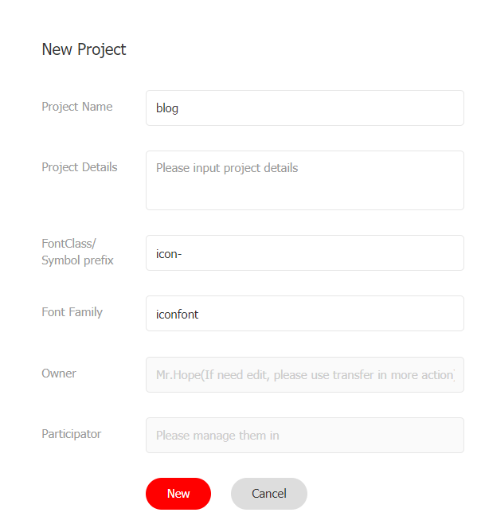

Вся тема добавляет поддержку иконок формата FontClass в нескольких местах.

Вы можете использовать iconfont и fontawesome для добавления иконок в свой проект.

- Для пользователей Китая рекомендуется iconfont
- Для зарубежных пользователей рекомендуется fontawesome

Также поддерживает иконку формата png/svg. Вы можете использовать абсолютный путь или имя пути для добавления иконок.

<!-- more -->

## Настройка иконок

Вы можете использовать иконку в нескольких местах.

- Страница: установить `icon` в frontmatter

  Эта иконка будет использоваться в навигационной цепочке, заголовке страницы, сгенерированном элементе панели навигации, сгенерированном элементе боковой панели, навигации страницы и т. д.

- Navbar: установите опцию `icon` в NavbarItemConfig

- Sidebar: установите опцию `icon` в SidebarItemConfig

- HomePage: установите опцию `icon` в элементе функции

## Iconfont

[Iconfont](https://iconfont.cn) — это платформа для управления векторными иконками и коммуникации, созданная Alimama MUX.

Дизайнер загружает иконку на платформу Iconfont, а пользователь может настроить загрузку иконок в различных форматах. Пользователи также могут преобразовать иконку в шрифт.

### Как использовать

Во-первых, вам нужно создать новый проект для установки и управления иконками вашего сайта:

1. Войдите в Iconfont с помощью GitHub или Weibo.
1. Найдите "Resources → My Projects" в верхней части веб-сайта и щелкните иконку "New Project" в правом верхнем углу.
1. Установите узнаваемое название проекта
1. Заполните `FontClass/Symbol prefix` с `icon-` (вы также можете заполнить в соответствии с вашими предпочтениями, но вам нужно установить это значение `iconPrefix` в настройках темы с дополнительным префиксом `iconfont`)
1. Семейство шрифтов, пожалуйста, сохраните `iconfont`



### Импорт иконки

1. Свободно ищите через iconfont, чтобы найти иконку, которую вы хотите использовать, и нажмите кнопку "Add to Library" на иконке

   

1. После поиска всех значков щелкните иконку "Add to Library" в правом верхнем углу, нажмите "Add to Project" ниже и выберите созданный проект, затем подтвердите.

### Редактирование иконки

На странице проекта вы можете редактировать иконки в проекте, включая настройки положения, размера, поворота, цвета, номера Unicode и класса/символа шрифта.


### Создание файлов иконок

1. Нажмите кнопку "Font Class" над проектом и нажмите "Generate".

   

1. Установите ссылку css на `iconAssets` в настройках темы.

::: tip

Если вы добавите новую иконку в будущем, повторно создайте новый адрес CSS и установите для него значение `iconAssets` в параметрах темы.

:::

## Fontawesome

Эта тема имеет встроенную поддержку Fontawesome.

### Импорт

Вам нужно установить `iconAssets: "fontawesome"` в настройках темы.

::: code-tabs#language

@tab TS

```ts
// .vuepress/config.ts
import { defineUserConfig } from "vuepress";
import { hopeTheme } from "vuepress-theme-hope";

export default defineUserConfig({
  theme: hopeTheme({
    iconAssets: "fontawesome",
  }),
});
```

@tab JS

```js {7-9}
// .vuepress/config.js
import { hopeTheme } from "vuepress-theme-hope";

export default {
  theme: hopeTheme({
    iconAssets: "fontawesome",
  }),
};
```

:::

::: note

Текущая версия Font-awesome 6

:::

### Использование

Пожалуйста, следуйте [документации fontawesome](https://fontawesome.com/).

- [Инструкции по использованию](https://fontawesome.com/docs/web/add-icons/how-to)
- [Список иконок](https://fontawesome.com/icons)

## Избранные иконки IconFont

Вы можете установить для `iconAssets` значение `"iconfont"`, чтобы использовать следующие избранные иконки IconFont:

::: code-tabs#language

@tab TS

```ts
// .vuepress/config.ts
import { defineUserConfig } from "vuepress";
import { hopeTheme } from "vuepress-theme-hope";

export default defineUserConfig({
  theme: hopeTheme({
    iconAssets: "iconfont",
  }),
});
```

@tab JS

```js {7-9}
// .vuepress/config.js
import { hopeTheme } from "vuepress-theme-hope";

export default {
  theme: hopeTheme({
    iconAssets: "iconfont",
  }),
};
```

:::

<IconDisplay link="//at.alicdn.com/t/font_2410206_a0xb9hku9iu.css" />

<script setup lang="ts">
import IconDisplay from '@IconDisplay';
</script>
