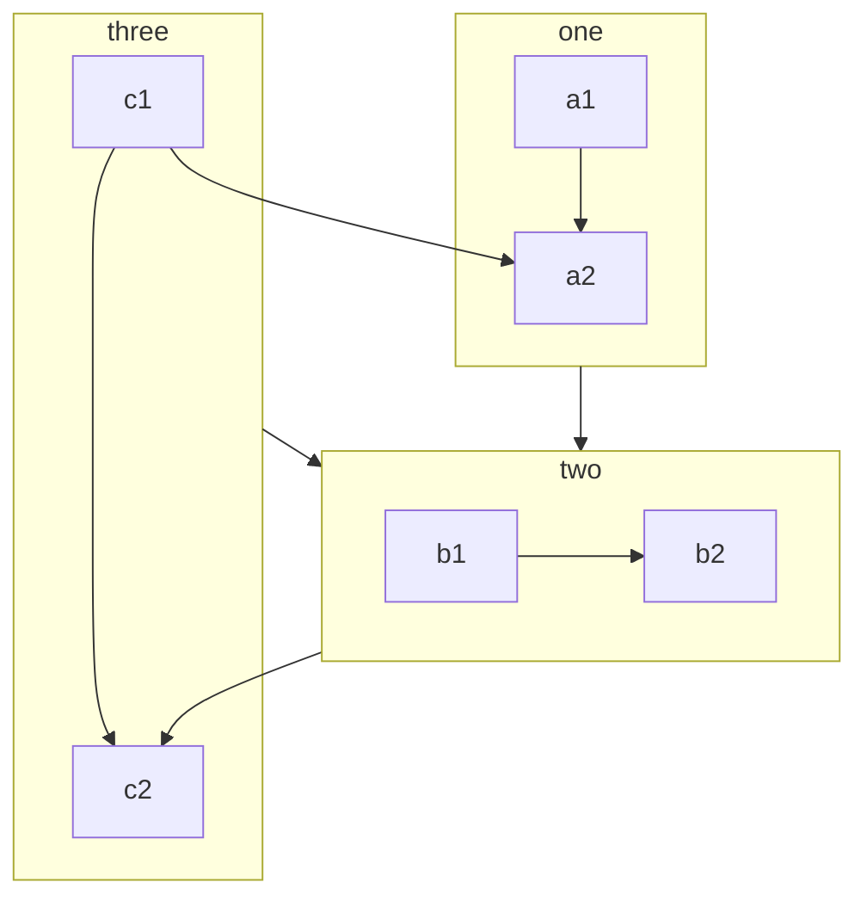
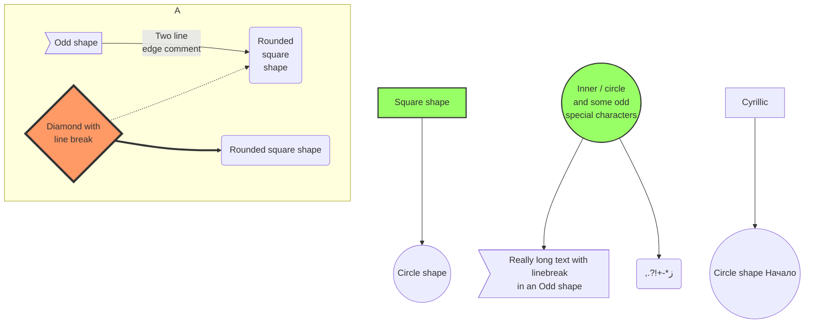

Пусть файл Markdown поддерживает [mermaid](https://mermaid-js.github.io/mermaid/#/) на вашем сайте VuePress.

<!-- more -->

## Конфиг

::: code-tabs#language

@tab TS

```ts {8-10}
// .vuepress/config.ts
import { defineUserConfig } from "vuepress";
import { hopeTheme } from "vuepress-theme-hope";

export default defineUserConfig({
  theme: hopeTheme({
    plugins: {
      mdEnhance: {
        mermaid: true,
      },
    },
  }),
});
```

@tab JS

```js {7-9}
// .vuepress/config.js
import { hopeTheme } from "vuepress-theme-hope";

export default {
  theme: hopeTheme({
    plugins: {
      mdEnhance: {
        mermaid: true,
      },
    },
  }),
};
```

:::

## Синтаксис

````md
```mermaid

<!-- Your mermaid code here. -->

```
````

## Использование

Пожалуйста, смотрите [mermaid](https://mermaid-js.github.io/mermaid/#/).

## Демо

### Блок-схема



::: details Код

````md

````

:::

### Диаграмма последовательности

```sequence
Alice ->> Bob: Hello Bob, how are you?
Bob-->>John: How about you John?
Bob--x Alice: I am good thanks!
Bob-x John: I am good thanks!
Note right of John: Bob thinks a long<br/>long time, so long<br/>that the text does<br/>not fit on a row.

Bob-->Alice: Checking with John...
Alice->John: Yes... John, how are you?
```

::: details Код

````md
```sequence
Alice ->> Bob: Hello Bob, how are you?
Bob-->>John: How about you John?
Bob--x Alice: I am good thanks!
Bob-x John: I am good thanks!
Note right of John: Bob thinks a long<br/>long time, so long<br/>that the text does<br/>not fit on a row.

Bob-->Alice: Checking with John...
Alice->John: Yes... John, how are you?
```
````

:::

### Диаграмма классов

```class
class Square~Shape~{
    int id
    List~int~ position
    setPoints(List~int~ points)
    getPoints() List~int~
}

Square : -List~string~ messages
Square : +setMessages(List~string~ messages)
Square : +getMessages() List~string~
```

::: details Код

````md
```class
class Square~Shape~{
    int id
    List~int~ position
    setPoints(List~int~ points)
    getPoints() List~int~
}

Square : -List~string~ messages
Square : +setMessages(List~string~ messages)
Square : +getMessages() List~string~
```
````

:::

### Диаграмма состояний

```state
[*] --> Active

state Active {
    [*] --> NumLockOff
    NumLockOff --> NumLockOn : EvNumLockPressed
    NumLockOn --> NumLockOff : EvNumLockPressed
    --
    [*] --> CapsLockOff
    CapsLockOff --> CapsLockOn : EvCapsLockPressed
    CapsLockOn --> CapsLockOff : EvCapsLockPressed
    --
    [*] --> ScrollLockOff
    ScrollLockOff --> ScrollLockOn : EvScrollLockPressed
    ScrollLockOn --> ScrollLockOff : EvScrollLockPressed
}
```

::: details Код

````md
```state
[*] --> Active

state Active {
    [*] --> NumLockOff
    NumLockOff --> NumLockOn : EvNumLockPressed
    NumLockOn --> NumLockOff : EvNumLockPressed
    --
    [*] --> CapsLockOff
    CapsLockOff --> CapsLockOn : EvCapsLockPressed
    CapsLockOn --> CapsLockOff : EvCapsLockPressed
    --
    [*] --> ScrollLockOff
    ScrollLockOff --> ScrollLockOn : EvScrollLockPressed
    ScrollLockOn --> ScrollLockOff : EvScrollLockPressed
}
```
````

:::

### Диаграммы отношений сущностей

```er
CAR ||--o{ NAMED-DRIVER : allows
CAR {
    string registrationNumber
    string make
    string model
}
PERSON ||--o{ NAMED-DRIVER : is
PERSON {
    string firstName
    string lastName
    int age
}
```

::: details Код

````md
```er
CAR ||--o{ NAMED-DRIVER : allows
CAR {
    string registrationNumber
    string make
    string model
}
PERSON ||--o{ NAMED-DRIVER : is
PERSON {
    string firstName
    string lastName
    int age
}
```
````

:::

### Диаграмма пути пользователя

```journey
title My working day
section Go to work
  Make tea: 5: Me
  Go upstairs: 3: Me
  Do work: 1: Me, Cat
section Go home
  Go downstairs: 5: Me
  Sit down: 5: Me
```

::: details Код

````md
```journey
title My working day
section Go to work
  Make tea: 5: Me
  Go upstairs: 3: Me
  Do work: 1: Me, Cat
section Go home
  Go downstairs: 5: Me
  Sit down: 5: Me
```
````

:::

### Диаграммы Ганта

```gantt
dateFormat  YYYY-MM-DD
title       Adding GANTT diagram functionality to mermaid
excludes    weekends
%% (`excludes` accepts specific dates in YYYY-MM-DD format, days of the week ("sunday") or "weekends", but not the word "weekdays".)

section A section
Completed task            :done,    des1, 2014-01-06,2014-01-08
Active task               :active,  des2, 2014-01-09, 3d
Future task               :         des3, after des2, 5d
Future task2              :         des4, after des3, 5d

section Critical tasks
Completed task in the critical line :crit, done, 2014-01-06,24h
Implement parser and jison          :crit, done, after des1, 2d
Create tests for parser             :crit, active, 3d
Future task in critical line        :crit, 5d
Create tests for renderer           :2d
Add to mermaid                      :1d

section Documentation
Describe gantt syntax               :active, a1, after des1, 3d
Add gantt diagram to demo page      :after a1  , 20h
Add another diagram to demo page    :doc1, after a1  , 48h

section Last section
Describe gantt syntax               :after doc1, 3d
Add gantt diagram to demo page      :20h
Add another diagram to demo page    :48h
```

::: details Код

````md
```gantt
dateFormat  YYYY-MM-DD
title       Adding GANTT diagram functionality to mermaid
excludes    weekends
%% (`excludes` accepts specific dates in YYYY-MM-DD format, days of the week ("sunday") or "weekends", but not the word "weekdays".)

section A section
Completed task            :done,    des1, 2014-01-06,2014-01-08
Active task               :active,  des2, 2014-01-09, 3d
Future task               :         des3, after des2, 5d
Future task2              :         des4, after des3, 5d

section Critical tasks
Completed task in the critical line :crit, done, 2014-01-06,24h
Implement parser and jison          :crit, done, after des1, 2d
Create tests for parser             :crit, active, 3d
Future task in critical line        :crit, 5d
Create tests for renderer           :2d
Add to mermaid                      :1d

section Documentation
Describe gantt syntax               :active, a1, after des1, 3d
Add gantt diagram to demo page      :after a1  , 20h
Add another diagram to demo page    :doc1, after a1  , 48h

section Last section
Describe gantt syntax               :after doc1, 3d
Add gantt diagram to demo page      :20h
Add another diagram to demo page    :48h
```
````

:::

### Диаграммы круговых диаграмм

```pie
title What Voldemort doesn’t have?
  "FRIENDS" : 2
  "FAMILY" : 3
  "NOSE" : 45
```

::: details Код

````md
```pie
title What Voldemort doesn’t have?
  "FRIENDS" : 2
  "FAMILY" : 3
  "NOSE" : 45
```
````

:::

### Диаграммы Gitgraph

```git-graph
commit
branch hotfix
checkout hotfix
commit
branch develop
checkout develop
commit id:"ash" tag:"abc"
branch featureB
checkout featureB
commit type:HIGHLIGHT
checkout main
checkout hotfix
commit type:NORMAL
checkout develop
commit type:REVERSE
checkout featureB
commit
checkout main
merge hotfix
checkout featureB
commit
checkout develop
branch featureA
commit
checkout develop
merge hotfix
checkout featureA
commit
checkout featureB
commit
checkout develop
merge featureA
branch release
checkout release
commit
checkout main
commit
checkout release
merge main
checkout develop
merge release
```

::: details Код

````md
```git-graph
commit
branch hotfix
checkout hotfix
commit
branch develop
checkout develop
commit id:"ash" tag:"abc"
branch featureB
checkout featureB
commit type:HIGHLIGHT
checkout main
checkout hotfix
commit type:NORMAL
checkout develop
commit type:REVERSE
checkout featureB
commit
checkout main
merge hotfix
checkout featureB
commit
checkout develop
branch featureA
commit
checkout develop
merge hotfix
checkout featureA
commit
checkout featureB
commit
checkout develop
merge featureA
branch release
checkout release
commit
checkout main
commit
checkout release
merge main
checkout develop
merge release
```
````

:::

### Диаграммы C4C

```c4c
title System Context diagram for Internet Banking System

Person(customerA, "Banking Customer A", "A customer of the bank, with personal bank accounts.")
Person(customerB, "Banking Customer B")
Person_Ext(customerC, "Banking Customer C")
System(SystemAA, "Internet Banking System", "Allows customers to view information about their bank accounts, and make payments.")

Person(customerD, "Banking Customer D", "A customer of the bank, <br/> with personal bank accounts.")

Enterprise_Boundary(b1, "BankBoundary") {

  SystemDb_Ext(SystemE, "Mainframe Banking System", "Stores all of the core banking information about customers, accounts, transactions, etc.")

  System_Boundary(b2, "BankBoundary2") {
    System(SystemA, "Banking System A")
    System(SystemB, "Banking System B", "A system of the bank, with personal bank accounts.")
  }

  System_Ext(SystemC, "E-mail system", "The internal Microsoft Exchange e-mail system.")
  SystemDb(SystemD, "Banking System D Database", "A system of the bank, with personal bank accounts.")

  Boundary(b3, "BankBoundary3", "boundary") {
    SystemQueue(SystemF, "Banking System F Queue", "A system of the bank, with personal bank accounts.")
    SystemQueue_Ext(SystemG, "Banking System G Queue", "A system of the bank, with personal bank accounts.")
  }
}

BiRel(customerA, SystemAA, "Uses")
BiRel(SystemAA, SystemE, "Uses")
Rel(SystemAA, SystemC, "Sends e-mails", "SMTP")
Rel(SystemC, customerA, "Sends e-mails to")
```

::: details Код

````md
```c4c
title System Context diagram for Internet Banking System

Person(customerA, "Banking Customer A", "A customer of the bank, with personal bank accounts.")
Person(customerB, "Banking Customer B")
Person_Ext(customerC, "Banking Customer C")
System(SystemAA, "Internet Banking System", "Allows customers to view information about their bank accounts, and make payments.")

Person(customerD, "Banking Customer D", "A customer of the bank, <br/> with personal bank accounts.")

Enterprise_Boundary(b1, "BankBoundary") {

  SystemDb_Ext(SystemE, "Mainframe Banking System", "Stores all of the core banking information about customers, accounts, transactions, etc.")

  System_Boundary(b2, "BankBoundary2") {
    System(SystemA, "Banking System A")
    System(SystemB, "Banking System B", "A system of the bank, with personal bank accounts.")
  }

  System_Ext(SystemC, "E-mail system", "The internal Microsoft Exchange e-mail system.")
  SystemDb(SystemD, "Banking System D Database", "A system of the bank, with personal bank accounts.")

  Boundary(b3, "BankBoundary3", "boundary") {
    SystemQueue(SystemF, "Banking System F Queue", "A system of the bank, with personal bank accounts.")
    SystemQueue_Ext(SystemG, "Banking System G Queue", "A system of the bank, with personal bank accounts.")
  }
}

BiRel(customerA, SystemAA, "Uses")
BiRel(SystemAA, SystemE, "Uses")
Rel(SystemAA, SystemC, "Sends e-mails", "SMTP")
Rel(SystemC, customerA, "Sends e-mails to")
```
````

:::

### Карта разума

```mindmap
root((VuePress))
  Out of box
    Default theme
      Navbar
      Sidebar
      Darkmode
    I18n
    Search
      Search
      DocSearch<br />by algolia
  Customize
    Theme
      (hope)
    Plugins
      (components)
      (md-enhance)
      (photo-swipe)
      (copy-code2)
      (copyright2)
      (feed2)
      (sitemap2)
      (seo2)
```

::: details Код

````md
```mindmap
root((VuePress))
  Out of box
    Default theme
      Navbar
      Sidebar
      Darkmode
    I18n
    Search
      Search
      DocSearch<br />by algolia
  Customize
    Theme
      (hope)
    Plugins
      (components)
      (md-enhance)
      (photo-swipe)
      (copy-code2)
      (copyright2)
      (feed2)
      (sitemap2)
      (seo2)
```
````

:::

### Сложный пример



::: details Код

````md

````

:::
