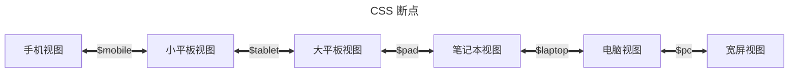

## 添加 Markdown 扩展

你可以在 [配置文件](../cookbook/vuepress/config.md#配置文件) 中使用 `extendsMarkdown` 钩子来添加 Markdown 扩展:

```ts {7-9} title=".vuepress/config.ts"
import { defineUserConfig } from "vuepress";

export default defineUserConfig({
  // 站点配置
  // ...

  extendsMarkdown: (md) => {
    md.use(yourMdItPlugin, options);
  },
});
```

## 如何让侧边栏可折叠 / 如何在移动端显示 TOC / 如何在 PC 上将侧边栏置于左侧

为了更好的适应不同尺寸的设备，主题使用 [响应式布局](../guide/interface/responsive.md) 通过屏幕宽度来调整布局。

由于布局是预渲染的，所有尺寸的屏幕共享相同的 DOM 结构，为了正确的首屏渲染和较佳性能，不同尺寸布局几乎仅通过 CSS 渲染而非脚本控制。在同一 DOM 结构上，我们实现了若干套 CSS 来显示不同布局。这意味着你不能自定义这些布局或者调整它们的顺序。

你唯一可配置的内容就是 CSS 断点，默认的断点如下:



你可以通过 [样式配置文件](../config/style.md#configscss) 来调整这些断点。

比如:

- 如果你不喜欢宽屏布局，你可以将 `$pc` 断点设置一个非常大的值:

  ```scss title=".vuepress/config.scss"
  $pc: 9999px;
  ```

- 如果你不想要 Pad 布局，你可以将 `$tablet` 断点和 `$pad` 断点重合:

  ```scss title=".vuepress/config.scss"
  $tablet: 959px;
  ```

当然，如果你足够强，你可以自行通过覆盖主题的 CSS 样式来通过这份 DOM 实现你想要的布局。这可能会很困难，但技术上绝对是可行的。

## 调整内容宽度

如果你对默认的内容宽度不满意，你可以通过在 [调色板文件](../config/style.md#布局设置) 中设置 `$content-width` 变量来调整内容宽度。

::: warning 内容宽度很窄

如果你觉得内容宽度很窄，这大概率是你的个人审美问题，因为 vuepress-theme-hope 遵循了最佳布局设计实践。相关讨论与让内容占满屏幕的方式的解决办法，详见 [此讨论](https://github.com/orgs/vuepress-theme-hope/discussions/3742)。

:::

## 配置中的链接

打包工具需要知道要打包的资源的路径，所以只有可以静态分析的内容才能被打包。这意味着：

- 在 Markdown 中：只支持相对页面链接和图片链接
- 在 html 中 (包括 vue 模板) ：只支持相对链接，包括 `img` 和 `video` 标签的 `src` 属性
- 在样式文件中 (css, scss) ：一些资源，包括背景图片 url，字体文件等
- 在脚本文件中：`import` 语句或 `import()` 表达式中的链接

而对于 VuePress 中所有的配置，包括 [frontmatter](../cookbook/vuepress/page.md#frontmatter) 、[VuePress 配置文件](../cookbook/vuepress/config.md) 以及主题选项和插件选项，VuePress 都会将它们解析为数据，所以它们不能被打包工具静态分析。这意味着任何链接都会保持原样，所以你必须使其可解析。

大多数链接将接受以下值：

- 完整链接: 可以直接访问，如 `https://example.com/example.jpg`
- 路由链接: 将从站点根目录解析，如 `/foo/example.jpg`。

  在不同的基础路径下，路由链接对应的实际路径名会有所不同，例如：基础路径为 `/` 时为 `/foo/example.jpg`，基础路径为 `/bar/` 时为 `/bar/foo/example.jpg`

只有少数选项会保持输入不变，这意味着以 `/` 开头的输入不会自动添加基础路径。这些选项会在文档中给出警告提示，如 [VuePress 配置文件](../cookbook/vuepress/config.md#配置文件) 中的 `head` 选项。
