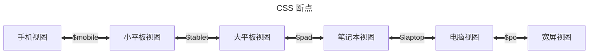

## Adding Markdown Extensions

## 添加 Markdown 扩展

你可以在 [配置文件](../cookbook/vuepress/config.md#config-file) 中使用 `extendsMarkdown` 钩子来添加 Markdown 扩展:

::: code-tabs#language

@tab TS

```ts title=".vuepress/config.ts"
import { defineUserConfig } from "vuepress";

export default defineUserConfig({
  // 站点配置
  // ...

  extendsMarkdown: (md) => {
    md.use(yourExtension, options);
  },
});
```

@tab JS

```js title=".vuepress/config.js"
import { defineUserConfig } from "vuepress";

export default defineUserConfig({
  // 站点配置
  // ...

  extendsMarkdown: (md) => {
    md.use(yourExtension, options);
  },
});
```

:::

## 如何让侧边栏可折叠 / 如何在移动端显示 TOC / 如何在 PC 上将侧边栏置于左侧

为了更好的适应不同尺寸的设备，主题使用 [响应式布局](../guide/interface/responsive.md) 通过屏幕宽度来调整布局。

由于布局是预渲染的，所有尺寸的屏幕共享相同的 DOM 结构，为了正确的首屏渲染和较佳性能，不同尺寸布局几乎仅通过 CSS 渲染而非脚本控制。在同一 DOM 结构上，我们实现了若干套 CSS 来显示不同布局。这意味着你不能自定义这些布局或者调整它们的顺序。

你唯一可配置的内容就是 CSS 断点，默认的断点如下:



你可以通过 [样式配置文件](../config/style.md#configscss) 来调整这些断点。

比如:

- 如果你不喜欢宽屏布局，你可以将 `$pc` 断点设置一个非常大的值:

  ```scss title=".vuepress/config.scss"
  $pc: 9999px;
  ```

- 如果你不想要 Pad 布局，你可以将 `$tablet` 断点和 `$pad` 断点重合:

  ```scss title=".vuepress/config.scss"
  $tablet: 959px;
  ```

当然，如果你足够强，你可以自行通过覆盖主题的 CSS 样式来通过这份 DOM 实现你想要的布局。这可能会很困难，但即技术上绝对是可行的。

## 显示四级或更多级的标题

默认情况下，VuePress 只会从 Markdown 提取 h2 和 h3 标题，所以仅靠配置主题，你永远也看不见 h4 标题。

你需要在 VuePress 配置文件中配置 [markdown.headers.levels](https://vuejs.press/zh/reference/config.html#markdown-headers):

```ts title=".vuepress/config.ts"
export default {
  markdown: {
    headers: {
      // 用到哪一级就提取哪一级
      levels: [2, 3, 4, 5, 6],
    },
  },

  // 其他配置
  // ...
};
```

在上方提取更深层级的标题后，你就能在 [主题选项](../config/theme/layout.md#headerdepth) 或 [页面 Frontmatter](../config/frontmatter/layout.md#headerdepth) 中通过增加 `headerDepth` 的数值来展示更多标题了。

## 调整内容宽度

如果你对默认的内容宽度不满意，你可以通过在 [调色板文件](../config/style.md#布局设置) 中设置 `$content-width` 变量来调整内容宽度。

::: warning 内容宽度很窄

如果你觉得内容宽度很窄，这大概率是你的个人审美问题，因为 vuepress-theme-hope 遵循了最佳布局设计实践。相关讨论与让内容占满屏幕的方式的解决办法，详见 [此讨论](https://github.com/orgs/vuepress-theme-hope/discussions/3742)。

:::
