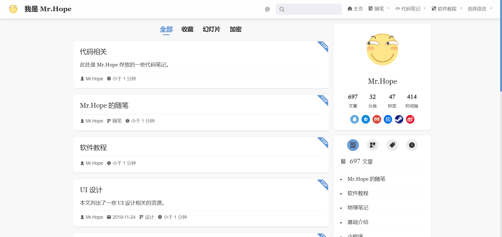
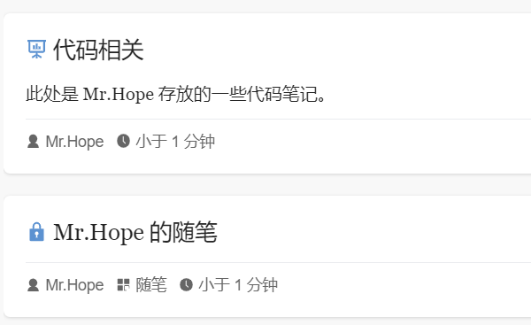

主题在 `/article/` 路径下为你提供了全部的文章列表。

<!-- more -->

## 文章

所有文章都会默认被添加到文章列表中渲染在 `/article/` 路径下。

如果你不希望该列表包含一些特定的文章，只需在文章的 frontmatter 中将 `article` 设置为 `false`。

如果你希望在文章列表中置顶特定文章，只需在文章的 frontmatter 中将 `sticky` 设置为 `true`。

::: tip 置顶顺序

对于置顶文章，你可以将 `sticky` 设置为 `number` 来设置它们的顺序。数值大的文章会排列在前面。

:::

## 收藏文章

你可以通过在 frontmatter 中设置 `star` 为 `true` 收藏一个文章。收藏后，用户就可以在 `/star/` 页面中查看这些文章。

同时任何任何收藏的文章都会显示在博客主页侧边栏的文章栏目中。

::: info

我们提供收藏选项的考虑是: 主题使用者可能希望向访客展示一定数量的精品文章，而又不希望置顶文章充斥主页，导致用户不能看到最近更新的文章。

:::

::: tip 收藏顺序

类似置顶文章，你同样可以将 `star` 设置为 `number` 来设置它们的顺序。数值大的文章会排列在前面。

:::

## 加密与幻灯片

主题为加密文章页与幻灯片页这两个特殊页面提供了单独的列表，你可以在 `/encrypt/` 和 `/slide/` 页面查看它们。

同时为了帮助访问者区分，这两个类别的页面会在文章列表中用图标明确标明其类别。

