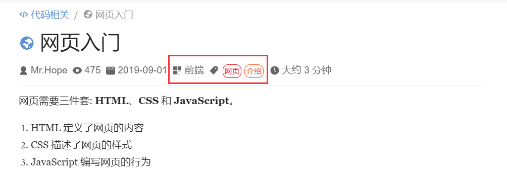
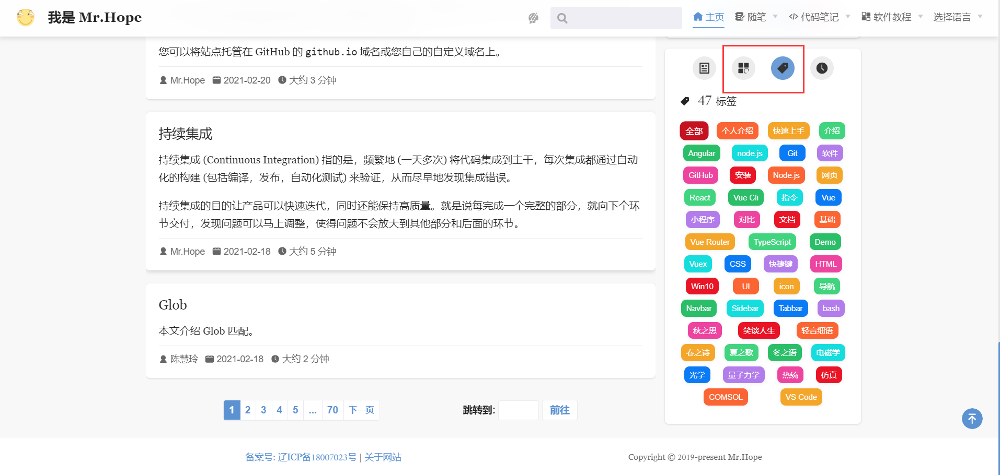

你可以通过 frontmatter 来为文章配置分类与标签，使它们出现在特定的分类与标签页面中。

<!-- more -->

## 分类设置

只需要在页面 frontmatter 中设置 `category` 数组，并设置一个或多个文章所属的分类，该文章会自动渲染在 `/category/<分类名>/` 分类页面的列表中。

比如在某个页面设置:

```md
---
category:
  - HTML
  - Web
---

页面内容...
```

你就可以在 `/category/html` 和 `/category/web` 页面下找到它。


## 标签

只需要在页面的 frontmatter 中设置 `tag`，并设置一个或多个文章所属的标签，该文章会自动渲染在 `/tag/<标签名>/` 标签页面的列表中。

比如在某个页面设置:

```md
---
tag:
  - HTML
  - Web
---

页面内容...
```

你就可以在 `/tag/html` 和 `/tag/web` 页面下找到它。


## 查看列表

除了直接访问对应的地址外，分类和标签名称会显示在文章开头的文章信息处，你可以点击它来导航到对应的列表查看相同分类或标签的文章。



你也可以在博客主页侧边栏中选择分类或标签选项卡选择对应的项目进入列表。


