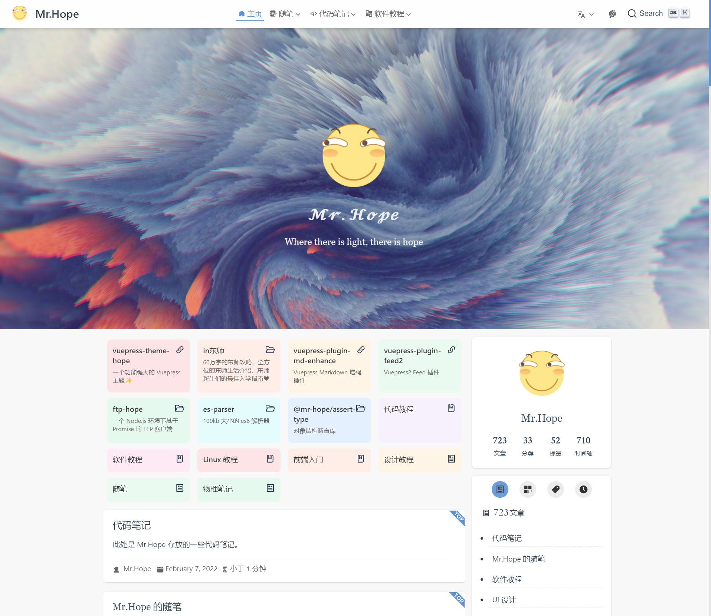

`vuepress-theme-hope` 允许你启用博客风格的首页。

你需要在相应的页面的 frontmatter 中，设置 `blog: true` 来开启博客风格。

<!-- more -->

## 可配置的项目

你可以自由配置右上方的博主头像与博主姓名，他们的配置项为 `themeConfig.blog.avatar` 和 `themeConfig.blog.name`。如果你没有填写它们，它们会自动回退到站点 Logo (`themeConfig.logo`) 和 站点名称 (`themeConfig.name`)。

主题默认会将头像剪裁成圆形，如果你拥有一个方形的 logo 且不希望它被破坏，请在 `themeConfig.blog` 中设置 `roundAvatar` 为 `false`。

如果你将 `themeConfig.intro` 设置为个人介绍页地址，点击右上角的博主头像和博主名称，会自动跳转到博主的个人介绍页。

你还可以在 `themeConfig.blog.links` 这个对象中以 `社交媒体名: 社交媒体链接` 的格式配置你的社交媒体链接。

::: tip 可用的社交媒体:

- `'Baidu'`: 百度
- `'Bitbucket'`: Bitbucket
- `'Dingding'`: 钉钉
- `'Discord'`: Discord
- `'Dribbble'`: Dribble
- `'Email'`: Email
- `'Evernote'`: 印象笔记
- `'Facebook'`: 脸书
- `'Flipboard'`: 红板报
- `'Gitee'`: Gitee
- `'Github'`: GitHub
- `'Gitlab'`: Gitlab
- `'Gmail'`: 谷歌邮箱(当然你也可以填入你自己的其他邮箱)
- `'Instagram'`: Instagram
- `'Line'`: Line
- `'Linkedin'`: 领英
- `'Pinterest'`: 拼趣
- `'Pocket'`: Pocket
- `'QQ'`: QQ
- `'Qzone'`: QQ 空间
- `'Reddit'`: Reddit
- `'Rss'`: RSS 地址
- `'Steam'`: Steam
- `'Twitter'`: Twitter
- `'Wechat'`: 微信
- `'Weibo'`: 微博
- `'Whatsapp'`: Whatsapp
- `'Youtube'`: YouTube
- `'Zhihu'`: 知乎

:::

## Frontmatter 可用参数

### hero

- 类型: `boolean`
- 默认: `true`

是否显示主页的图标与描述。主页的图标、描述设置同 [默认主页](../layout/home.md)。

### bgImage

- 类型: `string`

背景图片的地址，需填写绝对路径。如果不填写，会自动应用一张默认的风景图片。

### bgImageStyle

- 类型: `Record<string, string>`

背景图片的 CSS 样式。

### heroImageStyle

- 类型: `Record<string, string>`

首页图标的 CSS 样式

### heroFullScreen

- 类型: `boolean`
- 默认: `false`

是否全屏显示 Hero

### 项目

- 类型: `ProjectOption[]`

`ProjectOption` 包括以下键值:

- `type`: 类型，可选值为 `'link' | 'project' | 'book' | 'article'`
- `name`: 项目名称，必填
- `link`: 项目链接，必填，填入外部链接或绝对路径。
- `desc`: 项目描述，选填
- `cover`: 项目封面，选填，填入外部链接或绝对路径。
