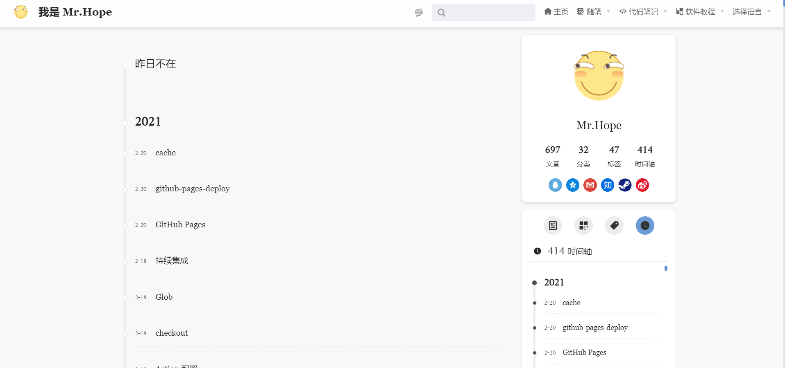
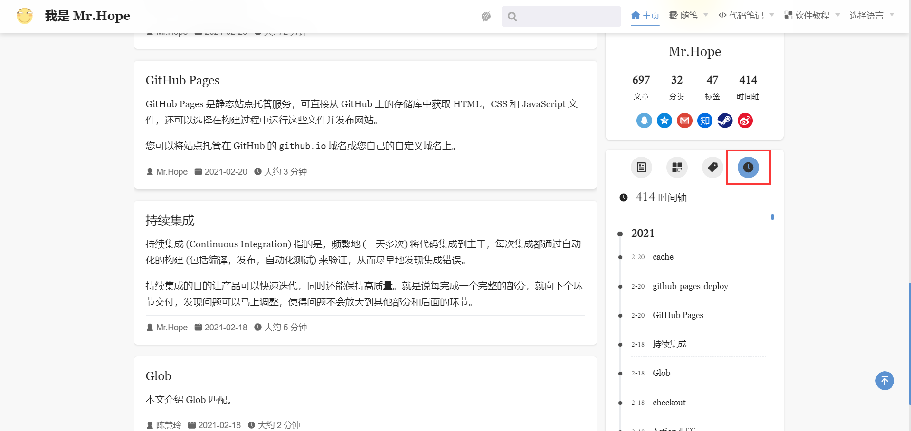

你可以通过 `/timeline/` 访问时间页面，在页面中，你可以按照时间倒序查看所有的文章列表。

## 排除文章

默认情况下所有注明了写作日期的文章都会显示时间线中。如果你不希望某篇文章被包含，只需在文章的 frontmatter 中将 `timeline` 设置为 `false`。

## 配置时间线顶部文字

我们允许你定制时间线的顶部文字，你可以通过 `themeConfig.blog.timeline` 配置它。

## 侧边栏

我们在博客相关页面的侧边栏添加了时间线选项卡，供用户快速预览时间线。

