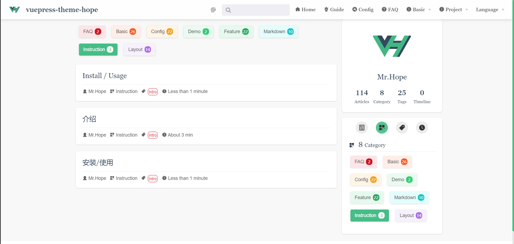

# 博客相关

主题通过配置 `@vuepress/plugin-blog` 启用了一些博客功能。你也可以配置 `themeConfig.blog` 为 `false` 来禁用全部的博客功能。

## 分类

只需要在页面的 frontmatter 中添加 `category: <分类名>` ，该文章会自动渲染在 `/category/` 分类页面的列表中。

请注意，一篇文章只能设置一个分类。

## 标签

只需要在页面的 frontmatter 中添加 `tags: <标签名>` 即可，该文章就会自动列出在 `/tag/` 标签页面的列表中。

`tags` 接受 `string | string[]`，也就是说一个文章可以包含多个标签。

## 文章

所有文章都会默认被添加到文章列表中渲染在 `/article/` 路径下。

如果你不希望该列表包含一些特定的文章，只需在文章的 frontmatter 中将 `article` 设置为 `false`。

如果你希望置顶特定文章，只需在文章的 frontmatter 中将 `sticky` 设置为 `true`。

## 时间线

所有注明了写作日期的文章都会被按照时间排序在 `/timeline/` 时间线中。

如果你不希望某篇文章被包含，只需在文章的 frontmatter 中将 `timeline` 设置为 `false`。

::: warning
请勿在根目录中添加并放置对应的文件夹("tag", "article", "timeline")，否则可能造成编译时文件被覆盖而造成错误。

如果你的确需要一个“文章”文件夹的话，请考虑使用 "articles"。
:::

## 版权信息

有些时候，你可能不想让你的某些文章被他人复制，或者你想让他人在复制时，自动生成一段版权信息到剪切板中。

你可以在页面中配置这一内容，在 frontmatter 中讲 `copyright.noCopy` 设置为 `true` 会禁用该页面的复制，设置 `copyright.noSelect` 为 `true` 会禁止该页面的选中。

你还可以通过 `copyright.minLength` 设置触发禁用复制或者追加版权信息的最小字符数，默认为 `100`。
