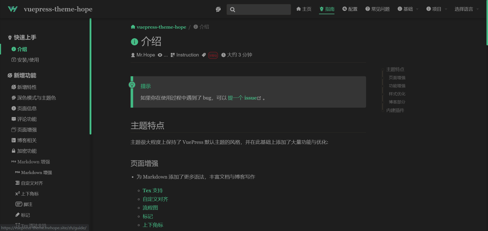

# 深色模式与主题色

## 深色模式

在深色模式下，页面会使用深色背景以保护你的眼睛。



深色模式支持选项:

- `'auto-switch'`: "关闭 | 自动 | 打开" 的三段式开关 (默认)
- `'switch'`: "关闭 | 打开" 的切换式开关
- `'auto'`: 自动根据用户设备主题或当前时间决定是否应用深色模式
- `'disable'`: 禁用深色模式

## 主题色

这是一个开箱即用的功能，除了你的主题色之外，还提供 “红、蓝、绿、橙、紫” 五种颜色主题。

### 禁用功能

你可以将 `themeConfig` 的 `themeColor` 设置为 `false` 来禁用它。

### 自定义颜色

你需要按照 `{ 颜色名1: 颜色值, 颜色名2: 颜色值, ... }` 的格式来配置 `themeConfig.themeColor`:

::: details 例子

```js {5-10}
// .vuepress/config.js
module.exports = {
  themeConfig: {
    themeColor: {
      blue: "#2196f3",
      red: "#f26d6d",
      green: "#3eaf7c",
      orange: "#fb9b5f",
    },
  },
};
```

:::

同时为了使 Stylus 编译器正常工作，你还需要将颜色变量赋值给 `$colorPicker` 写入 `.vuepress/styles/palette.styl` 中:

::: details 例子

```stylus
// .vuepress/styles/palette.styl
$colorPicker = {
  red: #f26d6d,
  blue: #2196f3,
  green: #3eaf7c,
  orange: #fb9b5f
}
```

:::

## 全屏按钮

默认启用，可在主题配置中将 `fullscreen` 设置为 `false` 将其取消。

::: tip
如果当前浏览器不支持全屏，则全屏按钮会自动隐藏。
:::

```js {4}
// .vuepress/config.js
module.exports = {
  themeConfig: {
    fullscreen: false, // 默认启用，设置 false 将其关闭
  },
};
```
